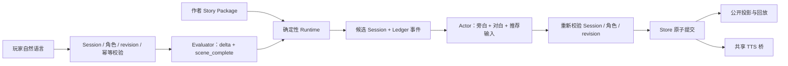

# N.E.K.O 小剧场架构开发文档

状态：当前开发与实施合同（Numeric v2）

本文是 N.E.K.O 仓库内小剧场唯一的架构开发文档，统一收录产品边界、Story Package、Runtime、模型权限、持久化、前端、生成器协作和验收要求。当前代码和测试高于本文；发现实现与本文不一致时，应先在[小剧场实测问题描述以及解决方案](./neko-theater-issues-and-solutions.md)记录可复现证据，再决定修改代码或修正文档。

## 1. 产品边界

小剧场保留两种完全隔离的模式：

| 模式 | 页面 | 服务端状态 | 持久化 |
| --- | --- | --- | --- |
| Numeric v2 剧本模式 | `/theater-numeric` | Story Package、Session、Ledger、表现历史 | `theater/numeric_v2/` |
| 自由模式 | `/theater` | Free Session 与沙盒历史 | 自由模式私有目录 |

`/theater-home` 只负责模式介绍和跳转，不在同一 Session 内切换模式。两种模式只共享当前猫娘配置与底层 TTS 播放桥，不共享 Prompt、Session、恢复指针、正式状态或演绎历史。

自由模式继续作为角色卡聊天沙盒，不读取或推进 Numeric v2 的节点、数值、路线、Ledger 与结局，也不把临时聊天写成剧本事实。自由模式角色卡的最终专有格式尚未锁定，不能为了剧本模式提前固化。

Numeric v2 的产品定位是：

- 作者控制背景、双角色身份、主线、支线、结局、隐藏数值规则、路线条件和过渡合同；
- 玩家使用自然语言决定当下行动；
- Evaluator 只判断本回合隐藏数值变化和当前幕是否完成；
- Actor 只生成旁白、猫娘对白和推荐输入；
- Runtime 确定性处理节点推进、路线、结局、`min_turns`、Ledger、Session 和原子提交；
- 不使用正式 Choice；推荐输入只是可选的普通自然语言快捷输入；
- 隐藏数值、阈值、路线条件和内部判定依据不对玩家公开。

## 2. 模块与权限

| 模块 | 职责 |
| --- | --- |
| `services/theater/numeric_v2.py` | Story Package 合同、静态图、条件与可达性编译 |
| `numeric_v2_registry.py` | 剧本包导入、列举、加载与删除 |
| `numeric_v2_cast.py` | 将作者候选身份投影为当前玩家称呼和当前猫娘名 |
| `numeric_v2_identity.py` | 角色卡不可变 ID 与当前猫娘绑定 |
| `numeric_v2_evaluator.py` | 单回合 metric delta 与 `scene_complete` 判定 |
| `numeric_v2_runtime.py` | 候选状态、限幅、`min_turns`、路线、结局和 Ledger 事件 |
| `numeric_v2_actor.py` | 已结算回合的旁白、猫娘对白和推荐输入 |
| `numeric_v2_store.py` | Session、Ledger、表现历史和槽位索引的原子持久化 |
| `numeric_v2_maintenance.py` | 冷启动审计、隔离区和可恢复删除事务 |
| `main_routers/numeric_theater_router.py` | `/api/theater-numeric` 的 Numeric v2-only HTTP 入口 |
| `static/js/theater_numeric_v2.js` | 剧本选择、恢复、输入、回放和结局展示 |
| `services/theater/tts_bridge.py` | 已提交猫娘对白的共享 TTS 播放桥 |



权限边界不可跨越：

- Evaluator 不能选择路线、编写剧情或写 Session；
- Actor 不能修改 metric、节点、路线、结局、Ledger 或正式事实；
- Runtime 不解释自然语言，只应用已验证 delta，并从作者声明的路线中确定性选择；
- 前端不能提交隐藏 metric、阈值或目标节点；
- Store 只提交完整成功回合，不保存模型执行中的候选半状态；
- TTS 失败只降级为文字，不能回滚已经提交的剧情。

不新增 Planner、Director、多轮 Repair、自动评分模型或运行时动态剧情规划层。

## 3. Story Package 合同

剧本模式只接受 `neko.story.numeric.v2`，顶层核心结构为：

- `meta`
- `intro`
- `characters`
- `catgirl_binding`
- `metric_schema`
- `initial_state`
- `start_node_id`
- `nodes`
- `endings`

Story Package 是作者事实源，不包含玩家 Session、Ledger、模型演绎历史或生成器项目元数据。

### 3.1 角色与身份

作者包可以使用候选男女主身份描述，但运行时必须统一投影：

- 男主由玩家扮演，显示和演绎统一使用当前猫娘对玩家的称呼；
- 女主由当前猫娘扮演，统一使用当前角色卡猫娘名；
- 候选原名不能重新出现在 Actor 输出中；
- 玩家与猫娘的行为、经历和台词归属不能交换；
- 角色卡不可变 ID 只用于存储身份，不进入人格正文。

### 3.2 隐藏数值

`metric_schema` 定义数值 ID、范围、bands 和允许的增减规则；`initial_state.metrics` 必须完整覆盖所有 metric。Evaluator 只能引用作者已声明的规则给出 delta，Runtime 负责限幅。玩家端不显示原始值、metric ID、阈值、route gate 或内部判定证据。

### 3.3 节点、路线与结局

每个非结局节点必须声明 `min_turns`，范围为 1—20；生成器新建和生成时默认填 2，作者可以修改。这里的回合是“当前节点内成功提交的玩家自然语言输入回合”，不是主线章节数，也不包含失败、重复或 revision 冲突的提交。`min_turns` 只是最短停留时间：

- 未达到最少回合时，Runtime 返回 `waiting_min_turns`；
- 已达到但 `scene_complete=false` 时，返回 `scene_incomplete`，不能按回合数硬切；
- `scene_complete=true` 后才计算 route gate；
- 条件不满足时返回 `conditions_blocked` 并留在当前节点；
- 多条路线同时满足时，只选择唯一最高 priority；同优先级并列属于非法状态；
- 只有一个出口的顺序节点允许空条件；同一节点有多个出口时，每条路线都必须有明确数值条件；
- 每个可达非结局节点最终都必须能够到达 terminal ending。

非结局节点还可以声明玩家不可见的 `recommended_turns`，范围为 `min_turns`—40；生成器默认填 4。旧包未声明时，Actor 使用 `min_turns + 2`（最高 40）的兼容默认值。它是软节奏预算，不是正式路线条件：

- 接近预算时，Actor 应减少重复闲聊并把互动重新聚焦到本幕 `pending_goals`；
- 达到或超过预算时，Actor 应主动收束当前交流，允许休息、离开和时间流逝，但不能替玩家行动或跳过本幕目标；
- `recommended_turns` 不改变 `scene_complete`，不触发路线，也不改变 Runtime 的 `min_turns`、route gate 和 priority 判定；
- 玩家端不显示预算；作者可以在生成器节点检查器中调整。

路线的 `transition_contract` 至少承担两类约束：

- `must_deliver`：换场时必须带入目标场景的事件或信息；
- `must_preserve`：换场后仍必须保持的已发生事实。

进入 terminal node 后 Session 标记为 `ended`，前端显示公开结局标题和摘要并关闭输入。Normal、Good、Bad 等结局类型属于作者语义，不改变 Runtime 的统一终局处理。

## 4. 单回合合同

正式顺序如下：

```text
玩家原话
  → 校验 Session ID、Story、当前猫娘不可变 ID、base_revision、client_turn_id 和输入长度
  → Evaluator 一次调用
  → Runtime 应用 delta、min_turns、scene_complete、route gate 和 priority
  → Actor 一次调用
  → 重新校验 Session、角色绑定和 revision
  → 原子提交 Session + Ledger event + performance record
  → 公开快照
  → 已提交猫娘对白进入 TTS
```

Evaluator 输出严格限定为：

```json
{
  "scene_complete": false,
  "metric_changes": {
    "metric_id": {
      "delta": 0,
      "criterion_id": "author_rule_id"
    }
  }
}
```

普通未换场回合的 Actor 输出严格限定为：

```json
{
  "content": [
    {"type": "narration", "text": "第三人称环境与猫娘行动"},
    {"type": "dialogue", "speaker_id": "active_catgirl", "text": "猫娘第一句对白"},
    {"type": "narration", "text": "对白后的动作或神态"},
    {"type": "dialogue", "speaker_id": "active_catgirl", "text": "猫娘第二句对白"}
  ],
  "suggested_inputs": ["玩家可以直接输入的普通自然语言"]
}
```

`content` 是 2—16 个有序内容块；旁白和多句对白按实际发生顺序穿插保存、恢复和显示，不能再把全部对白统一堆到旁白之后。普通回合至少包含一个旁白块和一句有效猫娘对白；非法 block、错误 speaker 或纯旁白输出都会阻止整回合提交，不再静默过滤成无对白记录。Actor 的旁白不能替玩家补写动作、姿势、心理或已完成事实；推荐输入不能绑定路线、泄漏条件或假定玩家已经做过某事。

节点 `chapter` 标题作为 Actor 的软主题锚点：开场和未换场回合提供当前标题，换场回合同时提供来源与目标标题。标题只在玩家输入和已发生记录都没有明确对象、且存在多个同样成立的候选焦点时用于取舍。它不是已发生事实、幕完成条件或必须复述的文案，不能覆盖 `recent_context`、`pending_goals`、禁止事项或过渡合同。Evaluator 和 Runtime 不使用标题判定幕完成、路线或结局。

### 4.1 换场合同

当 Runtime 已选择路线时，Actor 同一回合必须完成三个连续动作：

1. 直接回应玩家本轮输入并收住来源节点的当前互动；
2. 用必要的时间、地点或行动桥接完成过渡合同；
3. 建立目标节点 `opening_scene` 的现场，但不在同一回合演完整个目标节点。

换场输出使用固定顺序的 `source_response`、`transition_bridge`、`target_opening` 三段结构，每段内部同样使用有序 `content`。`source_response` 至少包含一句直接回应玩家的对白；`target_opening` 的第一个旁白块必须以 Runtime 提供的目标 `opening_scene` 原文开头。解析器、Runtime 和 Store 分别校验三段完整性、可见目标节点与 Ledger `to_node_id` 一致。任一条件不满足时整回合不提交，前端按三段及段内内容块顺序连续展示，不额外暴露节点标题。新提交的 performance 带内部合同版本；旧 `narration/dialogue` 记录继续按原顺序恢复，不能因新增校验废掉既有 Session。

节点 ID 已推进不等于玩家看见了换场。换场交付必须成为可验证的提交条件；仅把 `route_changed`、目标 beat 和过渡合同放进 Prompt 不足以保证一致性。实测证据和复测状态见[“正式节点已推进，但可见场景没有切换”](./neko-theater-issues-and-solutions.md#问题-1正式节点已推进但可见场景没有切换)。

“休息、睡觉、离开、结束交谈”不是独立路线条件：

- 若本幕尚未完成，只能自然收束当前对话或做同一节点内的时间过渡，不能跳过 `pending_goals`；
- 若本幕已经完成且 Runtime 选出路线，可以作为进入下一场景或第二天的自然桥；
- Runtime 不增加关键词意图分类器，Evaluator 仍只判断数值和本幕完成度；
- Actor 在明确休息后不应继续推荐“装睡并继续对话”等与玩家意图冲突的输入，除非目标开场存在叫醒或紧急事件。

### 4.2 回合工作记忆

Numeric v2 不增加独立记忆模型或第三次总结调用。Session 和 Ledger 仍是完整历史档案；Actor 的“回合工作记忆”只是从已提交记录构建本轮 Prompt 的确定性投影，不产生新事实、不单独持久化、不参与 Runtime 推进。

装箱合同如下：

1. 玩家本轮输入完整优先，并作为 Human Prompt 的最后一个字段交付，避免末尾历史在注意力上覆盖当前要求；
2. 最新一轮已提交表现在预算允许时原样保留，物品位置、状态、持有人、许可和末句对白不能与旧记录一起平均裁剪；
3. 开场锚点其次，再从新到旧加入最多六轮历史；较早记录按完整句优先保留玩家输入、对白与首尾旁白；
4. 任何降级都必须在完整句边界停止，不得向模型交付“虽然是”“如果你敢”等由程序截断的半句；
5. 未换场回合只发送 `current_story_beat`，不发送重复的来源 beat、空目标 beat 和空过渡合同；换场时才发送来源、目标与过渡数据；
6. Actor 总输入预算仍为 3200 Token，系统合同上限为 1400 Token；程序先计算本轮固定字段的实际占用，再把剩余预算分配给工作记忆，工作记忆最多 1000 Token；
7. 通用 `bound_prompt_messages` 只作为最后安全网。Actor 专用装箱完成后，它不应再改写最新回合；
8. 若模型仍照搬上一轮全部对白，且本轮正文与上一轮达到高相似度，Actor 必须拒绝提交该结果。该保护不新增自动重试或模型调用，Session、Ledger 和 revision 保持原状。

旧 Session 不需要迁移；工作记忆每轮直接从现有 `opening_performance` 和 `performance_history` 重建。这一层只改变模型看到历史的方式，不改变公开 API、Ledger、Session revision 或原子提交。

### 4.3 角色化表达与文风多样性

Numeric v2 是由 AI 驱动的类 Galgame。角色卡切换的价值不能只体现为猫娘名字变化；在同一剧情身份和同一玩家输入下，不同猫娘仍应表现出可感知的措辞、句长、主动性、情绪外显方式和互动节奏差异。

演绎优先级必须拆开“能发生什么”和“如何表现”：

1. 已发生事实、节点 `boundaries` 和过渡合同决定剧情硬边界；
2. 当前猫娘角色卡是唯一核心人格，决定措辞、句长、价值取向、主动性和情绪外显方式；
3. 剧情身份、当前幕状态和隐藏关系 band 只能调整她此刻的目标、信任、距离、亲密度和主动性，不能覆盖核心人格；
4. 当轮情绪和文风变化在以上边界内自由生成。

现有 Story Package 字段直接复用，不新增第二份人格：

| 来源 | Actor 投影 | 权限 |
| --- | --- | --- |
| 当前角色卡人格摘要 | `acting_context.core_persona` | 唯一核心人格；人格冲突时优先 |
| `intro.catgirl_identity` | `acting_context.story_identity` | 初始剧情身份、经历、能力与目标，不定义基础性格 |
| `catgirl_binding.role_overlay` | `acting_context.story_role_context` | 如何进入故事及长期关系弧线，不定义基础性格 |
| 当前节点 `story_beat.catgirl_situation` | `acting_context.current_scene_state` | 当前幕临时状态 |
| 目标节点 `catgirl_situation` | `acting_context.target_scene_state` | 换场后临时状态 |
| 当前隐藏 metric bands | `acting_context.relationship_state` | 调整关系姿态，不公开原始数值 |

`characters` 当前只要求是对象，Actor 不消费，不能把它启用为并行人格事实源。每轮 Actor 都从角色卡、当前节点和 Session metrics 确定性重建 `acting_context`；数值跨 band 或 Runtime 进入目标节点时自然得到新的临时状态，不改写角色卡、不持久化模型总结，也不需要“每幕重写人设”。

Actor 使用以下无额外模型调用的软文风控制：

1. 将完整 `acting_context` 放在 Human Prompt 尾部、靠近本轮输入交付；开场同样显式获得核心人格、初始关系 band 和当前幕状态；
2. 从最近三轮已提交表现中确定性提取首个内容块的首个完整分句，作为 `recent_openings`；每条最多 40 Token，只用于识别近期起手结构、比喻和动作组合，不产生新事实、不单独持久化；
3. Actor 应根据角色与情境选择从对白、动作、停顿或环境变化切入，不能把“听到玩家的话 → 固定反应 → 对白”当作每轮模板；
4. “听到”“闻言”等词不是禁词，在当下最自然时可以使用；目标是避免连续机械复用，而不是通过同义词替换制造另一套模板；
5. 旁白优先展示可观察反应，少替作者评价、概括或给玩家发言贴标签；不能为了追求变化随机改变人格、关系、事实或剧情节奏；
6. 不使用 Runtime 随机轮换模板，不增加文风模型、Planner 或额外 Actor 调用。现有近重复提交保护只拦截“全部对白照搬且整轮高度相似”，不能把单个常用词或角色口头禅当成错误。

正式质量验收至少包括：同一角色连续 8—10 轮的起手结构复用检查，以及同一 Story、同一输入在三张明显不同角色卡下的盲测对比。通过标准是角色差异能够从措辞、节奏和行为反应中识别，而不只是替换显示名称；该项需要真实模型压测，单元测试只验证 Prompt 权重、边界和上下文投影。

## 5. Session、Ledger 与原子性

每个回合使用稳定 `client_turn_id` 和 `base_revision`：

- 重复提交不能重复调用模型或写入第二条记录；
- revision 冲突返回 409，前端刷新服务端快照并保留未提交草稿；
- Evaluator、Actor 或 Store 任一步失败都不提交半回合；
- Actor 生成成功前不写 Session、Ledger 或表现历史；
- Session 文件中的 Ledger 事件和表现记录按 revision 一一对应，加载时复验节点、数值、计数器和链尾；
- 并发结束、重复结束、剧本删除和回合提交通过相同的故事级边界保护，只有一个最终结果可以提交。

公开 HTTP 投影只包含恢复和演绎所需信息：intro、当前场景摘要、开场表现、表现历史、revision、Session 状态、推荐输入和公开结局。完整 Ledger、隐藏数值和内部规则保留在服务端。

## 6. 演绎槽位与持久化生命周期

Numeric v2 的持久化唯一键是：

```text
Story ID × 猫娘角色卡不可变 character_id
```

每个组合最多保留一个 Session 文件，`story_sessions.json` 只保存槽位到 Session ID 的恢复指针。

- 角色卡改名不改变 `character_id`，因此不丢进度；
- 删除角色卡后新建同名角色会得到新 ID，不能继承旧进度；
- 关闭窗口或退出 N.E.K.O 不结束 Session，重启后恢复当前猫娘对应的剧本槽位；
- 切换猫娘不删除其他猫娘的进度，切回后恢复各自槽位；
- 终局和主动结束在当前槽位保留只读记录；
- “重新开始”创建新 Session ID，并原子替换槽位旧文件；旧页面因 Session ID 失效不能继续提交，磁盘也不累积历史 Session；
- 正常恢复只读取索引；Numeric v2 冷启动初始化或显式维护才全盘复验文件并重建索引；
- 损坏、无主或重复文件移入有界隔离区，最多保留 6 份，不能阻断其他合法槽位恢复。

删除剧本使用可恢复事务级联删除 Story Package、该剧本全部 Session 和索引项；任一步失败恢复删除前快照。存在 `active` Session 时，前端列出对应猫娘名并要求确认。删除猫娘角色卡按不可变 ID 级联删除其在所有剧本下的 Session。

当前只约束 Session 文件数量，不限制单个 Session 的回合数或文件体积；Ledger 与表现历史会持续增长。这是已知容量风险，收到实际容量证据后再设计归档或上限。

## 7. 前端与 TTS

- 舞台显示背景介绍、玩家身份和猫娘身份，不显示节点标题、场景卡或隐藏状态；
- 演绎区按开场、玩家原话、旁白、猫娘对白顺序回放；
- 玩家输入和猫娘对白均使用可辨识的引号样式，猫娘对白不显示“猫娘：”前缀；
- 服务端和 TTS 保存、播放无前端引号与角色标签的原始对白；
- 推荐输入只回填或直接作为普通文本提交，不携带正式 Choice ID；
- terminal scene 显示结局标题和摘要，并关闭输入、发送按钮和推荐输入；
- 刷新只恢复已提交历史，不重播历史 TTS；
- TTS 去重键包含模式、Session 与 revision，剧本和自由模式不能串播。

## 8. NEKO_Numeric_drama 生成器协作边界

剧本生成器是作者侧工具，后续可以 SDK 形式嵌入 N.E.K.O，但职责保持独立：

- 创建作者项目并生成初始主线和一个 Normal 结局；
- 编辑节点、支线、路线条件、过渡合同、隐藏数值和多个结局；
- 编译、检查、跨仓库复验、导出和安装 Story Package；
- 保证导出、安装和 N.E.K.O 复验使用相同 canonical bytes；
- 不持有 Session、Ledger、演绎状态或 Runtime 推进权；
- 不增加 Planner、Repair 或额外评分模型。

首次结构生成不要求模型同时输出 metric、阈值、priority、`min_turns` 或 `recommended_turns`。两类回合默认值、稳定 ID、正式条件、互补路线、结构校验、编译和原子写入应由程序确定性处理。

### 8.1 引导式支线创作

支线生成采用“终点先行、结局反推、默认不要求手算阈值”：

1. 作者从当前恰好只有一个出口的非结局节点发起；
2. 先选择终点：回到主线、通往已有结局或产生新结局；
3. 选择回到主线时，必须让作者明确选择具体回接节点，默认推荐原顺序出口的下一幕；
4. 产生新结局时，先生成并确认可编辑的结局草稿，再从结局反推 1—3 幕过程；
5. 作者用自然语言说明触发原因和想要的篇幅；
6. 生成模型只生成可预览的剧情过程与因果解释；
7. 作者确认后，程序一次性写入节点、路线、过渡合同和可选新结局。

默认界面展示“当信任达到愿意托付秘密的程度”一类人类可读语义，不要求作者手算 metric ID、运算符、阈值和 priority。高级编辑仍必须可以检查和修改原始条件，不能形成黑箱。

若作者已经选择条件，模型只能解释因果；只有作者选择“让生成模型推荐”时，模型才能从程序依据现有 metric bands 构造的候选集合中返回一个候选 key。项目缺少合适 metric，或 bands 只有无法表达剧情含义的占位词时，向导必须先要求作者完善数值规则或确认新增预设，不能让模型静默发明正式数值。

回接点选择器必须显示会绕过的主线幕和关键事实。支线需承接被绕过的 `must_happen` 与主线路线 `must_deliver`；1—3 幕无法安全承接时，在模型调用前禁用该候选。主线顺序来自生成器作者项目元数据，不能依赖 `mainline_XX` ID 前缀猜测，也不写入 Story Package。旧项目无法唯一识别主线时，由作者沿现有路线确认。

模型只接收任务需要的上下文投影：背景、双角色身份、来源节点、最近 1—2 个上游节点、原出口、已选终点、被绕过事实、相关 metric 语义与 bands、允许候选、作者方向和篇幅。目标预算为 8K—12K tokens，硬上限 16K；不发送完整项目、无关支线、Session、Ledger 或 Runtime 历史。超限候选应在选择前禁用并解释，不能截断关键事实后继续生成。

生成器的专项字段和 DTO 仍以 `NEKO_Numeric_drama` 仓库内生成器设计文档和当前代码为准；它们不能覆盖本页的 Runtime 权限边界。

## 9. 验收矩阵

架构改动至少验证以下范围：

1. Story Package schema、数值规则、路线条件、可达性和结局编译；
2. `min_turns`、`recommended_turns` 软节奏、`scene_complete`、priority、条件阻塞、支线进入与回流；
3. Actor 身份替换、玩家行为归属、开场、换场和推荐输入合同；
4. Session revision、幂等、并发提交、原子失败、重启恢复和跨剧本隔离；
5. 角色改名、同名新角色、切换角色、重新开始、删剧本和删角色；
6. 前端公开投影、刷新恢复、结局面板、输入关闭和隐藏数值隔离；
7. 剧本模式与自由模式的 API、目录、Prompt、恢复指针和状态不串线；
8. 八语言用户文案 key 一致且 JSON 可解析；
9. 真实前端模型回放按固定归因顺序记录在问题文档；
10. 真实桌面 TTS 设备发声仍需人工验收，自动测试只能覆盖桥接和降级语义。

任何“提示词看起来已经要求模型做到”的行为，都必须用真实输出或可执行回归证明；Prompt 本身不算完成证据。
