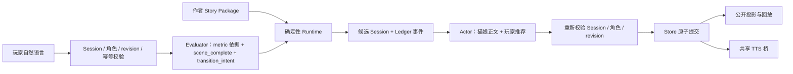

# N.E.K.O 小剧场架构开发文档

状态：当前开发与实施合同（Numeric v2.2）

本文是 N.E.K.O 仓库内小剧场唯一的架构开发文档，统一收录产品边界、Story Package、Runtime、模型权限、持久化、前端、生成器协作和验收要求。当前代码和测试高于本文；发现实现与本文不一致时，应先在[小剧场实测问题描述以及解决方案](./neko-theater-issues-and-solutions.md)记录可复现证据，再决定修改代码或修正文档。

## 1. 产品边界

小剧场只保留 Numeric v2 剧本模式。`/theater` 是唯一正式页面入口，只负责选剧、查看前情和角色身份以及开始或继续 Session；正式演绎在 N.E.K.O 本体胶囊与历史区中进行。旧 `/theater-home`、`/theater-numeric` 页面和自由模式的页面、API、Prompt、Session、Runtime 均已退役，不提供兼容重定向。

小剧场与普通聊天只共享当前猫娘配置、现有聊天宿主和底层 TTS 能力，不共享输入状态、草稿、历史、恢复指针或正式事实。剧场控制器只有在 Numeric v2 Session 激活且等待玩家输入时才能接管真实胶囊输入框；未激活时必须完全退出普通聊天链路。

Numeric v2 的产品定位是：

- 作者控制背景、双角色身份、主线、支线、结局、隐藏数值规则、路线条件和过渡合同；
- 玩家使用自然语言决定当下行动；
- Evaluator 只判断本回合隐藏数值变化、当前幕是否完成和对已提出转场的态度；
- Performance Actor 在同一次调用中生成旁白、猫娘动作与对白，以及玩家可直接发送的推荐输入；
- Runtime 确定性处理节点推进、路线、结局、软节奏提示、Ledger、Session 和原子提交；
- 不使用正式 Choice；推荐输入只是可选的普通自然语言快捷输入；
- 隐藏数值、阈值、路线条件和内部判定依据不对玩家公开。

## 2. 模块与权限

| 模块 | 职责 |
| --- | --- |
| `services/theater/numeric_v2.py` | Story Package 合同、静态图、条件与可达性编译 |
| `numeric_v2_registry.py` | 剧本包导入、列举、加载与删除 |
| `numeric_v2_cast.py` | 将作者候选身份投影为当前玩家称呼和当前猫娘名 |
| `numeric_v2_identity.py` | 角色卡不可变 ID 与当前猫娘绑定 |
| `numeric_v2_evaluator.py` | 当前回合 metric 依据、自然收束信号和已提出转场的态度；不保存目标证据 |
| `numeric_v2_runtime.py` | 候选状态、限幅、路线、结局、转场提议和 Ledger 事件；不提供旧 Session 迁移 |
| `numeric_v2_actor.py` | Performance 上下文投影、Prompt 预算，以及正文与推荐的同次编排 |
| `numeric_v2_actor_output.py` | Performance 输出解析、混合正文校验、换场去重和共享玩家输入文本保护 |
| `numeric_v2_budget.py` | Actor 的白名单输入档位、历史窗口和连续性预算 |
| `numeric_v2_workflow.py` | 串行执行 Evaluator → Runtime 候选 → Actor 正文与推荐 → 身份复验 → 原子提交，并记录分段耗时诊断 |
| `numeric_v2_store.py` | Session、Ledger、表现历史和槽位索引的原子持久化；不迁移旧证据链 |
| `numeric_v2_archive.py` | 结束回执、单集记忆胶囊和完整公开演绎冷档案 |
| `numeric_v2_maintenance.py` | 冷启动审计、隔离区和可恢复删除事务 |
| `main_routers/numeric_theater_router.py` | `/api/theater-numeric` 的请求校验、错误映射、TTS 与归档 HTTP 入口 |
| `app/memory_server/routes.py`、`memory/recent.py`、`memory/timeindex.py` | 剧场胶囊 upsert、有界周目记忆、时间索引覆盖和 Prompt 渲染隔离 |
| `utils/llm_client/messages.py` | 内部消息来源元数据的序列化、识别与供应商协议剥离 |
| `static/js/theater_selector.js` | `/theater` 的剧本选择、导入、删除、开始和继续交接 |
| `static/js/theater_transport.js` | 选择页与本体共用的消息协议、请求 ID 和本地 JSON/CSRF 请求边界 |
| `static/app/app-theater-runtime.js` | N.E.K.O 本体中的 Session 恢复、输入提交、内容块播放和结束流程 |
| `services/theater/tts_bridge.py` | 已提交猫娘对白的共享 TTS 播放桥 |



权限边界不可跨越：

- Evaluator 不能选择路线、编写剧情或写 Session；
- Performance 与 Suggestion 都不能修改 metric、节点、路线、结局、Ledger 或正式事实；
- Runtime 不解释自然语言，只应用已验证 delta，并从作者声明的路线中确定性选择；
- 前端不能提交隐藏 metric、阈值或目标节点；
- Store 只提交完整成功回合，不保存模型执行中的候选半状态；
- TTS 失败只降级为文字，不能回滚已经提交的剧情。

不新增 Planner、Director、多轮 Repair、自动评分模型或运行时动态剧情规划层。

## 3. Story Package 合同

剧本模式只接受 `neko.story.numeric.v2`，顶层核心结构为：

- `meta`
- `intro`
- `characters`
- `catgirl_binding`
- `metric_schema`
- `initial_state`
- `start_node_id`
- `nodes`
- `endings`

Story Package 是作者事实源，不包含玩家 Session、Ledger、模型演绎历史或生成器项目元数据。

### 3.1 角色与身份

作者包可以使用候选男女主身份描述，但运行时必须统一投影：

- 男主由用户扮演；`player_address_known=false` 时 Actor 只能看到“你”，直到用户输入中出现完整配置昵称并由成功回合原子确认；
- `player_address_known=true` 时显示和演绎才使用当前猫娘对玩家的称呼；
- 女主由当前猫娘扮演，统一使用当前角色卡猫娘名；
- 候选原名不能重新出现在 Actor 输出中；
- 玩家与猫娘的行为、经历和台词归属不能交换；
- 角色卡不可变 ID 只用于存储身份，不进入人格正文。

### 3.2 隐藏数值

`metric_schema` 定义数值 ID、范围、bands 和允许的增减规则；`initial_state.metrics` 必须完整覆盖所有 metric。`initial_state.player_address_known` 是结构化布尔状态，声明本剧开场时猫娘是否已经知道玩家称呼，不能从自然语言摘要或“称呼未知”等文案解析。v2.2 编译器不再为旧包补字段或保留兼容哈希；可选 `relationship_effect` 只能是 `positive / negative / none`，由作者或生成器明确声明，Runtime 不得根据数值 ID、名称或题材猜测。

Evaluator 只能选择作者已经声明的 `criterion_id` 和有限强度 `weak / normal / strong / decisive`，不能直接决定任意 delta。服务端依据该 metric 对应方向的 `per_turn_limit` 确定性换算：`weak=1`、`normal=ceil(limit/3)`、`strong=ceil(2×limit/3)`、`decisive=limit`，再由 Runtime 限幅。关系型 metric 的相同依据在最近四条 Ledger 事件中已经获得奖励时，仅换一种说法、重复礼貌或延续同一态度不能再次变化；只有出现新的成本、风险、明确兑现或可验证结果时才允许继续计分。玩家端不显示原始值、metric ID、阈值、route gate、强度或内部判定证据。

### 3.3 节点、路线与结局

每个非结局节点仍可声明 `min_turns`，范围为 1—20；它只作为作者节奏提示，不作为运行时换幕门槛。这里的回合是“当前节点内成功提交的玩家自然语言输入回合”，不是主线章节数，也不包含失败、重复或 revision 冲突的提交。当前运行语义为：

- 没有上一轮可见转场提议时，普通回合始终留在当前节点并返回 `playing`；
- `scene_complete` 只锁存当前幕完成事实，不自动触发路线，也不要求目标全部完成；
- 只有上一轮已经提交 `transition_offered=true`，且玩家后续明确接受或亲自实施具体下一步时，Runtime 才计算 route gate；
- 条件不满足时仍留在当前节点并保留 `transition_offered`，等待新的数值变化或新的剧情因果；
- 多条路线同时满足时，只选择唯一最高 priority；同优先级并列属于非法状态；
- 只有一个出口的顺序节点允许空条件；同一节点有多个出口时，每条路线都必须有明确数值条件；
- 每个可达非结局节点最终都必须能够到达 terminal ending。

非结局节点还可以声明玩家不可见的 `recommended_turns`，范围为 `min_turns`—40；当前短篇生成器默认把 `min_turns` 与 `recommended_turns` 都设为 3，作者可在剧本生成器的节点属性中逐幕调整建议回合。它是软节奏预算，不是正式路线条件：

- 接近预算时，Actor 应减少重复闲聊并把互动重新聚焦到当前幕自然方向；
- 当前节点成功回合数等于预算时进入 `closure`：先回应玩家，再依据下一幕完整简介和当前已发生事实形成自然、具体的下一步提议；未出现的目标和道具可以舍弃；
- 当前节点成功回合数超过预算时进入 `overdue`：禁止新开支线、补齐遗漏目标或为道具追加使用场景，当轮收住当前话题并提出下一步；只能邀请玩家决定，不能替玩家接受或强制换幕；
- `overdue` 可以增强表达直接性，也可以让剧本已经明确的环境压力随时间合理发展，但必须承接最近已提交事实，不得无来源制造倒计时、追兵、事故、截止日期或最后通牒。`HH:MM` 究竟是当前钟点还是剩余时长只能由 Story Package 事实决定，演绎器不得仅凭文本格式猜测方向或硬改数值；
- `closure / overdue` 都允许休息、离开和时间流逝，但不能替玩家作自主决定或跳过本幕目标；有正式前因的即时身体结果仍按因果合同处理；
- `recommended_turns` 不改变 `scene_complete`，不触发路线，也不改变 Runtime 的 route gate 和 priority 判定；`min_turns` 只作为作者提示保留；
- 玩家端不显示预算；作者可以在生成器节点检查器中调整。

每个非结局节点的 `story_beat` 可以使用以下结构化作者事实；它们只提供创作上下文，不是 Runtime 任务：

- `opening_scene`：本幕唯一确定性可见开场。缺少时只取当前摘要首句作为作者输入。开场只能建立环境或猫娘可见行动，不能替“你”执行行动或决定；
- `relationship_ceiling`：当前幕允许的最高关系阶段，只能是 `stranger / guarded / cooperative / trusted / intimate`。Actor 将它与隐藏关系 metric 的当前阶段取更严格者；缺少时按当前场景的默认关系边界处理；
- `goals`：带稳定作者 ID、行为主体和证据方式的目标数组，与旧 `must_happen` 互斥。同幕最多八项，`owner` 只能是 `catgirl / player / shared / environment`；Actor 不能代替 `player` 目标行动，`shared` 必须保留双方各自证据；
- `goals[].evidence.mode=semantic` 时由 Evaluator 结合已提交事实做语义判断且不得填写字面锚点；`mode=exact` 时必须提供 1—8 个完整 `anchors`，服务端只在该 owner 允许的已提交来源中逐字核验。模型为 exact 目标返回的 revision 不直接生效，只有服务端逐字核对得到的证据可以锁存；锚点缺失会把模型给出的 `scene_complete=true` 确定性降为 `false`。

结构化目标示例：

```json
{
  "id": "goal.reboot_identity_question",
  "owner": "catgirl",
  "description": "猫娘明确说明主存储区损坏，并询问自己的过去与唤醒者身份。",
  "evidence": {
    "mode": "semantic",
    "anchors": []
  }
}
```

目标字段不会写入 Session，也不会被 Runtime 转换为完成任务；作者可以在 v2.2 包中改写、遗漏、合并或舍弃这些素材。角色身份、不可逆事实和重要道具生命周期仍需由作者上下文保持连续。

路线的 `transition_contract` 至少承担两类约束：

- `must_deliver`：换场时必须带入目标场景的事件或信息；
- `must_preserve`：换场后仍必须保持的已发生事实。

进入 terminal node 后 Session 标记为 `ended`，前端显示公开结局标题和摘要并关闭输入。Normal、Good、Bad 等结局类型属于作者语义，不改变 Runtime 的统一终局处理。

## 4. 单回合合同

正式顺序如下：

```text
玩家原话
  → 校验 Session ID、Story、当前猫娘不可变 ID、base_revision、client_turn_id 和输入长度
  → Evaluator 一次调用
  → 服务端把 criterion + strength 确定性换算为 delta
  → Runtime 应用 delta、scene_complete 提示、转场态度、route gate 和 priority
  → Runtime 按完整配置昵称精确检查本轮披露候选，形成候选称呼状态
  → Actor 生成正文与推荐；输出合同失败或超软预算出口失败时按受限次数重采样
  → 重新校验 Session、角色绑定和 revision
  → 原子提交 Session + Ledger event + performance record
  → 公开快照
  → 已提交猫娘对白进入 TTS
```

工作流始终按上述顺序串行调用。TTS 只读取原子提交后的公开对白。

Evaluator 输出严格限定为：

```json
{
  "scene_complete": false,
  "metric_changes": {
    "metric_id": {
      "strength": "weak",
      "criterion_id": "author_rule_id"
    }
  },
  "goal_evidence": {
    "goal.1": [3]
  }
}
```

v2.2 不再有 `goal_evidence`、交付回执或完成锁存字段。`scene_complete` 只是 Evaluator 提供的自然收束提示，不能绕过可见转场提议和玩家后续接受门槛；普通目标与道具只作为 Actor 创作素材。

普通未换场回合的 Actor 输出严格限定为：

```json
{
  "performance": "（把咖啡推到玩家手边）先暖暖手。刚才那件事……（抬眼看向玩家）我答应了。",
  "suggested_inputs": ["（我握住杯子）我先听你说。", "（我放下杯子）这件事先缓一缓。"],
  "transition_offered": false
}
```

`performance` 是模型一次生成的完整演绎正文：全角中文括号内只允许当前猫娘的即时微动作，括号外全部视为当前猫娘实际说出口的对白。动作与对白可以自然穿插，不限制固定对白句数，也不要求每句对白前机械添加动作。Runtime 在提交前校验括号成对、禁止嵌套并要求普通回合至少有有效对白；提交后按同一解析器确定性投影为内部 action/dialogue 片段，供历史展示、TTS、Evaluator、归档与近重复保护消费。Session 保存原始 `performance` 顺序，不保存第二份易漂移的解析结果；旧 `content`、`narration/dialogue` 存档不再由当前运行时兼容恢复。

推荐输入是点击后原样发送的玩家自然语言，不强制以“我”开头。纯动作省略玩家主语并从动作动词起笔；纯台词直接写玩家实际说出口的话；动作与台词混合时先写动作，再用中文引号标出台词。对白内部仍可按语义自然使用“我”等代词。推荐输入不得退化为“解释、询问、展示、选择”等编辑指令，也不由前端机械改写语态。

旁白采用分层节奏：普通回合以对白为主体，每个括号只写一项猫娘动态微动作，目标长度不超过 18 个汉字或 12 个单词；不能写静态情绪解释、心理结论、关系评价，也不能压缩多个连续动作、未来剧情或整幕摘要。普通回合只有在环境、时间、地点、实体、关键物品状态或玩家即时身体状态确实产生新变化时，才可额外输出 `scene_update`。玩家身体结果必须由玩家输入、已提交记录或作者确定性事实直接造成，并在同一句交代可见前因；允许受伤、失衡、条件反射或被外力带动，不能扩写成玩家的意愿、承诺、路线或关系选择。解析后按 `scene_narration` 原子保存并以独立 system 气泡展示。开场、`transition_bridge`、`target_opening` 和结局交付继续使用独立 `scene_narration`，保持原有场景旁白样式且不受微动作字数限制。实时演绎时，`performance` 按原始字符顺序在同一个猫娘历史消息气泡中逐字显示；Runtime 只把已经提交且位于括号外的对白片段依次交给 TTS。独立场景旁白继续使用 system 气泡且不进入 TTS。`min_turns` 只作为作者提示保留；目标、道具和过渡描述始终只是演绎素材，不构成收幕硬条件。接近推荐回合时 Actor 优先保证当前互动与下一幕之间的自然因果，允许遗漏、改写或舍弃任何不合时宜的素材。

节点 `chapter` 标题作为 Actor 的软主题锚点：开场和未换场回合提供当前标题，换场回合同时提供来源与目标标题。标题只在玩家输入和已发生记录都没有明确对象、且存在多个同样成立的候选焦点时用于取舍。它不是已发生事实、幕完成条件或必须复述的文案，不能覆盖 `recent_context`、当前场景边界或过渡合同。Evaluator 和 Runtime 不使用标题判定幕完成、路线或结局。

### 4.1 换场合同

当 Runtime 已选择路线时，Actor 同一回合必须完成三个连续动作：

1. 直接回应玩家本轮输入并收住来源节点的当前互动；
2. 用必要的环境、时间、地点变化或有正式前因的玩家即时身体结果完成桥接，不替玩家作自主决定；
3. 建立目标节点 `opening_scene` 的现场，但不在同一回合演完整个目标节点。

换场输出继续使用固定顺序的 `source_response`、`transition_bridge`、`target_opening` 三段结构。`source_response.performance` 使用混合正文并至少包含一句直接回应玩家的对白；`transition_bridge.scene_narration` 只交代目标开场没有覆盖的必要环境、时间、地点变化、来源收束，以及这些正式事实直接造成的玩家即时身体结果。出现“你 / 您 / 男主 / 玩家 / 配置昵称”时，必须同句交代前因，且不能分配对白、承诺、路线或关系选择。目标开场去重后仍有独立 `must_deliver` 时桥段必须非空；没有独立事实的同场连续才允许为空且前端不显示占位旁白。作者可额外声明 `transition_contract.bridge_scene_narration`：存在时 Runtime 原文注入该确定性桥段，Actor 生成的同段文本不作为事实源；不存在时由同一次 Actor 调用生成必要桥段。`target_opening.scene_narration` 必须以 Runtime 提供的目标 `opening_scene` 原文开头，随后可用 `target_opening.performance` 交付目标场景中的猫娘动作与对白。解析器、Runtime 和 Store 分别校验三段完整性、可见目标节点与 Ledger `to_node_id` 一致。任一条件不满足时整回合不提交，前端按三段顺序连续展示，不额外暴露节点标题。当前只提交 v2.2 performance 合同，旧合同不能恢复运行。

节点 ID 已推进不等于玩家看见了换场。换场交付必须成为可验证的提交条件；仅把 `route_changed`、目标 beat 和过渡合同放进 Prompt 不足以保证一致性。实测证据和复测状态见[“正式节点已推进，但可见场景没有切换”](./neko-theater-issues-and-solutions.md#问题-1正式节点已推进但可见场景没有切换)。

“休息、睡觉、离开、结束交谈”不是独立路线条件：

- 若本幕尚未完成，只能自然收束当前对话或做同一节点内的时间过渡，不能跳过 `pending_goals`；
- 若本幕已经完成且 Runtime 选出路线，可以作为进入下一场景或第二天的自然桥；
- Runtime 不增加关键词意图分类器，Evaluator 仍只判断数值和本幕完成度；
- Suggestion 在明确休息后不应继续推荐“装睡并继续对话”等与玩家意图冲突的输入，除非目标开场存在叫醒或紧急事件。

### 4.2 回合工作记忆

Numeric v2 不增加独立记忆模型或第三次总结调用。Session 和 Ledger 仍是完整历史档案；Actor 的“回合工作记忆”只是从已提交记录构建本轮 Prompt 的确定性投影，不产生新事实、不参与 Runtime 推进。Session 不保存目标证据、交付回执或模型改写的摘要正文。

装箱合同如下：

1. 玩家本轮输入完整优先，并作为 Human Prompt 的最后一个字段交付，避免末尾历史在注意力上覆盖当前要求；
2. 最新一轮已提交表现在预算允许时原样保留，物品位置、状态、持有人、许可和末句对白不能与旧记录一起平均裁剪；
3. 当前节点本次访问的开场或进入该节点的换场记录其次；在预算内发送本次访问的全部前文，超出预算时从最早完整回合开始整条淘汰，不截断句子或半个回合，也不能混入循环重访前的同名节点记录；Evaluator 读取跨节点记录时只投影 `target_opening`，不把属于上一幕的 `source_response`、换场桥或触发换场的旧玩家输入重复算作新幕事实；Actor 在新幕第一个普通回合可额外读取已提交 `source_response` 末尾最多两个可见动作/对白块，总计不超过 80 Token，作为一次性 `previous_scene_tail`；该尾声不含旧玩家输入、完整旧幕正文或任务，下一普通回合自动消失，预算不足时优先于当前幕真实历史删除；
4. 任何降级都必须在完整句边界停止，不得向模型交付“虽然是”“如果你敢”等由程序截断的半句；
5. 未换场回合只发送 `current_story_beat`，不发送重复的来源 beat、空目标 beat 和空过渡合同；换场先做固定紧凑投影，只保留来源幕硬边界、目标幕待完成目标与硬边界、Runtime 目标开场、过渡合同及两幕各自的演绎和关系合同，不再发送完整来源 beat、目标自由文本临时状态或重复的数值解释；
6. Actor 总输入预算由 Session 的白名单档位确定：精简档为 6000 Token、本幕最多 6 个完整历史回合、历史最多 1800 Token、连续性胶囊最多 900 Token；标准档为 10000 / 12 / 5200 / 1600；丰富档为 16000 / 20 / 10000 / 2600。回合数是上限，仍可能受历史 Token 预算继续淘汰最早完整回合。档位只影响模型输入窗口，不修改 Runtime 状态、路线或提交语义；Evaluator 继续使用独立 5200 Token 上限。稳定背景、双方身份、当前玩家输入、当前/目标幕边界、过渡合同、角色人格和关系控制仍按完整字段交付；
7. 换场紧凑投影在预算装箱前确定性完成；Performance 先移除仅用于正文防重复的旧开场标记，再从最早的完整历史回合开始淘汰，必要时允许把历史全部丢空。推荐只作为同次 Actor 输出的字符串列表参与格式校验，不进入隐藏目标槽位。不能截断保留下来的字符串，也不能删除当前玩家输入或当前/目标幕合同；只有不含历史的固定合同本身仍超限时才整轮失败并保持原子回退；
8. 跨幕连续性只来自已提交的自然历史、一次性可见尾声、角色身份、不可逆事实和重要道具状态。Actor 不读取或生成目标证据胶囊，也不新增 `emotional_tail` 分类器或 Session 字段；预算不足时先删除一次性旧幕尾声，再淘汰较早的普通完整回合，当前幕和最新回合按合同保留；
9. Evaluator 使用独立固定输入预算，并采用相同的完整回合淘汰原则：其余上下文超限时依次丢弃最早的完整历史，不能把半句事实交给模型。当前 revision 只有玩家输入，任何数值或转场判断都不写入目标证据索引；
10. Actor 与 Evaluator 的装箱诊断只记录预算、最终 Token 数以及保留/淘汰的 revision，不记录玩家或猫娘正文；Workflow 另记录 Evaluator、Runtime 结算、Actor、转场复核、提交的累计工作耗时与墙钟总耗时，同时区分 Actor 生成尝试数和真正进入供应商请求的次数，并记录 Evaluator 降级状态；
11. 通用 `bound_prompt_messages` 只作为最后安全网。Actor 专用装箱完成后，它不应再改写最新回合；
12. 若模型仍照搬上一轮全部对白，且本轮正文与上一轮达到高相似度，Actor 必须拒绝该候选；Workflow 允许使用逐次不同的改写提示进行受限重采样，所有候选都失败时整回合保持原子回退，不能提交半份 Session、Ledger 或 performance。

旧 Session 不提供继续演绎或迁移入口；带有旧证据链字段、旧包 hash 或旧版本合同的存档在正常恢复时直接拒绝。维护/删除链路仍可读取生命周期快照，用于结束旧 Session、补齐公开归档或清理孤儿回执，但不会把它重新投影为当前剧情，也不会允许继续提交新回合。新 Session 缺少档位字段时才按标准档恢复，工作记忆每轮直接从现有 `opening_performance` 和 `performance_history` 重建。继续演绎沿用 Session 原档位，重新开始创建新 Session 时才允许重选。这一层只改变模型看到历史的方式，不改变 Ledger、Session revision 或原子提交。

压测需要复用真实中段状态时，Runtime 可以从指定 revision 确定性重放并创建隔离测试分叉。分叉必须使用新 Session ID，保持原档位和截至该 revision 的 Ledger/正文，先完整复验后一次写入独立 Session 文件；不得发布到剧本的“继续演绎”恢复槽，也不得修改来源 Session。该能力是内部压测基础设施，不向玩家暴露世界线选择。

内部真实模型压测统一使用 `scripts/run_numeric_v2_stress.py`。执行器只读已安装剧本和当前模型/角色配置，所有 Session、Ledger、分叉与 JSON 报告写入新建临时目录；支持 `economy / balanced / quality` 档位、推荐/自由/混合输入策略、指定 revision 分叉、失败后的原子回退复验、Performance/Evaluator 装箱 revision 诊断和每轮 Workflow 分段耗时。执行器不调用 TTS、不发布到正式恢复槽，也不替代前端人工测试。

### 4.3 角色化表达与文风多样性

Numeric v2 是由 AI 驱动的类 Galgame。角色卡切换的价值不能只体现为猫娘名字变化；在同一剧情身份和同一玩家输入下，不同猫娘仍应表现出可感知的措辞、句长、主动性、情绪外显方式和互动节奏差异。

演绎优先级必须拆开“能发生什么”和“如何表现”：

1. 已发生事实、节点 `boundaries` 和过渡合同决定剧情硬边界；
2. 当前猫娘角色卡是唯一核心人格，决定措辞、句长、价值取向、主动性和情绪外显方式；
3. 剧情身份、当前幕状态和隐藏关系 band 只能调整她此刻的目标、信任、距离、亲密度和主动性，不能覆盖核心人格；
4. 当轮情绪和文风变化在以上边界内自由生成。

Story Package 只新增结构化入幕状态，不新增第二份人格或可变 Runtime 状态：

| 来源 | Actor 投影 | 权限 |
| --- | --- | --- |
| 当前角色卡人格摘要 | `acting_context.core_persona` | 唯一核心人格；人格冲突时优先 |
| `intro.catgirl_identity` | `acting_context.story_identity` | 初始剧情身份、经历、能力与目标，不定义基础性格 |
| `catgirl_binding.role_overlay` | `acting_context.story_role_context` | 如何进入故事及长期关系弧线，不定义基础性格 |
| 当前节点 `story_beat.catgirl_situation` | `acting_context.current_scene_state` | 当前幕临时状态 |
| 当前节点 `story_beat.character_state` | `acting_context.character_state` | 作者写定的女主、男主、环境入幕状态、跨幕连续事实和角色归属边界；不进入 Session/Ledger |
| 当前节点 `story_beat.acting_contract` | `acting_context.acting_contract` | 结构化声明当前认知、记忆、自称模式、人格权限和允许/禁止行为；优先于角色卡表达风格 |
| 目标节点 `story_beat` | `target_story_beat.pending_goals / boundaries`、`acting_context.target_character_state` 与 Runtime 目标开场 | 换场时分别交付目标幕待发生事实、入幕状态和硬边界；状态线只约束目标开场，不把待办倒写为已完成 |
| `relationship_effect != none` 的隐藏 metric bands 与当前幕关系合同 | `acting_context.relationship_control` | 两类上限取更严格者；控制距离、触碰、亲昵称呼、暧昧、依赖和关系承诺，不公开原始数值和阈值 |
| `relationship_effect = none` 的隐藏 metric bands | `acting_context.capability_state` | 提供能力、压力、线索等非关系状态，不得改变关系距离 |
| 目标节点关系合同 | `acting_context.target_relationship_control` | 仅在换幕回合提供，防止目标开场沿用来源幕的亲密许可 |

`characters` 当前只要求是对象，Actor 不消费，不能把它启用为并行人格事实源。每轮 Actor 都从角色卡、当前节点和 Session metrics 确定性重建 `acting_context`；`acting_contract` 明确规定当前认知、记忆和自称权限时，角色卡只能提供剩余的表达风格，不能覆盖该合同。数值跨 band 或 Runtime 进入目标节点时自然得到新的临时状态，不改写角色卡、不持久化模型总结，也不需要“每幕重写人设”。

关系型 metric 只由显式 `relationship_effect` 识别。Actor 把正向数值的低、中、高 band 投影为从戒备到亲密的阶段，把反向数值按相反方向投影；多个关系数值取最严格者，再与当前幕 `关系上限` 取更严格者，得到 `effective_stage`。该阶段是亲密行为硬上限：最低阶段只能礼貌回应、有限软化和保持距离，不能提前演出暧昧、占有、依赖、主动肢体接触、伴侣式亲昵称呼或已经建立的亲密关系；较高阶段仍必须由已发生事实支撑。核心人格只决定许可行为如何表达，不能越过阶段；推荐输入服从同一上限，低关系阶段也不能反向授权敌视、羞辱或威胁。Actor 只接收 band 标签、统一阶段和允许/禁止行为，不接收原始数值或阈值。

当前回合可见关系姿态使用 Evaluator 结算前的 Session metrics，避免玩家单次行为刚跨 band 就在同一条猫娘回复中瞬间改变关系；非关系型 `capability_state` 可以使用本回合结算后的候选 metrics，让线索、能力和压力变化及时影响表现。换场回合分别计算来源幕与目标幕上限，目标开场不能沿用来源幕更宽松的亲密许可。

关系语义不能用有限关键词正则伪装成硬校验，也不能依赖模型在生成后自报“是否越界”：同义改写无法穷举，自报结果也可能与正文矛盾。Runtime 应按 `effective_stage` 确定性投影阶段化 `response_contract`，分别交给 Performance 与 Suggestion，要求两者在各自职责内服从同一关系上限。结构、字段和确定性事实继续硬校验；自由文本中的关系语义在“不增加分类模型或 Repair”的边界下属于生成合同，必须通过真实模型压力测试评估，不能宣称达到百分之百确定性拦截。

Actor 使用以下无额外模型调用的软文风控制：

1. 将完整 `acting_context` 放在 Human Prompt 尾部、靠近本轮输入交付；开场同样显式获得核心人格、初始关系 band 和当前幕状态；
2. 从最近三轮已提交表现中确定性提取首个内容块的首个完整分句，作为 `recent_openings`；每条最多 40 Token，只用于识别近期起手结构、比喻和动作组合，不产生新事实、不单独持久化；
3. Actor 应根据角色与情境选择从对白、动作、停顿或环境变化切入，不能把“听到玩家的话 → 固定反应 → 对白”当作每轮模板；
4. “听到”“闻言”等词不是禁词，在当下最自然时可以使用；目标是避免连续机械复用，而不是通过同义词替换制造另一套模板；
5. 旁白优先展示可观察反应，少替作者评价、概括或给玩家发言贴标签；不能为了追求变化随机改变人格、关系、事实或剧情节奏；
6. 不使用 Runtime 随机轮换模板，不增加文风模型、Planner 或额外 Actor 调用。现有近重复提交保护只拦截“全部对白照搬且整轮高度相似”，不能把单个常用词或角色口头禅当成错误。

正式质量验收至少包括：同一角色连续 8—10 轮的起手结构复用检查，以及同一 Story、同一输入在三张明显不同角色卡下的盲测对比。通过标准是角色差异能够从措辞、节奏和行为反应中识别，而不只是替换显示名称；该项需要真实模型压测，单元测试只验证 Prompt 权重、边界和上下文投影。

## 5. Session、Ledger 与原子性

每个回合使用稳定 `client_turn_id` 和 `base_revision`：

- 重复提交不能重复调用模型或写入第二条记录；
- 服务端已提交但响应丢失时，同一 `client_turn_id` 只返回当前权威快照；胶囊据此重建完整历史并移除乐观气泡，不要求服务端再次返回或播放单条 performance；
- revision 冲突返回 409，前端刷新服务端快照并保留未提交草稿；
- Evaluator、Actor 或 Store 任一步失败都不提交半回合；
- Actor 生成成功前不写 Session、Ledger 或表现历史；称呼状态与成功回合的 Session、Ledger event、performance record 一起原子提交；
- 称呼未知时不把配置昵称发送给 Actor；只有玩家本轮明确包含完整昵称时，Actor 输出中的相同字符串才允许通过确定性保护；
- Session 文件中的 Ledger 事件和表现记录按 revision 一一对应，加载时复验节点、数值、计数器和链尾；
- 并发结束、重复结束、剧本删除和回合提交通过相同的故事级边界保护，只有一个最终结果可以提交。

公开 HTTP 投影只包含恢复和演绎所需信息：intro、当前场景摘要、开场表现、表现历史、revision、Session 状态、Actor 预算档位、推荐输入和公开结局。完整 Ledger、隐藏数值和内部规则保留在服务端。

## 6. 演绎槽位与持久化生命周期

Numeric v2 的持久化唯一键是：

```text
Story ID × 猫娘角色卡不可变 character_id
```

每个组合最多保留一个 Session 文件，`story_sessions.json` 只保存槽位到 Session ID 的恢复指针。

- 角色卡改名不改变 `character_id`，因此不丢进度；
- 删除角色卡后新建同名角色会得到新 ID，不能继承旧进度；
- 关闭窗口或退出 N.E.K.O 不结束 Session，剧本槽位和 `player_address_known` 继续持久化；但完整重启后默认关闭小剧场，玩家需从选剧页主动“继续演绎”才重新进入；
- 切换猫娘不删除其他猫娘的进度，切回后恢复各自槽位；
- 剧情终局在当前槽位保留只读记录；玩家主动退出写入 `ended_reason=user_exit`，不改变 Ledger、revision 和演绎历史，并可从选剧页原子恢复为 `active`；
- 主动退出后同时提供“继续”和“开始”：继续恢复同一 Session，“开始”经确认后创建新 Session ID 并原子替换旧文件；剧情终局只提供“开始”；
- 正常恢复只读取索引；Numeric v2 冷启动初始化或显式维护才全盘复验文件并重建索引；
- 损坏、无主或重复文件移入有界隔离区，最多保留 6 份，不能阻断其他合法槽位恢复。

删除剧本使用可恢复事务级联删除 Story Package、该剧本全部 Session 和索引项；任一步失败恢复删除前快照。存在 `active` Session 时，前端列出对应猫娘名并要求确认。删除猫娘角色卡按不可变 ID 级联删除其在所有剧本下的 Session。

活动 Session 仍不限制单次演绎的回合数或文件体积，Ledger 与表现历史会在该周目内持续增长。玩家确认记忆后，完整公开演绎转入不参与 Prompt 的冷档案；近期工作记忆按每个 Story 最近三个周目、全部 Story 合计最多三十条收敛；冷档案按 Story × `character_id` 默认保留最近五份未收藏记录，收藏记录不参与自动淘汰。

### 6.1 演绎记忆归档

玩家在剧本页明确选择“记下本次演绎”后，服务端从已结束 Session 确定性生成单集记忆胶囊并复用 memory server `/cache/{lanlan_name}`；前端不能拼接 transcript、直写记忆文件或在结束前台增加摘要模型调用。

#### 6.1.1 存储分层

活动 Session、Ledger 与 `performance_history` 是演绎期间的唯一事实源。“记下本次演绎”之后，数据分成冷档案和工作记忆两层；完整 transcript 不进入普通聊天 Prompt。

| 层级 | 稳定键与位置 | 保存内容 | 是否进入日常 Prompt |
| --- | --- | --- | --- |
| 活动演绎事实 | Story ID × `character_id` 的当前 Session 槽位 | 完整 Session、Ledger、开场和表现历史 | 只供 Numeric v2 Runtime 与 Actor 使用 |
| 结束回执 | `numeric_v2/end_receipts`，按 Session 指针和结束事实定位 | `pending / writing / written / skipped`、归档 revision 水位、稳定请求 ID 和待提交冷档案 | 否 |
| 完整公开冷档案 | `numeric_v2/public_archives/<sha256(session_id)>.json` | 玩家可见的开场、玩家输入、旁白、转场、动作、猫娘对白和公开结局 | 否 |
| 单集工作记忆 | 当前猫娘 `recent.json` | 每个 Session 一条 `system` 单集摘要胶囊 | 是，但只以虚构剧场上下文渲染 |
| 时间索引副本 | 当前猫娘 `time_indexed.db` | 每个 Story 一个稳定事件，内容覆盖为最近三个周目胶囊 | 只服从相同的剧场来源隔离 |

冷档案 schema 为 `neko.theater.numeric.v2.public-archive`。顶层只保存 `story_id`、`session_id`、剧本标题、不可变 `character_id`、归档时的双方称呼、revision、暂停或完成状态和公开结局；`opening` 保存有序表现及 `parts`，`turns` 按 revision 保存 `player_input`、有序表现及 `parts`。`parts.kind` 只允许玩家可见的 `scene_narration / action / dialogue` 投影。隐藏数值、关系 band、阈值、路线条件、Evaluator 输出、推荐输入、内部节点 ID 和 Ledger 一律排除。

暂停周目的摘要取最新一轮公开表现，规范空白后最多保留 360 个字符，并优先在完整句末收束；已经进入公开结局时直接使用结局摘要。这个摘要过程完全确定性，不新增 LLM 调用，也不把冷档案全文重新总结一遍。

#### 6.1.2 单集胶囊合同

每次归档只向 memory server 发送一条 `role=system` 消息。基础元数据为：

```json
{
  "source": "theater_numeric_v2",
  "memory_tier": "episode_summary",
  "message_kind": "episode_summary",
  "story_id": "story_id",
  "session_id": "session_id",
  "story_title": "剧本标题",
  "episode_status": "paused | completed",
  "ending_title": "公开结局标题或空字符串",
  "ending_summary": "公开结局摘要或空字符串",
  "episode_summary": "确定性单集摘要",
  "archive_from_revision": 1,
  "archive_through_revision": 8
}
```

memory server 写入时再确定性补充 `run_index`、`story_run_count` 和 `ending_titles_seen`。同一 `story_id + session_id` 的暂停、继续和完成归档必须替换原胶囊，沿用原 `run_index`；状态、摘要和 revision 范围以最新成功写入为准。重新开始使用新 Session ID，因此形成同一 Story 的新周目。每个 Story 在 `recent.json` 中只保留最近三个周目胶囊，但最新胶囊继续携带累计周目数和去重后的已见结局集合。

胶囊不是猫娘对白，也不是玩家现实经历。Prompt 渲染只能自然说明猫娘与玩家共同演绎过该虚构剧本、这是第几周目、本次暂停或达到哪个结局，以及公开摘要；不能给 `system` 胶囊套用玩家或猫娘署名。剧本标题已有成对书名号或当地语言标题符号时原样保留，缺失时才由八语言模板补齐。

#### 6.1.3 写入、失败与重试顺序

归档端点先复验结束回执、Story、Session、当前 `character_id` 和 revision，再与回合提交、重新开始、剧本删除共用故事级锁。锁内执行以下顺序：

```text
receipt: pending
  → receipt: writing
  → Theater：原子写待提交公开冷档案
  → memory server：recent 按 Session upsert
  → memory server：以 recent 为基线重建全部剧场 time_indexed 事件
  → Theater：发布冷档案并执行“最近 5 份 + 收藏”保留策略
  → receipt: written，并推进 archived_through_revision
```

memory server 对当前猫娘使用 settle lock 串行 recent 与时间索引更新。待提交冷档案在迁移旧时间索引之前落盘，但不出现在正式档案列表；memory server 成功后才发布。任一步失败都把 receipt 恢复为 `pending`，重试再次执行同一 Session upsert 和全量有界剧场索引重建，不追加重复胶囊。玩家在失败后改选“暂不记录”时销毁待提交档案。相同结束事实的重复点击、刷新和响应丢失由 Story ID、Session ID、revision、`character_id` 生成的稳定 `end_receipt_id` 与 `archive_request_id` 收敛。

点击“暂不记录”只把 receipt 标记为 `skipped`，不创建胶囊或冷档案，也不删除可继续的 Session。归档持有故事级锁期间，重新开始和剧本删除必须等待，不能在删除完成后重新产生孤立冷档案。

#### 6.1.4 记忆隔离与容量边界

- `BaseMessage.metadata` 在 `recent.json` 和 SQL 时间索引序列化中保留，转换成供应商 OpenAI 消息时主动剥离，不能把内部来源字段发送成模型协议内容；
- 全部 Story 在 `recent.json` 中合计最多三十条剧场胶囊；时间索引每次以这一有界集合重建，每个 Story 使用一个稳定事件，并自动删除旧版剧场全文行、已淘汰胶囊和已不在 recent 中的 Story 事件；
- 普通聊天压缩只摘要非剧场消息，压缩提交后把结构化剧场胶囊原样放回；普通历史触发硬上限裁剪时也必须保留剧场胶囊及其来源元数据；
- 剧场胶囊不参与普通聊天的用户事实、猫娘自我披露、反馈、复读、人格提取、证据信号、反思合成或通用 history review，不能把角色扮演内容晋升成现实事实；
- 完整公开冷档案不进入 recent 压缩、时间召回或普通 Prompt。每个 Story × `character_id` 默认保留最近五份未收藏档案，收藏档案额外保留；取消收藏后立即重新执行保留策略；
- 每个可恢复 Session 只保留最新回执指针。重新开始删除旧 Session 回执；冷启动 GC 删除无 Session 指向、已被新 revision 替换的回执和待提交档案；
- 旧格式 `recent.json` 中同一 Session 的多条剧场正文在下一次剧场胶囊写入时折叠为一条 `system` 摘要；同次写入会以 recent 有界集合原子重建 `time_indexed.db` 剧场行，完成旧时间索引的惰性迁移；
- 选剧页提供显式“忘记该剧本”。确认后删除当前猫娘该 Story 的 recent 胶囊、time-indexed 剧场行、完整冷档案和旧回执，但不删除 Story Package 或当前 Session；已结束 Session 保留一个最新 `skipped` 决策回执，防止页面立即重复询问。

#### 6.1.5 重开、删除与恢复

已经 `written` 的周目在“重新开始”前必须存在公开冷档案。兼容旧版本时，如果旧 receipt 已写入记忆但还没有对应 `public_archives` 文件，Runtime 先从仍在槽位中的旧 Session 补写冷档案；补写失败则不得替换旧 Session。补写成功后，新 Session 原子替换恢复槽位，旧周目胶囊与冷档案按各自生命周期保留。

删除剧本时，可恢复删除事务必须同时备份并级联删除 Story Package、该 Story 的 Session、槽位索引、公开冷档案、结束回执和待提交档案；事务失败时一起恢复。删除角色卡时按不可变 `character_id` 清理其 Session、冷档案和回执，并纳入角色删除回滚快照；旧数据缺少 ID 时才使用历史猫娘名回退。已经写入当前猫娘记忆系统的单集胶囊不因删本地剧本包而跨服务静默删除；用户需要完整删除时使用“忘记该剧本”。

“记下本次演绎”最终语义是：让猫娘在日常对话中保留一份有界、明确标记为虚构的单集摘要，同时把完整公开 transcript 写入 Theater 冷档案。需要检查具体回合时从 `public_archives` 按 Story ID 与 Session ID 读取，不能反向依赖 recent 胶囊重建演绎。

## 7. 前端与 TTS

- `/theater` 选择页显示背景介绍、玩家身份和猫娘身份，不显示节点标题、场景卡或隐藏状态；
- 选择页允许在创建新 Session 或重新开始前选择 Actor 单回合上下文档位；活动 Session 禁止中途改档，主动退出后的“继续”沿用原档，“重新开始”使用当前选择；
- N.E.K.O 本体历史区按服务端已提交顺序播放玩家原话、场景旁白和猫娘演绎内容，不把剧场历史混入普通聊天消息；
- 普通回合的括号微动作与对白保留在同一猫娘消息中，开场、换场和结局旁白使用独立 system 消息；
- 只有猫娘对白进入 TTS，括号微动作和独立场景旁白不朗读；服务端只允许按已提交内容块坐标请求播放；
- 推荐输入直接作为普通自然语言提交，不先回填输入框，也不携带正式 Choice ID；
- terminal scene 关闭玩家输入和推荐输入，并引导返回选剧页；玩家主动结束先确认，再回到选剧页询问是否写入记忆；
- 刷新只恢复已提交历史，不重播历史 TTS；
- TTS 去重键包含 Session、revision 和内容块坐标，不能与普通聊天音频串播。

## 8. NEKO_Numeric_drama 生成器协作边界

剧本生成器是作者侧工具，后续可以 SDK 形式嵌入 N.E.K.O，但职责保持独立：

- 创建作者项目并生成初始主线和一个 Normal 结局；
- 编辑节点、支线、路线条件、过渡合同、隐藏数值和多个结局；
- 编译、检查、跨仓库复验、导出和安装 Story Package；
- 保证导出、安装和 N.E.K.O 复验使用相同 canonical bytes；
- 不持有 Session、Ledger、演绎状态或 Runtime 推进权；
- 不增加 Planner、Repair 或额外评分模型。

首次结构生成不要求模型同时输出 metric、阈值、priority、`min_turns` 或 `recommended_turns`。两类回合默认值、稳定 ID、正式条件、互补路线、结构校验、编译和原子写入应由程序确定性处理。当前短篇生成器将非结局节点的 `min_turns` 与 `recommended_turns` 固定投影为 3；可达数值支线的阈值距离、作者声明的单回合变化范围和必要演绎余量只用于作者侧可达性与节奏诊断，不再拉长 Runtime 的推荐值。

生成器编译后还要执行全包作者诊断，结果复用 `compile_result.warnings` 的 `{code, path, message}` 结构，但不写入 Story Package，也不阻断导出：

- 在 metric 声明的完整整数范围内，对当前 `metric_compare` 条件的阈值分区进行确定性代表点枚举，识别条件本身数学不可能、全部满足状态被更高 priority 兄弟路线遮蔽、合法状态没有任何出口，以及按数值与 priority 无法进入的节点或结局；
- 从 `initial` 状态沿图传播软节奏区间，分别提示 `recommended_turns` 内难以进入、只在部分入口可进入，以及理论可达但需要额外演绎回合的结局；这些结论只能叫“软节奏困难”，不能写成 Runtime 不可达；
- 条件组合超过枚举上限、路径状态过多、循环或复杂入口无法给出可靠结论时，必须返回 `route_analysis_unknown`，不能用近似结果冒充数学证明；
- 同一来源、不同目标的兄弟路线若精确复用相同转场原因和可见桥段，只产生 `route_transition_duplicate` 软提示；作者显式触发的质量评估再结合条件语义、玩家可执行行动与进入后的直接后果做语义审查。共同地点或个别措辞相似本身不是问题，不使用 embedding/文本距离阈值，也不把语义相似度变成编译硬门槛。

前段剧情的支线还必须按每轮正常变化 2 点估算，入口到阈值的预计回合数不超过 8；不满足时阻断生成并提示作者降低阈值、调整入口状态或后移支线。

生成器作者项目同时维护与关系弧并行的 `character_state_arc`。它逐幕分别声明女主、男主和环境的入幕状态、从上一幕延续的事实、状态主体与职责边界，以及猫娘当前认知、记忆、自称、人格范围和发声合同。状态线本身不进入 Session 或 Ledger；生成器把三方状态、连续事实和状态边界投影到 `story_beat.character_state`，同时把猫娘认知权限投影到 `acting_contract`、把边界并入 `must_not_happen`、把连续事实写入目标路线的 `must_preserve`。普通换场不得重新 `fresh_boot`，伤情、昏迷、持有物和照护方向必须明确主体；支线与结局继续承接同一状态线。

主线模型每章使用 `catgirl_progress_events` 输出 1—4 项由“女主”或“环境”主动完成的原子事件。每项只能包含一个可独立核验的交付，不能把展示资料、解释来源和确认结论合并成一个复合目标；涉及日期、编号、期限、金额或条款时，实际值必须直接进入对应事件，缺少既定值时改写为协商、报价或共同填写。生成器将新项目的每项事件投影为结构化 `goals` 创作素材，保留稳定 ID，并明确 `owner` 与 `evidence.mode`；Story Package 导出统一使用当前字段，不再为旧作者项目保留运行时兼容分支。

生成器预设和缺省数值根据 `relationship_effect` 选择安全限幅：关系型默认每回合增减上限为 3，非关系型默认 5；作者在高级设置中仍可显式修改。该默认值只负责降低未来剧本的关系跳变速度，Runtime 继续使用 Story Package 中已经声明的正式限幅。

### 8.1 引导式支线创作

支线生成采用“终点先行、结局反推、默认不要求手算阈值”：

1. 作者从当前恰好只有一个出口的非结局节点发起；
2. 先选择终点：回到主线、通往已有结局或产生新结局；
3. 选择回到主线时，必须让作者明确选择具体回接节点，默认推荐原顺序出口的下一幕；
4. 产生新结局时，先生成并确认可编辑的结局草稿，再从结局反推 1—3 幕过程；
5. 作者用自然语言说明触发原因和想要的篇幅；
6. 生成模型只生成可预览的剧情过程与因果解释；
7. 作者确认后，程序一次性写入节点、路线、过渡合同和可选新结局。

默认界面展示“当信任达到愿意托付秘密的程度”一类人类可读语义，不要求作者手算 metric ID、运算符、阈值和 priority。高级编辑仍必须可以检查和修改原始条件，不能形成黑箱。

若作者已经选择条件，模型只能解释因果；只有作者选择“让生成模型推荐”时，模型才能从程序依据现有 metric bands 构造的候选集合中返回一个候选 key。项目缺少合适 metric，或 bands 只有无法表达剧情含义的占位词时，向导必须先要求作者完善数值规则或确认新增预设，不能让模型静默发明正式数值。

回接点选择器必须显示会绕过的主线幕和关键事实。支线需承接被绕过的 `must_happen` 与主线路线 `must_deliver`；1—3 幕无法安全承接时，在模型调用前禁用该候选。主线顺序来自生成器作者项目元数据，不能依赖 `mainline_XX` ID 前缀猜测，也不写入 Story Package。旧项目无法唯一识别主线时，由作者沿现有路线确认。

模型只接收任务需要的上下文投影：背景、双角色身份、来源节点、最近 1—2 个上游节点、原出口、已选终点、被绕过事实、相关 metric 语义与 bands、允许候选、作者方向和篇幅。目标预算为 8K—12K tokens，硬上限 16K；不发送完整项目、无关支线、Session、Ledger 或 Runtime 历史。超限候选应在选择前禁用并解释，不能截断关键事实后继续生成。

生成器的专项字段和 DTO 仍以 `NEKO_Numeric_drama` 仓库内生成器设计文档和当前代码为准；它们不能覆盖本页的 Runtime 权限边界。

## 9. 验收矩阵

架构改动至少验证以下范围：

1. Story Package schema、数值规则、路线条件、可达性和结局编译；
2. `min_turns`、`recommended_turns` 软节奏、`scene_complete`、priority、条件阻塞、支线进入与回流；
3. Performance 身份替换、玩家行为归属、开场与换场合同，以及 Suggestion 玩家候选合同；
4. Session revision、幂等、并发提交、原子失败、重启恢复和跨剧本隔离；
5. 角色改名、同名新角色、切换角色、重新开始、删剧本和删角色；
6. 前端公开投影、刷新恢复、结局面板、输入关闭和隐藏数值隔离；
7. 剧场模式与普通聊天的输入、草稿、历史、音频和恢复链路不串线；
8. 八语言用户文案 key 一致且 JSON 可解析；
9. 记忆归档必须覆盖：明确同意才写入、待提交档案发布/销毁、公开冷档案不含隐藏状态、同 Session upsert、暂停到完成更新、新 Session 周目递增、同 Story 最近三个周目与全局三十条上限、旧时间索引迁移、冷档案最近五份与收藏保留、回执 GC、显式忘记、普通压缩与硬裁剪保留剧场胶囊、重开保留已确认冷档案、删除事务回滚和失败安全重试；
10. 真实前端模型回放按固定归因顺序记录在问题文档；
11. 真实桌面 TTS 设备发声仍需人工验收，自动测试只能覆盖桥接和降级语义。
12. 数值与关系专项必须覆盖：强度到 delta 的确定性映射、同依据重复奖励抑制、低关系越级对白和推荐输入拒绝、跨 band 延迟到下一回合生效；
13. Actor 预算专项必须覆盖：先删辅助字段、再淘汰最早完整回合、换场来源目标降级顺序、固定事实与当前输入不截断，以及固定合同超限时不产生半回合；
14. 生成器专项必须覆盖：主线每章 1—4 项原子 `catgirl_progress_events`、复合事件拆分、玩家归属阻断，以及关系/非关系数值默认限幅分别为 3/5。

任何“提示词看起来已经要求模型做到”的行为，都必须用真实输出或可执行回归证明；Prompt 本身不算完成证据。

## 10. Numeric v2.2 优化方案（已收口）

> 历史说明：本节中早期 `v2.1` 目标交付、事实来源和旧包兼容描述仅保留作决策记录，不代表当前运行合同。当前实现统一使用 `meta.contract_version: "v2.2"`；旧包文件可以留在磁盘供作者参考，但导入、加载和运行都会返回 `numeric_v2_upgrade_required`。

当前实现不再维护 v2.1 的交付证据链和兼容分支。v2.2 只保留剧本身份、数值、自然历史、角色表达合同和转场提议等仍会影响演绎的最小状态；目标、道具、Evaluator、Runtime 和转场门槛不再组成强制任务系统。旧包必须先重新导出 v2.2，不能通过运行时迁移绕过版本门禁。

当前实施状态：

- 已落地：v2.2 六块普通 Prompt、当前幕处境与真实历史投影、下一幕方向（结局节点标记收束方向）、正式换场时的完整目标摘要、自然历史压缩、正文与推荐同次 Actor 调用、三值转场态度、拒绝后的提议抑制、单回合 metric 限幅、v2.2 注册表门禁和旧 Session 继续演绎兼容清理（维护链路仅保留生命周期收尾能力）；
- 版本状态：v2 / v2.1 或未声明版本的包不再导入、加载或运行，统一返回 `numeric_v2_upgrade_required`；
- 已同步：8 个本地 v2.2 Story Package 已直接迁移到 InkAI 剧本生成器对应项目，并同步 `setup.metrics` 限幅；迁移后项目需重新编译和 N.E.K.O 复验。
- 已落地：生成器支线向导按每条可达入口路线分别估算数值阈值；8 回合内全部可达时通过，部分入口可达时显示作者警告，全部不可达或前序无法可靠解析时阻断。诊断只返回作者界面，不写入 Story Package 或 Evaluator 上下文。
- 免费版 `free-model` 仍沿用 `config/providers.py` 的 `thinking.type` 映射；其端点对该字段的兼容性不在本轮小剧场修改范围内，首轮真实调用的失败样式记于问题文档 2.70。
- 当前真实模型验证：临时使用已配置的 `qwen3.7-plus` 对《月影森林的四叶契约》和《零号日志：星火之后》各压测 8 回合；共 16 个成功提交、0 个 Actor/Evaluator 错误、0 个推荐质量错误，森林在 revision 7、零号日志在 revision 8 平滑进入 `mainline_02`。该结果不代表免费端点已经通过兼容验收。
- 当前代码层验证：上述两本的全部路线（森林 14 条、零号 8 条）均通过 `transition_offered → accept → advanced → target_opening` 合同探针，未发现 Runtime 组装顺序或目标开场注入失败。
- 待完成：四个重点剧本的新包混合终局长程压测，以及在真实前端、桌面窗口和 TTS 上完成换场与连续体验验收；本次 Qwen 隔离压测不替代真人长程验收，也不替代免费端点兼容验收。

### 10.1 已确认问题与升级目标

多剧本标准档压测已经证明，当前问题不是单一剧本题材或单次模型波动：不同剧本会重复出现目标长期失证、推荐输入没有完成剩余目标、关键事实无来源、角色职责倒置、转场结构非法和转场因果缺失。严格解析与原子回滚阻止了错误内容进入正式 Ledger，但模型格式或语义波动仍会表现为用户可见的发送失败；技术零错误也不能证明剧情没有空转、身份倒置或事实编造。

Numeric v2.1 的目标是：

- 新剧本的内容缺陷优先在编译期暴露，不再依赖真实演绎后逐个修 Actor Prompt；
- 关键剧情交付从自由文本提示提升为 Runtime 可验证的正式合同；
- 背景事实、玩家行动、角色行动和环境变化都有明确来源与 owner；
- Actor 只承担一次最终表演生成，不再同时自行解释整幕规划、关键事实和推进责任；
- 转场关键事实由作者包与 Runtime 确定性交付，Actor 只负责自然回应和表演；
- 推荐输入在引导阶段确实包含可完成剩余目标的玩家表达，而不是只有表面相关的闲聊选项；
- 压测同时评价技术正确性和演绎质量，不能再以“成功提交”代替“剧情合理”。

### 10.2 保留边界

以下能力不是当前问题的根因，v2.1 必须保留：

- Runtime 独占 metric、节点、路线、结局、正式事实和 Ledger；
- Store 只提交完整成功回合，任何模型、解析、身份或持久化失败均保持 revision 不变；
- Evaluator 不写剧情、不选择路线，只判断数值依据和真正需要语义判断的目标；
- Performance Actor 是正文和玩家推荐的唯一模型出口，在同一次调用中生成猫娘微动作、对白和必要的普通场景变化，以及玩家候选；
- 不增加第二次 Actor、Repair Agent、独立旁白 Agent、独立对白 Agent或额外评分模型；
- 玩家自然语言仍是正式输入，推荐输入仍只是快捷输入，不变成公开 Choice 系统；
- TTS 继续只消费已提交的猫娘对白，不朗读括号微动作与独立场景旁白。

### 10.3 Typed Goal 与原子交付

新生成或重新导出的剧本不能只用 `owner + description + semantic` 承担关键推进。关键目标需要声明有限的交付类型，至少覆盖：

- 猫娘明确说出的对白；
- 猫娘实际完成的动作；
- 环境、时间、地点或实体状态事实；
- 玩家在当前输入中明确实施的行动或表达的选择；
- 双方分别留下证据的共同确认；
- 只有情绪、态度、理解程度等无法逐字核验的语义状态。

每个关键目标只能描述一个可独立核验的事件，并明确 `owner`、目标输出位置、验证方式、必要锚点以及相关事实来源。日期、人数、编号、物品状态、明确决定和关键对白应优先使用 exact、作者原文或其他确定性验证；`semantic` 只保留给真正模糊的状态，不得作为所有关键路线闸门的默认选择。

Runtime 根据当前节点、已完成目标、节奏阶段和玩家本轮输入生成正式 `DeliveryDirective`，至少确定：本轮目标 ID、owner、交付类型、允许的输出位置、必须出现的作者原文或 anchors、禁止由推荐输入接管的角色责任。Actor 负责把指令自然演出来，但不能改写目标语义、虚构前置步骤或另选推进目标。

Actor 输出后，Runtime 在提交前生成确定性交付回执：

- 猫娘对白只能从括号外对白核验；
- 猫娘动作只能从 action 块核验；
- 环境事实只能从独立场景变化或作者注入的场景旁白核验；
- 玩家目标只能从玩家已提交输入核验；
- shared 目标必须分别保存双方证据，不能由一方代替另一方完成；
- exact 或作者原文交付通过后，在当前 revision 与正文一起原子锁存，不再等待下一轮 Evaluator 重复判断。

由于换场正文仍只允许一次 Actor 调用，本轮 Actor 新完成的目标不会在同一回合再次触发第二次 Actor 生成转场；Runtime 可以在当前 revision 锁存证据，并在下一次玩家输入时确定性选择路线。这个最多一回合的推进延迟是单 Actor 与严格原子合同下的明确产品边界，不得用隐式第二次调用规避。

### 10.4 正式事实来源与剧本编译门禁

Runtime 只接受来自作者开场、已提交玩家输入、已验证的 Typed Deliverable、确定性转场桥段和既有 Ledger 的正式事实。Performance 可以把这些正式事实推导出的即时身体结果写入旁白，并随当前回合原子提交；场景摘要、目标描述、模型推测、推荐输入和场景导演计划本身都不是“已经发生”的前因，不能据此给玩家增加受伤、物品、动作、承诺或共同经历。

玩家归属采用“因果约束”，不是“动作绝对禁写”。当前能力边界只覆盖 A 类结果：有正式前因的受伤、失衡、条件反射、被外力带动或被迫位移。B 类自主内容——玩家主动对白、心理、承诺、路线、关系选择和其他关键决定——仍必须来自玩家输入。系统无法可靠观察玩家尚未表达的意图，因此不能仅凭模型认为“动机充分”就替玩家完成 B 类内容。

编译器和生成器至少增加以下阻断或明确告警：

1. 场景摘要预写无正式前因的玩家动作、受伤或身体接触，或者替玩家写对白、心理与自主选择；
2. 使用“从未被命令”“此前没有发生”等可能被自由输入永久破坏的负向历史完成条件；
3. 一个目标合并多个必须跨回合完成的独立事件；
4. `owner`、交付类型、证据来源和目标输出位置不一致；
5. 关键节点全部依赖 semantic 证据，或 exact 目标缺少可核验 anchors；
6. 关键物品、伤情、记忆、日期或既往共同经历缺少上游 `source` 或 `produced_by`；
7. 玩家最终明确选择与路线条件只看累计 metric、可能导向相反结局；此类路线必须使用与玩家输入绑定的稳定选择事实，而不是用旧数值替代当轮立场；
8. 转场包含独立关键时间、地点、事件或因果，却没有作者提供的确定性桥段；
9. `min_turns`、`recommended_turns`、目标数量和目标依赖关系没有合理容错余量；
10. 推荐输入承担猫娘或环境责任，或者引导阶段没有覆盖尚未完成的玩家/shared 目标。

旧 Numeric v2 Story Package 不再通过兼容投影读取。作者必须重新导出声明 `meta.contract_version: "v2.2"` 的包；新 canonical bytes 和 package hash 不与旧包兼容。

当前事实目录由正式字段确定性建立，不从摘要或 Actor 推测中抽取：`intro.*` 表示作者前提，`opening.<node_id>` 表示节点开场，`goal.<goal_id>` 表示已完成目标结果，`transition.<route_id>` 表示作者桥段，`runtime.player_input` 表示当前玩家原始输入；作者还可以在顶层 `facts` 中声明更细的前提或派生事实。每项 typed delivery 和确定性桥段都必须提供非空 `source_ids`。严格编译会验证来源存在、全包 goal/route ID 唯一、同节点目标顺序、全路径支配关系、路线桥段唯一入边、重复引用与循环依赖；Runtime 再按 Session 已访问节点、完成目标和实际转场复验来源，把当前交付直接引用的事实正文放进 `DeliveryDirective.source_facts`。声明 v2.1 的包若在当前世界线引用尚未发生的来源，整回合在 Actor 调用前失败且不提交；Actor 不需要也不允许根据 ID 猜含义。

发布入口只接受 Story Package 在 `meta.contract_version` 中显式声明 `v2.2`；不存在查询参数绕过或未声明版本的兼容编译。旧包保留在磁盘供作者参考，但导入前会直接返回升级提示，不写入安装目录。

### 10.5 确定性转场

只要 `transition_contract.must_deliver` 包含目标开场没有覆盖的独立关键事实，作者包就必须提供对应的确定性桥段，由 Runtime 原文注入 `transition_bridge.scene_narration`。编译器需要验证桥段覆盖全部关键交付；桥段可描述这些事实直接造成的玩家身体结果，但必须阻止无前因伤情以及玩家对白、心理和自主选择。

v2.1 换场职责固定为：

- Actor 生成 `source_response`，直接回应玩家本轮输入；
- Runtime 注入作者桥段，交代必要的时间、地点、环境和因果变化；
- Runtime 注入目标 `opening_scene`；
- Actor 只在目标场景补充猫娘动作与对白；
- Parser、Runtime 和 Store 继续复验段落顺序、目标节点、owner 与 Ledger 一致性。

当前实现中，v2.2 路线统一走可见提议 → 玩家后续明确接受 → 同回合生成来源回应、必要桥段和目标开场的路径；旧路线的 Actor 桥段兼容和自动路线重放已删除。

### 10.6 推荐输入的推进语义

推荐输入是与正文同一次 Actor 调用生成的纯字符串列表，不再保存 `purpose`、`goal_id`、`advance / explore / boundary` 等隐藏元数据。公开 API 与前端只展示自然语言文本，点击后仍作为普通玩家输入提交。

- 普通回合每次生成 2—3 条第一人称 `（我做动作）玩家对白`，候选之间必须提供真实不同的取舍；
- 当 Actor 在正文中提出具体下一步并设置 `transition_offered=true` 时，推荐中必须且只能有一条明确接受或亲自实施该下一步的路径，并至少保留一条拒绝、暂缓、当前幕替代行动或追问路径；
- 候选只能建议玩家可以说或决定的内容，不能替猫娘或环境完成动作、对白或事实交付；
- 玩家自由输入始终可用，没有选择推荐项不能成为路线失败原因；
- 压测器只按可见字符串顺序消费推荐，不从隐藏字段或固定槽位推断路线意图。

### 10.7 受限场景导演 Agent

在 Typed Goal、事实来源和 Runtime 交付回执完成后，v2.1 可以增加一个受限的场景导演 Agent，缓解 Actor 同时承担整幕结构、节奏和最终文风的压力。它不是事实管理器、路线 Planner 或第二 Actor，只输出结构化 `ScenePlan`，不直接生成玩家可见正文。

`ScenePlan` 只允许包含：当前场景目标、建议节拍、节奏阶段、需要聚焦的 deliverable ID、允许引用的事实 ID、禁止假设、情绪方向和推荐输入意图。它不能新增正式事实，不能修改 metric、节点、路线、结局、Session 或 Ledger，不能替玩家作自主决定，也不能覆盖 Runtime 的 `DeliveryDirective`；它可以建议表现由允许事实直接造成的 A 类身体结果，最终仍由 Actor 同句交代因果。

场景导演不要求每回合调用。默认只在新 Session 开场、进入新节点、路线锁定、连续空转达到阈值或已提交事实使旧计划失效时生成或刷新；其余回合复用节点内缓存计划。计划缓存不是正式事实，Session 恢复时可以依据 Ledger 重新生成。导演失败时应降级为 Runtime 指令直达 Actor，不能破坏已提交 Session。

不拆分旁白 Agent 与对白 Agent。猫娘动作、对白和普通场景变化仍由同一个 Performance Actor 一次生成，避免多个正文模型合并造成文风割裂、动作与对白矛盾或角色声音漂移。Player Suggestion Actor 在正文完成后只读取公开结果和玩家目标生成短候选，不改写正文。v2.1 的目标结构是“Runtime 管真相与推进、场景导演管结构、Performance 管最终表演、Suggestion 管玩家候选”。

### 10.8 工作流与实施顺序

v2.1 目标工作流为：

```text
玩家输入
  → Session / 角色 / revision / 幂等校验
  → Evaluator 判断数值与 semantic 目标
  → Runtime 构建候选状态和 DeliveryDirective
  → 必要时生成或刷新 ScenePlan
  → Performance Actor 一次生成最终演绎
  → Player Suggestion Actor 生成短候选，失败时确定性降级
  → Runtime 校验 owner、事实来源和交付回执
  → Session / Ledger / 正文原子提交
```

建议按以下顺序实施，不能先增加场景导演来掩盖剧本合同缺陷：

1. 扩展目标模型、事实来源和剧本编译门禁；
2. 实现 Runtime `DeliveryDirective` 与提交前交付回执；
3. 收口确定性转场和带推进语义的推荐输入；
4. 修复并重新编译现有重点剧本包；
5. 扩展内部压测质量指标；
6. 最后增加受限场景导演，并与单 Actor 基线做同输入盲测。

### 10.9 v2.1 压测与完成标准

内部压测除现有提交数、模型错误、原子回退和隔离检查外，还必须记录：

- 每个节点达到 `recommended_turns` 后仍未完成的目标和 owner；
- 同一目标连续重复、相同问题反复询问和推荐输入自我强化；
- 玩家、猫娘与环境职责倒置；
- 伤情、物品、身份、记忆和既往事件的事实来源缺失；
- 转场桥段对时间、地点、事件和因果的覆盖；
- 推荐输入是否实际关联并完成待办目标；
- 关系阶段、身体边界和称呼知情状态是否越界；
- 技术成功但剧情空转、事实错误或转场突兀的质量失败。

v2.1 达标至少要求：

1. 全推荐策略中，在路线条件已经满足的前提下，节点应在 `recommended_turns` 加一次明确观察延迟内推进；
2. 混合与自由输入策略允许玩家停留，但引导阶段必须持续提供至少一个合法推进选项；
3. 不得用未提交事实补写玩家受伤、持有物品、实施动作或建立共同经历；有正式前因时只允许 A 类即时身体结果，承诺和关键选择始终必须来自玩家输入；
4. 新包关键转场全部使用确定性桥段，不因 Actor 三段结构波动产生用户可见发送失败；
5. exact/作者原文交付在生成当回合原子锁存，不再连续多轮重复交付；
6. 玩家明确选择与最终路线一致，不能被旧累计数值静默覆盖；
7. 场景导演方案只有在同输入盲测中改善剧情流畅度、目标空转率和事实连续性，且额外延迟与 Token 成本可接受时才能默认启用；否则保留为关闭状态；
8. 所有新增拒绝路径继续满足 revision 不变、无半 Ledger、无半正文和可安全重试。

Numeric v2.1 完成后，新剧本仍然需要人物、节奏和文笔层面的内容打磨，但不应再因为相同的目标失证、事实无来源、职责倒置或转场格式问题反复修改演绎器。只有发现新的通用能力类别时才扩展 Runtime；单个剧本的目标、事实和节奏缺陷应留在 Story Package 内修正。

### 10.10 多输入少输出与长程连贯性收口

本阶段采用“增加确定性有效输入、压缩生成式输出”的成本与质量策略。输入预算变大不代表把完整 Session 原样重复发送；Runtime 必须先区分最新状态、正式证据、近期原文和较早连续性，再按优先级装箱。输出预算变小也不代表删掉必要对白、动作或因果过程；只删除背景复述、目标解释、重复确认和无状态变化的长旁白。

#### 10.10.1 输入优先级与缓存友好顺序

早期 v2.1 方案曾把 Performance Actor 和独立推荐代理的输入顺序固定为下列结构；当前 v2.2 已删除独立推荐代理，普通回合改用第 11.4 节的六块 Prompt，换场改用紧凑 `transition` 数据：

```text
固定 system contract
→ 同一剧本内稳定的 Story / 角色合同
→ 当前节点、关系和发声状态
→ 已完成目标与正在进行的目标证据
→ 最近完整回合
→ 当前玩家输入
→ 本轮 DeliveryDirective / 转场硬合同
```

固定合同与同一 Session 内稳定字段放在前缀，变化最频繁的玩家输入和本轮指令放在尾部，以提高支持前缀缓存的 provider 命中机会。缓存只能降低成本和延迟，不能成为正确性依赖；未命中缓存时合同、装箱和提交语义必须完全相同。

白名单档位调整为：

| 档位 | Actor 总输入 | 最近历史 | 完整回合上限 | 连续性胶囊 |
| --- | ---: | ---: | ---: | ---: |
| 精简 | 6000 | 1800 | 6 | 900 |
| 标准 | 10000 | 5200 | 12 | 1600 |
| 丰富 | 16000 | 10000 | 20 | 2600 |

上述值是 N.E.K.O 侧上限，不承诺任意 provider 都具有相同上下文窗口。调用前仍须经过 provider-aware 总预算检查；固定合同本身超出所选模型能力时明确失败，不能截断安全规则、玩家当前输入或 Runtime 硬合同后继续生成。

#### 10.10.2 进行中目标证据

> 本小节记录的进行中目标证据、交付回执和目标胶囊属于早期 v2.1 方案，已在 v2.2 收口时删除；当前运行时不再保存或消费这些字段。

`scene_goal_evidence` 继续只表示已经完整成立的目标，不能复用它保存“已经开始但尚未完成”的行为。Evaluator 在现有单次调用结果中增加 `goal_progress`，只允许引用当前节点、当前访问中的正式 revision；它表示这些原始记录对目标已有实质贡献，但不能据此移除 `pending_goals`、锁存 `scene_complete` 或开放路线。

Session 新增 `in_progress_goal_evidence`：每个目标最多保留最近两条 revision，全幕仍受总 revision 上限约束。玩家和 shared 目标可以引用本轮待提交的玩家输入 revision；猫娘和 environment 目标只能引用已经提交的表现记录。Runtime 在目标完整完成时删除对应进行中证据，离开节点或重新开始时全部清空。Performance 与推荐代理按 revision 回取原文，明确标记为 `in_progress`，不得把目标描述本身冒充已发生事实。

这一结构不增加 Evaluator、Actor、Repair 或总结模型调用。扩大历史窗口只是补充最近语言与情绪连续性，进行中证据才负责跨越窗口保存关键行动进度。

#### 10.10.3 转场来源完成胶囊

> 本小节记录的来源完成胶囊属于早期 v2.1 方案，已由普通真实历史和 `transition_bridge.scene_narration` 取代。

换场 Prompt 增加 `source_completion_capsule`，只包含来源节点已经完成的目标 ID、作者目标描述、真实证据 revision 与对应原文。它由候选 Ledger、Session 连续性索引和当前玩家输入确定性构建，不生成摘要。该胶囊在转场数据中晚于普通历史交付，并明确声明：已完成目标不得在 `source_response` 中重新描述为等待、失败、尚未开始或仍需玩家重复执行。

`source_response` 只回应当前玩家输入并收住来源互动；Runtime 作者桥段继续负责时间、地点、环境和正式因果。目标节点开场 Actor 不再接收或执行 `pending_goals`，只建立 `opening_scene` 下猫娘当下可见反应。目标节点的普通目标从下一次玩家回合开始推进。

#### 10.10.4 开场交付时机与发声状态

> 本小节中的目标交付时机和状态效果属于早期 v2.1 方案；v2.2 只保留节点发声合同，不把目标完成写入 Session。

`goals[].delivery.timing` 只能是 `opening` 或 `turn`，缺省按 `turn` 兼容。严格 v2.1 包同一节点最多声明一个 `opening` 目标，且开场不能沿 `source_ids` 依赖链连续交付后续目标。换场目标开场一律不交付普通目标；`timing=opening` 只用于新 Session 的初始开场。

`goals[].delivery.state_effects.dialogue_policy` 可以是 `required / optional / forbidden`。目标完整成立后，Runtime 与证据在同一原子提交中更新 Session 发声状态：

- `required`：正文必须含猫娘对白；
- `optional`：允许只有猫娘微动作；
- `forbidden`：禁止猫娘对白，只允许动作表现或必要的独立场景事实。

节点 `acting_contract.dialogue_policy` 可以在进入该节点时显式覆盖前一状态，用于作者确定的苏醒、恢复发声或继续沉睡；缺失时沿用 Session 状态。换场分别使用来源和目标两侧政策校验，不能为了满足解析器让沉睡、昏迷、失声或关机角色开口。TTS 仍只消费实际存在的已提交对白。

发声状态按 Actor 实际看到的时点校验：Evaluator 已经确认的语义状态和目标节点覆盖在 Actor 生成前生效；Actor 本轮 exact 动作或对白刚触发的 `state_effects` 与正文同一 revision 锁存，但只约束下一回合。Ledger 因此同时保存 `performance_dialogue_policy` 与提交后的 `dialogue_policy`，Store 重放不得用更新后的状态反向拒绝本轮生成时合法的对白。

#### 10.10.5 推荐兜底与重复保护

> 本小节中依赖目标兜底的推荐逻辑属于早期 v2.1 方案；当前推荐只根据同次 Actor 的可见正文生成，不携带目标元数据。

玩家或 shared 目标可以在 `delivery.fallback_player_inputs` 中声明一至三条玩家可原样发送的短句。只要当前存在已解锁的作者兜底，推荐代理就把它作为第一条 `advance` 候选，再补至多一条模型候选；模型失败、超时、返回空数组或候选全部被去重时仍保留作者兜底，并保留对应 `goal_id`。兜底仍须经过玩家视角、称呼知情、关系上限、exact anchors 和近期近重复过滤，不能为猫娘或环境目标自动拼接台词。全部候选都与近期输入重复时允许保留一条作者兜底，避免剧情入口被去重器永久删空。

重复保护继续拒绝无视当前输入、整段复刻上一轮或重新交付已完成目标的正文。只有玩家重复确认且候选回合没有新 metric、目标、场景或路线变化时，才允许简短的稳定状态确认；该例外不能放宽转场来源复读和已完成 exact 目标复演。

`catgirl_action + exact` 的锚点必须进入括号动作块。若模型已经逐字生成该锚点、但误放在括号外对白区，Actor 输出适配层只把现有原文移入动作括号，不近义改写、不补造缺失动作，也不增加模型调用；当前发声合同要求对白且归位后只剩动作时保持原输出并按既有校验处理。这样可避免动作被 TTS 朗读，也避免 Runtime 因输出位置错误而连续重演同一动作。

#### 10.10.6 分阶段输出预算

输出上限按职责拆分，不使用一个全局极低值截断合法 JSON：

| 调用 | 最大输出 Token | 内容目标 |
| --- | ---: | --- |
| 普通 Actor | 700 | 回应当前输入，只推进一个互动节拍 |
| 初始开场 Actor | 900 | 完整开场旁白与猫娘入场表现 |
| 换场 Actor | 1200 | 来源回应与目标现场猫娘表现；作者桥段由 Runtime 注入 |
| Evaluator | 360 | 数值、自然收束和已提出转场态度的紧凑 JSON |
| Actor 同次推荐补全 | 260 | 仅在正文合法但推荐格式失败时补齐 2—3 条候选，不输出解释 |

这些值是 runaway guard，不是要求模型写满。普通正文不设置会破坏文风的硬中文字数拒绝器；Prompt 继续要求对白承担信息与情感、动作只补足画面、没有新场景事实时省略 `scene_update`。开场、换场、高潮与结局可以在各自上限内保留完整因果，不能为了省 Token 省略必要过渡。

#### 10.10.7 生成器与验收

当前 v2.2 不再为旧 Session 或旧 Story Package 提供继续演绎兼容。带有旧证据链字段的 Session 在正常恢复时直接拒绝读取；旧包必须先重新导出 v2.2。维护/删除链路仍可短暂读取生命周期快照做结束、归档补齐或清理，但不开放新回合。Store 只重放 v2.2 Ledger，并与磁盘 Session 完整比对。

生成器可以继续校验 `timing`、`dialogue_policy_after` 和玩家/shared 目标的 `fallback_player_inputs` 作者字段，但 v2.2 Runtime 不把目标完成、作者兜底或交付字段当作换幕硬条件；实际发声以节点 `acting_contract` 与 Session 当前状态为准，推荐仍由同一次 Actor 调用生成。编译器阻止开场批量目标、owner 与兜底角色不一致、禁止对白状态与必须对白交付冲突。现有四个重点剧本迁移后仍使用通用 Runtime，不加入标题、节点 ID 或题材关键词特判。

完成标准：四个剧本以标准档和混合输入完成终局级长程压测；技术上保持零半提交，模型输出拒绝率低于 3%，引导/收束阶段没有空推荐；质量上不重复已经开始的关键行动、不在转场中回退完成状态、不让禁止发声角色说话、不在目标开场批量演完后续目标，并按可玩性、上下文连通、剧情完整性和行为突兀四项人工复核。

#### 10.10.8 设计审查与实施状态

本方案已完成实现前审查并按以下边界收口：增加的是当前幕完整摘要、最近真实对话、下一幕完整摘要和有限节奏提示，不是无上限重放整段历史；输出按开场、普通回合、换场和补推荐职责分别限额，不设置破坏叙事完整性的统一中文字数硬截断；推荐与猫娘表演在同一次 Actor 调用中生成，只有推荐格式异常时才允许一次仅补推荐的轻量调用，不增加 Planner、Repair 或独立推荐代理；旧证据链、旧迁移接口和旧包兼容已删除。

实现已落地到预算档位、完整真实历史、六块普通 Prompt、正文同次推荐、一次轻量补推荐、发声状态和 v2.2 版本门禁。目标证据、来源完成胶囊、交付回执、旧迁移接口和旧包兼容分支均已删除。紧凑换场的 `source_performance` 与 `target_performance` 必须是非空正文，进入终局也不能省略目标入场。

当前验收结论为“功能实现通过，终局与连续性通过，模型稳定性和四剧本混合终局未完全通过”。全工作区精简后，标准档混合轨迹共完成 238 个原子提交：校园、森林和零号日志到达终局，霓虹在最后一幕因累计 20 次模型拒绝停止；随后修正换场 exact owner 通用误判，霓虹全推荐轨迹以 64 个成功回合、2 次拒绝到达终局。进一步把已归因的作者缺陷留在 Story Package 修复：森林 `draft_32` 的首幕语义目标用 5 回合完成换场，零号日志 `draft_16` 用 50 个成功回合到达不重复启动的终局，霓虹 `draft_48` 定向复测证明男主发热主体、追踪幕目标开场和只用于突围的核心超载语义已收口。全部失败回合保持零半提交，但五条循环自由输入仍会放大近重复拒绝，因此不能把 10.10 的完整验收写成已通过。下一步只需以新包统一重跑四剧本混合终局；只有新的通用能力类别才允许扩展 Runtime，不为单个标题、节点或题材增加 Prompt 特判。

## 11. 演绎链路简化重构方案（当前实现合同）

本节记录已经落地的 v2.2 演绎链路。普通回合使用六块 Prompt，正文与推荐由同一次 Actor 调用生成，Runtime 只保留自然历史、数值和转场提议等必要状态；旧证据链、旧迁移接口和旧包兼容已删除。真实模型长程压测仍是质量验收项，但不改变以下接口边界。

本轮重构的首要目标不是继续提高确定性判定密度，而是让模型获得一份完整、清晰、无重复职责的角色扮演上下文，使小剧场重新接近“根据剧本大方向细化过程并自然走向结局”的产品定位。

### 11.0 讨论决策状态

| 编号 | 议题 | 状态 | 已确定结论 |
| --- | --- | --- | --- |
| D1 | 谁决定准备换幕，以及何时正式换幕 | 已确认 | 删除 `min_turns` 硬阻断和“目标全部完成”门槛；Actor 只能通过可见正文提出具体下一步，Runtime 锁存提议；玩家在后续输入中明确接受或亲自实施后才正式换幕 |
| D2 | 正文与推荐选项如何生成 | 已确认 | 正常路径由同一次 Actor 调用生成正文、必要旁白、2—3 条推荐和 `transition_offered`；只有正文合法但推荐格式失败时，才保留正文并执行一次仅补推荐的轻量兜底；兜底失败不阻断正文 |
| D3 | 普通回合 Prompt 如何组织 | 已确认 | 使用六块简单输入：角色、当前幕处境、实际已发生内容、当前/推荐回合、下一幕方向和玩家本轮输入；运行时对当前幕用开场处境加真实历史、对下一幕用接受后的方向做两级投影，正式换场才发送完整目标摘要；只保留先回应玩家、简介不是事实或清单、未经接受不能换幕三条剧情硬规则 |
| D4 | 角色身份和人格如何进入 Prompt | 已确认 | 使用当前角色卡的身份、性格、口癖、雷点和隐藏设定组织成一段自然描述；不复制普通聊天整份 System Prompt，不把零散记忆事实当作唯一人格来源；剧本身份决定“她是谁”，角色卡决定“她如何表达”，当前关系只调整亲疏距离 |
| D5 | `story_so_far` 保留多少历史 | 已确认 | 中短篇剧本在正常上下文预算内保留当前幕从开场到最新一轮的全部完整对话；只记录玩家真实输入和猫娘实际回复，未被选择的推荐不算已发生；前幕只保留仍影响当前演绎的关键事实；接近上下文上限时才从较早完整回合开始动态压缩，绝不截断当前回合 |
| D6 | 节奏预算与数值支线如何协调 | 已确认 | 短篇生成器把新节点的 `min_turns` 与 `recommended_turns` 固定为 3；可达数值支线的阈值距离、作者声明的单回合变化范围和必要演绎余量只用于作者侧诊断。预算只控制何时开始收束语气，不自动换幕；玩家未接受主线且支线尚未达标时继续自然演绎，明确接受主线仍可提前离开 |
| D7 | 数值支线的阈值距离 | 已确认 | 不再定义“前段剧情”。生成器对每条数值支线的每个可达入口情景分别估算：全部入口都能在 8 轮内达到时通过；所有入口都能可靠估算但只有部分可达时允许生成并在作者侧警告；任一入口无法可靠估算，或全部入口都不可达时阻断。确定性非数值事实另做连续性校验，主观语义不得成为正式路线门槛；诊断不写入 Story Package，也不交给 Evaluator |
| D8 | 单回合数值变化范围 | 已确认 | 新生成的 Story Package 使用 `meta.contract_version: "v2.2"`；v2.2 的每个 metric 在 `increase / decrease` 两个方向上的 `per_turn_limit` 都必须落在 `1—5`，可以更低或不对称，`[-5, +5]` 是硬上限而不是固定变化量。旧 v2 / v2.1 包不能沿用原合同运行，必须先重新导出 v2.2，生成新的 revision / hash |
| D9 | 普通回合是否携带完整前情 | 已确认 | 不发送上一幕完整剧情；当前幕首次进入时，只在 `story_so_far` 开头提供一段简短入幕承接，解释为何来到当前场景；后续回合不重复；真实对话历史和关键事实仍是已经发生内容的唯一依据 |
| D10 | 入幕承接由谁提供 | 已确认 | Runtime 复用已提交的 `transition_bridge.scene_narration` 作为一次性入幕承接；不新增“上一幕摘要”字段，不让 Actor 重新总结或改写；没有桥段时不补写、不猜测 |
| D11 | 玩家如何接受转场 | 已确认 | Evaluator 同时看到上一轮猫娘实际可见正文，只针对其中已经提出的具体下一步判断 `accept / reject / unclear`；接受可以是明确同意或亲自实施该步骤；不使用关键词、正则或泛化的“继续/开始”自动换幕；没有明确提议时不能触发换幕 |
| D12 | 被拒转场的重复保护 | 已确认 | 同一转场被明确拒绝后，下一轮不能原样重复；只有新的环境事实、数值变化、玩家态度变化或玩家重新提及时，才允许再次提出；关键转场也必须等待新的因果，不能机械催促 |
| D13 | `unclear` 转场提议的生命周期 | 已确认 | `unclear` 不算拒绝，暂时保留原提议；下一轮只回应玩家、不重复催促；玩家之后明确接受仍可换幕；玩家转向完全无关的话题后清除旧提议；不新增独立相关性字段、关键词或正则分类器 |
| D14 | `summary` 如何供作者和 Actor 使用 | 已确认 | `summary` 保持单一自然叙事字段，不拆固定子段；生成器只在内部检查处境、互动空间、可能变化和自然出口，不把四项写成运行时任务。摘要描述发展空间，不预写玩家决定、固定台词、必经顺序或自动关系结果 |
| D15 | 转场提议出现时如何组织推荐输入 | 已确认 | `transition_offered=true` 时，2—3 条推荐必须有且只有一条明确接受或实施正文中的具体下一步，并至少有一条不接受本次转场的真实路径；其余可用于拒绝、暂缓、当前幕替代行动或追问。接受项不固定位置，不保存分类元数据 |

本表记录已经与产品目标确认的细节，本轮没有继续悬置的产品规则。后续章节只展开实施和兼容方案；若其措辞与 D1—D15 冲突，以本表为准，也不能因为目标合同已经写入本文就把它描述成当前实现。

### 11.1 已确认问题

当前链路存在以下结构性问题：

1. 普通回合 Actor 能看到下一幕完整 `summary`，却看不到当前幕完整 `summary`。当前幕被拆成 `opening_scene`、`pending_goals`、`scene_direction`、`acting_context`、关系合同和连续性字段，模型必须自行反推本幕整体剧情；
2. 同一玩家回合依次经过 Evaluator、Runtime 多级状态、Performance Actor 和独立 Player Suggestion Actor。多个模型分别解释同一段剧情，正文和推荐选项容易失去共同意图；
3. Evaluator 同时负责数值、收幕、转场态度、目标完整证据和部分进度。任一可选判定的格式错误都可能阻断正文生成；
4. `min_turns`、`scene_completion_ready`、目标证据和 `closing_started → awaiting_transition → advanced` 形成多级推进门槛，容易制造已经应该离场却继续确认或补目标的回合；
5. Prompt 为了强调“目标和道具不是强制任务”，反复解释目标、owner、证据、交付和道具合同，反而把模型注意力持续拉回这些素材；
6. 分支未确定时 Actor 会同时看到多个下一幕的完整简介，再依靠文字规则禁止选择或混合，增加串线概率；
7. 推荐代理按照输出槽位确定 `advance / boundary / goal_id`，而不是理解候选的真实语义。推荐正文与猫娘刚刚说出的内容可能不一致；
8. 兼容期字段和辅助函数仍有无生产消费者的残留，增加维护和理解成本。

### 11.2 产品目标与非目标

重构后的普通回合必须做到：

- 明确告诉 Actor 当前角色是谁、当前幕完整讲什么、已经演了什么、本幕进行到第几轮、推荐回合数是多少、下一幕完整讲什么；
- 先回应玩家本轮输入，再根据当前演绎状态继续剧情；
- 距离推荐回合尚远时允许自由发挥，接近推荐回合时才逐步收束并形成通往下一幕的自然因果；
- 当前幕目标和普通道具只作为可选创作素材，允许改写、合并、遗漏或舍弃；
- 只有作者明确标记的重要道具状态、角色身份、已发生事实和分支条件需要保持连续；
- 每轮提供 2—3 条与本轮正文一致、第一人称、`（动作）对白` 格式的玩家推荐输入；
- 完成目标不等于立即切幕。Actor 先在正文中自然提出或形成下一步，玩家随后接受或实施，Runtime 才正式换场。

本轮不追求：

- 逐项证明作者目标已经交付；
- 让 Runtime 理解自由文本剧情；
- 为每类剧本或节点增加专用 Prompt；
- 增加 Planner、Director、Repair、自动评分模型或关键词路由；
- 用正则、词表或模糊语义规则枚举自然语言的所有合法内容。

### 11.3 目标工作流

普通回合目标链路收敛为：


职责边界调整为：

- **Evaluator**：只判断作者隐藏数值规则，以及玩家是否接受上一轮已经明确提出的转场；不再生成目标证据、部分目标进度或当前幕完成清单；
- **Runtime**：继续负责 Session、Ledger、分支条件、节点选择、幂等和原子提交，但不再要求全部目标成立才允许收束；
- **Actor**：在一次模型调用中生成猫娘正文、必要的可见场景变化、2—3 条玩家推荐输入，以及仅供 Runtime 锁存的 `transition_offered`；正文和推荐必须共享同一份上下文与推演；
- **输出校验**：只校验 JSON 形状、括号动作与对白边界、角色所有权、重要事实和精确重复，不用后处理器判断开放式文本“应该表达什么”；
- **Store**：继续保持整回合原子提交；不提供旧 Session 迁移，不保存模型执行中的半状态。

Evaluator 失败或返回无效可选字段时，应降级为“本轮无数值变化、转场态度不明确”，不得因此阻断合法正文。角色身份、Session revision、剧本哈希和持久化失败仍属于必须阻断的硬错误。

### 11.4 普通回合 Prompt 合同

已确认：普通回合不采用多层事实合同。System Prompt 使用简短自然语言说明角色权限、回应顺序、当前/下一幕简介的性质、节奏和输出形状；Human Prompt 只提供六块直接数据。建议目标文本为：

```text
现在正在进行角色扮演。

你的身份：
{猫娘身份和人格}

当前幕剧情：
{当前幕完整 summary}
这是本幕的发展方向，不代表其中所有内容已经发生，也不要求逐项完成。

实际已经发生的内容：
{开场、最近完整对话，以及历史过长时补充的少量关键事实}

演绎进度：
当前是第 {current_turn} 回合，本幕推荐 {recommended_turns} 回合。
{距离推荐回合尚远时自然展开；接近推荐回合时才开始收束的单句指导}

下一幕剧情：
{下一幕完整 summary}
这是未来方向。玩家接受具体转场提议前，不得提前演出。

玩家刚刚输入：
{player_input}

请先回应玩家，再自然推进当前剧情。只扮演猫娘和必要的可见环境变化，不替玩家说话、行动或决定。
```

实现时可以把六块数据放在一个浅层 JSON 中，字段只保留：

```json
{
  "role": "身份和人格",
  "current_scene": "当前幕完整简介",
  "story_so_far": "实际已经发生的内容",
  "pacing": "当前第3回合，推荐6回合，尚未接近收束",
  "next_scene": "接受后下一幕方向（结局节点为收束方向）",
  "player_input": "玩家本轮输入"
}
```

JSON 只负责清楚分隔数据，不再承载 `scene_horizon`、目标 owner、evidence、delivery、source ID、完成布尔值、关系阶段枚举或多层角色合同。角色身份和角色卡人格合并为一块自然描述；关系边界、失忆、禁言等确实影响本轮表演的状态也用一句自然语言并入 `role`，不再展开成独立合同树。

已确认的 `role` 内容来源和优先级如下：

```text
你是：{当前猫娘名}

剧本身份：{女主在本剧中的身份、经历和能力}
当前状态：{当前幕开始时的身体、认知和关系状态}
性格与说话方式：{角色卡的性格、口癖、雷点和隐藏设定}
与玩家的当前关系：{一句自然语言的亲疏边界}
```

- 剧本身份决定角色是谁、知道什么以及拥有什么能力；
- 当前状态决定角色此刻处于什么局势，不决定她的固定文风；
- 角色卡决定用词、句长、主动性、情绪表达和拒绝方式；
- 当前关系只调整信任、距离和亲密程度，不能把温柔角色改写成羞辱或致命威胁型角色；
- 角色卡中的“爱好”和“一句话台词”不作为普通回合固定素材，避免模型强行插入或复读示例；
- 普通聊天的整份 System Prompt 不直接复制到剧场，因为其中可能包含工具说明、记忆说明或与小剧场格式冲突的规则（例如禁止动作括号）；剧场只复用同一角色卡的有效人格字段；
- 零散 `persona.json` 记忆只能作为历史事实或关系背景，不能替代当前角色卡的人格。

三条剧情硬规则固定为：

1. 先回应玩家，不答非所问；
2. 当前幕和下一幕完整简介都是剧情方向，不是已经发生的事实，也不是必须逐项执行的任务清单；
3. 玩家接受正文中已经明确提出的具体下一步前，不能正式换幕或提前演出下一幕。

当前幕和下一幕 `summary` 均采用约 150—300 字的单段或双段自然叙事，数据层仍只保存一个字符串，不增加“起因 / 事件 / 目标 / 结局 / 转场”等固定子字段或标题。生成器只在内部检查摘要是否自然覆盖以下语义，不要求逐项列出或使用固定顺序：

1. 本幕开始时的处境；
2. 主要矛盾或双角色互动空间；
3. 可能发生的变化方向；
4. 可以自然靠近的下一步。

摘要描述的是发展空间，不是必经流程。它可以写环境压力、角色动机、猫娘可能采取的行为和普通道具素材，但不得断言玩家尚未实施的行动、决定或台词，不得规定事件必须依次发生，不得用“完成、确保、依次、必须达成、本幕任务”等待办式措辞，也不得把关系升温、获得信任或解开心结写成自动结果。转场只描述一种可能的自然出口；Actor 可以按玩家实际输入改写、合并、遗漏普通事件，只有角色身份、不可逆事实和重要道具生命周期必须连续。

Prompt 中应把两份摘要明确标为“当前幕剧情方向”和“下一幕可能方向”。Actor 先回应玩家，只选取与当前互动自然相关的部分，不按摘要顺序执行，也不能因为摘要写到某个结果就宣称该结果已经发生。

`story_so_far` 是唯一“已经发生”区域。小剧场按中短篇内容设计，正常情况下完整保留当前幕从开场到最新一轮的全部已提交对话；记录玩家真实输入和猫娘实际回复，未被选择的推荐输入、模型草稿和内部判定不算已经发生。当前幕首次进入时，Runtime 可以把已提交的 `transition_bridge.scene_narration` 放在开头作为一段简短的上一幕入幕承接，只解释为何来到当前场景；它不能替代真实历史，也不能把上一幕计划写成已经发生，Actor 不重新总结或改写。没有桥段时不补写、不猜测；后续回合不重复该承接。前幕不重复注入完整剧情，只保留仍影响当前演绎的关键事实。接近上下文上限时，才从最早的完整回合开始动态压缩，并优先保留当前幕最近回合与关键事实；任何情况下都不能截断句子或当前正在进行的回合。不为这些事实再创建 `important_continuity`、`established_facts` 或其他并列字段。

输出仍使用 JSON，但输出格式合同与剧情数据分开说明，避免把格式示例误当成剧本内容：

- 顶层必须包含 `performance:string`、`suggested_inputs:string[2..3]` 和 `transition_offered:boolean`；
- `scene_update:string` 是可选字段，仅在本轮确实产生新的可见环境变化时输出；
- `performance` 使用 `（猫娘动作）猫娘对白`，默认以自然对白为主；
- 每条推荐必须使用 `（我做动作）玩家对白`：全角括号内是玩家第一人称动作，括号外只写玩家实际说出的对白，不加引号，两部分都不能为空；
- 推荐只能描述玩家自己的动作和对白，不能替猫娘或环境行动，也不能提前写出行动结果；
- 2—3 条推荐必须提供至少两种真实不同的态度或做法，不能只是同义改写；
- Prompt 和输出合同不提供任何现有剧本的具体对白、地点、人物或道具示例，防止格式示例污染其他剧本；
- 服务端只校验 JSON、数量、括号边界、第一人称动作形状和角色所有权，不用正则、词表或模糊语义规则判断开放式内容是否自然。

### 11.5 分支与下一幕投影

普通顺序节点的六块 Prompt 发送当前幕开场处境、当前幕真实历史和唯一下一幕方向；玩家接受后进入正式换场，才发送目标幕完整 `summary` 与 `opening_scene`。如果目标节点是结局，方向提示会额外说明这是结局收束，允许地点连续的具体收束动作。

分支节点不再同时发送所有候选下一幕的完整内容。Evaluator 完成本轮数值结算后，Runtime 按结算后的当前数值投影“当前最可能进入的下一幕”，并标记 `provisional=true`。在玩家尚未接受转场前，该投影可以随后续数值变化更新；Actor 只能把它作为当前长期方向，不能自行锁定路线。

如果当前不存在满足条件的候选路线，则 `next_scene.status=unresolved`，只允许 Actor继续当前幕，不得混合候选剧情或猜测目标节点。正式路线仍只由 Runtime 在玩家接受已提出转场时确定性选择。

#### 11.5.1 数值支线的阈值可达性限制

不再区分“前段”和“后段”，也不增加阶段标签或按节点位置猜测阶段。生成器必须对每一条数值支线的每个可达入口情景分别估算，不能先把互不相同的前序路径压成一个会丢失因果的统一入口值。每个入口情景都按每轮正常变化约 2 点计算达到路线条件所需的额外回合；如果某一方向的 `per_turn_limit` 低于 2，则按该方向的实际限幅估算。`all` 条件取同一入口情景中最慢的一项，`any` 条件取同一入口情景中最快的一条可行路径。

一个入口情景的预计额外回合不得超过 8 轮；由于 Runtime 推荐值固定为 3，支线若需要更多正常互动回合必须在作者侧明确提示并调整剧情，而不是自动拉长节点预算。所有入口情景都满足时正常通过；只有部分入口情景满足时允许生成，但作者侧必须明确提示这条支线会继承前序选择的影响；没有任何入口情景满足时阻断生成。无条件主线仍可作为后备出口，不因数值支线未达标而阻塞整个剧本。

因循环、缺失状态或未知前序来源而无法得到可靠入口情景时同样阻断，并在诊断中指出来源节点、受影响 metric 和无法确定的前序原因；作者只能调整结构或数值后重新校验，不能直接忽略。确定性的不可逆事实或重要道具状态不计入数值回合，另走连续性校验；依赖模型主观判断的非数值前提不得成为 Runtime 的正式路线门槛，应回到 `summary` 作为演绎素材。所有提示只存在于生成器作者界面，不新增 Story Package 字段，也不交给 Evaluator。

生成器侧已按本节规则实现入口情景诊断：每条前序路线保留独立代表入口，候选只把 `pass / warning / blocked` 状态投影到作者向导；诊断不会进入 Story Package、支线模型上下文或 Evaluator，也不会改写固定的三回合 Runtime 推荐值。后续只需继续补充真实剧本的长程压测，不再恢复“前段剧情”阶段标签。

### 11.6 节奏与转场状态

已确认：普通节点不再使用 `min_turns` 阻止自然推进，也不以“所有目标已经完成”作为收束或转场前置条件。短篇生成器把新节点的 `recommended_turns` 固定为 3；它仍是软展开预算，不是自动换场倒计时，也不能替代 Runtime 的路线条件。数值支线机会只进入作者侧诊断：

新生成的 Story Package 使用 `meta.contract_version: "v2.2"`。v2.2 中，每个 metric 的 `per_turn_limit.increase` 和 `per_turn_limit.decrease` 都必须是 `1—5` 的正整数，可以低于 5，也可以不对称；因此 `[-5, +5]` 是单回合硬上限，不是要求每轮都能变化 5 点。生成器估算支线机会时按每轮约 `+2/-2` 的正常变化计算，某方向限幅低于 2 时使用实际限幅；metric 总值范围仍由剧本声明，当前生成器新建数值默认使用 `0—50`，以便短篇支线更早达到状态阈值。v2 / v2.1 或未声明版本的包必须先重新导出 v2.2，Runtime 不提供旧限幅兼容。

- 距离推荐回合两轮以上：回应玩家并自然展开当前幕；
- 距离推荐回合一至两轮：开始聚焦当前冲突和下一幕方向；
- 达到或超过推荐回合：回应玩家后逐步收住当前话题，并在当前已满足的路线中形成一个具体、可接受或拒绝的下一步；无条件主线是合法后备出口，数值支线达标时按 Runtime 优先级胜出；
- 推荐预算已经覆盖可达支线的合理积累空间后，玩家仍未接受主线且支线尚未达标时，允许继续当前幕，但不重复检查或机械补目标；只有剧本已经明确的环境压力可以自然发展；
- 玩家明确接受已提出的主线下一步时可以提前离开，不需要等待推荐回合数；推荐预算不能阻止玩家主动结束当前幕。

Runtime 状态收敛为：

- `playing`：正常演绎，尚未形成明确转场提议；
- `transition_offered`：上一条已提交正文包含玩家可以明确接受或拒绝的下一步；
- `advanced`：玩家接受或亲自实施该下一步，Runtime 已选择路线并完成换场。

不再使用 `goals_satisfied_waiting_min_turns`、`closing_started`、`awaiting_transition` 和 `transition_rejected` 作为独立剧情阶段。拒绝只把状态恢复为 `playing`，Actor 根据玩家最新意图继续当前幕，不进入持续催促状态。

`transition_offered=true` 必须与本轮玩家可见正文一致，不能成为隐藏判定。普通幕只有正文已经给出玩家可以明确接受、拒绝或实施的具体离幕行动时才能设置，例如“医疗站有完整诊断设备，要和我一起过去吗”。如果下一节点是结局且地点保持连续，则可以提出与结局方向一致的具体收束动作（例如开始记录、继续陪伴或确认收束选择），不要求虚构新的地点变化。只有“这里暂时稳定了”之类的总结、停顿、暗示、环境压力或泛泛询问下一步，不构成转场提议。

Runtime 不判断提议写得是否自然，也不从自由文本中搜索地点、动作或关键词；它只锁存通过 Actor 输出合同提交的 `transition_offered`。下一轮 Evaluator 判断玩家态度时，必须同时看到上一轮实际可见正文，只能针对其中已经提出的具体下一步返回：

- `accept`：玩家明确同意，或亲自开始实施该具体下一步；
- `reject`：玩家明确拒绝、取消、暂缓该提议，或完全转入与该提议和当前处境都无关的独立新话题；无关新话题使用现有 `reject` 仅为清除旧提议，不代表玩家反对剧情方向；
- `unclear`：追问提议细节或风险、相关观察、犹豫、继续当前场景旁支、沉默或含糊回应；它保留旧提议，但 Actor 下一轮不能原样催促。

只有 Session 已锁存 `transition_offered=true` 时，`accept` 才能触发正式换场；没有可接受对象时，“走吧”“继续”“开始”等省略说法不能凭空换幕。玩家接受后，换场仍须在同一成功回合中自然回应接受动作、完成必要桥段并建立目标开场；不能完成目标时立即切幕，也不能在提议出现的同一回合替玩家接受。

正式换场仍是独立、少量发生的阶段调用。其输入只包含来源幕最后一轮、玩家接受动作、作者桥段、目标幕开场和 `story_so_far` 中仍需保持的关键事实；不发送目标幕完整目标清单，也不在入场回合演完整幕。

#### 11.6.1 被拒转场的重复保护

玩家明确拒绝某个具体转场后，Actor 不得在下一轮原样复述同一提议或只替换地点、语气和同义词继续催促。只有出现新的环境事实、数值变化、玩家态度变化，或玩家重新主动提及时，才允许再次提出；重新提出时必须承接新的因果。该规则不把关键转场永久禁用，但禁止没有新事实的机械循环。

`unclear` 不算拒绝：原提议暂时保留，Actor 只回应玩家当前问题或行动，不在下一轮重复催促；玩家之后明确接受时仍可触发换幕。玩家转向完全无关的话题后，Runtime 清除旧提议，后续需要新的具体提议才能换幕。相关性沿用 Evaluator 对上一轮可见提议和当前玩家输入的语义判断，不新增独立字段、关键词或正则分类器。

### 11.7 目标、道具与重要连续性

Story Package 中的目标继续服务作者组织剧情和生成器质量检查，但普通 Actor 不再接收目标 owner、evidence、source ID、delivery type 或完成证据链。

目标在运行时只保留三种用途：

- **剧情方向**：普通事件、对白方向、氛围和可省略道具已经包含在当前幕完整 `summary` 中，不再向 Actor 发送独立 `optional_beats` 或目标列表；
- **已经发生的关键事实**：重要道具的持有人、当前状态、已经公开的内容，角色身份和不可逆事实，直接进入 `story_so_far`；
- **分支条件**：隐藏数值和路线阈值，继续只由 Evaluator 与 Runtime 消费，不进入 Actor 明文；
- **开场与桥段事实**：由 Runtime 在正式开场或换场时交付，不依赖普通回合逐项完成。

删除“目标必须全部交付才能完成当前幕”的运行时语义。exact anchor 只保留给真正不能改写的产品内容，例如作者要求角色必须说出的固定识别语；它不能扩展成所有动作、道具和剧情目标的通用完成机制。

### 11.8 推荐输入合同

已确认：推荐输入与正文在正常路径中由同一个 Actor 调用生成，确保它们承接猫娘刚刚说出的内容。输出 2—3 条，不固定为两条；每条均采用玩家第一人称：

```text
（我做动作）我实际说出的对白
```

候选之间必须提供真实可感知的不同取舍，例如接受、追问、暂缓、设置边界、改变做法或探索其他焦点。分支剧情由玩家输入造成的数值变化和 Runtime route gate 进入，不要求每条候选暴露隐藏分支标签。

当 `transition_offered=true` 时，候选组合进一步收紧：

- 2—3 条推荐中有且只有一条明确接受或亲自开始实施正文已经提出的具体下一步；
- 至少一条推荐不接受本次转场，可以明确拒绝、暂缓、继续当前幕、提出当前幕内前置条件或追问细节；
- 接受项不固定位置，避免第一项长期成为带有“正确答案”暗示的主线按钮；
- 推荐只能回应正文中的实际提议，不能用泛化的“继续 / 开始”替代具体接受，也不能首次发明正文中没有出现的地点、行动或转场。

上述 `accept / reject / unclear` 只描述候选应形成的真实取舍，不写入推荐数据。Actor 在同一次调用中保证正文、`transition_offered` 和推荐组合一致；服务端仍只校验 JSON、数量和 `（动作）对白` 形状，不使用关键词、正则或额外分类器判断开放式语义。轻量补推荐沿用同一组合要求，但不为此恢复 `purpose`、`goal_id` 或其他隐藏槽位职责。

产品只消费 `suggested_inputs` 字符串，不再在生产结果中保存按槽位推断的 `purpose` 和 `goal_id`。压测若需要选择推进路径，应使用显式测试输入或只基于玩家可见文本的测试策略，不能依赖固定候选位置，也不为压测保留一套用户不可见的生产语义。

正文和推荐分别解析：正文合法时不能因为推荐列表数量、格式或单条内容形状错误而丢弃、改写或重新生成正文。推荐部分失败时，只允许执行一次轻量兜底调用；兜底输入只包含已经确定的本轮可见正文、玩家身份、关系边界和输出格式，不重新读取目标证据、分支阈值或改写剧情。兜底仍失败时提交合法正文并返回空推荐，不得回到当前每轮独立推荐、最多重试五次的链路。人工验收仍要求正常模型路径稳定给出 2—3 条推荐。

### 11.9 兼容与清理范围

本轮已按用户确认删除旧包和旧 Session 的继续演绎兼容，不再提供隐式迁移或备份迁移入口。标准本地 `numeric_v2/sessions` 与 `story_sessions.json` 中的旧 Session 已清理；后续启动只恢复 v2.2 Session，带有旧证据链字段的存档会明确返回 `numeric_v2_legacy_session_unsupported`，不会猜测恢复。维护审计仍可短暂读取旧生命周期快照，仅用于结束、归档补齐和删除清理，不开放新回合。

旧 Story Package 文件不自动删除，以便作者查看和手工升级；但 `compile_for_import`、`import_package`、`load_engine`、Session Engine 加载和默认包安装全部要求 `meta.contract_version == "v2.2"`。任何 v2 / v2.1 或未声明版本的包都返回 `numeric_v2_upgrade_required`，不会出现在可运行剧本列表，也不能新建 Session。`compile_v2_1` 仅保留为明确的失败提示入口，不再编译旧包。

运行时不再生成、保存、重放或消费目标证据、目标交付回执、完成锁存和独立推荐元数据；普通目标与道具只作为 Actor 创作素材。结束归档所需的 `end_receipt` 仍由 Archive Store 管理，不属于目标完成合同。当前 Session 仅保留角色绑定、不可逆事实、metric、自然历史、节奏提示、转场提议和发声状态等仍会影响连续性的字段。没有生产消费者的旧辅助函数、参数和测试已同步移除。

数值限幅统一按 v2.2 校验：每个 metric 的 `per_turn_limit.increase/decrease` 必须为 `1—5`；旧包不能通过“沿用旧限幅”继续运行，必须重新导出 v2.2 并生成新的 package hash。旧包升级不修改原文件，不自动覆盖已有安装槽位。

### 11.10 分阶段实施计划

#### 阶段 A：建立可比较基线

1. 固定两个顺序剧本和两个带支线、多结局剧本；
2. 保存当前版本的普通回合、收束、拒绝转场和分支轨迹；
3. 记录每轮模型调用数、Prompt 字段、失败重试、空推荐、重复内容、换场轮数和人工流畅度评分；
4. 不用当前轨迹调整单个剧本专用词或增加新规则。

验证：基线报告可以从同一输入重建真实调用链，并明确区分剧本缺陷、Prompt 缺陷和 Runtime 状态问题。

#### 阶段 B：先简化普通 Actor Prompt（已实现）

1. 补入当前幕完整 `summary`；
2. 保留下一个实际投影的下一幕完整 `summary` 与 `opening_scene`；
3. 将角色信息压成 `role`，将重要事实和最近完整回合统一放入 `story_so_far`；
4. 将节奏压成当前回合、推荐回合和单条 `guidance`；
5. 移除普通 Actor 的目标证据、delivery、source ID、完成布尔值和重复节奏字段；
6. 保持现有 Runtime 的原子提交；旧 Session 不再迁移，已删除或拒绝恢复。

验证：普通 Actor 的固定上下文显著缩短；当前幕处境、真实历史和下一幕方向均存在，正式换场再补入目标幕完整摘要；四个剧本各运行至少 8 个自然语言回合，没有提前演下一幕、遗漏当前输入或因目标清单重复内容。

#### 阶段 C：合并正文与推荐（已实现，端到端压测待补）

1. Actor 输出增加 2—3 条 `suggested_inputs`；
2. 删除生产链路中的独立推荐模型调用和最多五次重试；
3. 前端协议保持只消费字符串列表，不改变点击后作为普通玩家输入提交的语义；
4. 清理 `choice_dimensions`、`suggestion_candidates` 和作者推荐兜底残留。

当前代码已完成前 3 项及生产压测器的字符串协议迁移：正文与推荐共享同一次 Actor 上下文，推荐格式异常只触发一次 `suggestions_only` 补全，补全失败仍提交合法正文；前端继续只消费字符串列表。旧独立推荐代理及其兼容测试已删除。顺序剧本、分支剧本的真实模型长程验证仍未完成。

#### 阶段 D：简化判定与推进状态（D-2 已实现，端到端压测待补）

1. Evaluator 输出收敛为数值变化和对已提出转场的态度；
2. Actor 输出 `transition_offered`，Runtime 只锁存是否存在明确下一步；
3. 删除 `min_turns` 硬阻断和目标全部完成门槛；
4. 将多级状态迁移为 `playing / transition_offered / advanced`；
5. 判定器可选字段失败时降级，不阻断正文。

当前代码已完成 D-1 与 D-2：`transition_offered` 由 Actor 输出合同解析，在正文通过校验后写入 Session、Ledger 和性能记录；Evaluator 与 Runtime 均拒绝在没有已提交可见提议时接受转场。新请求不再受 `min_turns` 或目标完成状态的换幕硬门槛影响，Runtime 使用 `playing / transition_offered / advanced` 三种状态；旧 Ledger 的自动路线语义已删除，不再重放。

验证：接近推荐回合才收束；目标出现与否不阻止自然换场；完成内容不会立即跳幕；拒绝后不循环催促；接受后同一回合完成来源回应、必要桥段和目标开场。

#### 阶段 E：删除旧证据链并同步生成器

1. 停止生成器输出 Runtime 不再消费的 evidence、delivery 和 fallback 字段；
2. 将普通目标降为作者剧情建议，将重要道具转成明确连续性事实；
3. 新建作者项目和首次生成包切换到 v2.2，并为全部数值支线执行入口距离、8 回合上限和推荐回合覆盖校验；
4. 删除 v2 / v2.1 的读取、运行和 Ledger 重放兼容；旧包仅返回升级提示，旧 Session 直接删除或拒绝恢复；
5. 删除旧目标 / 交付推进证据的 Ledger 写入、Store 重放、编译器校验和迁移接口；
6. 删除确认无消费者的函数、参数、预算和测试替身；
7. 更新第 2—10 节，使架构文档只描述最终现行合同，不长期保留两套相反设计。

当前进度：E-1、E-2 已完成。运行时、Store、Evaluator、Actor、注册表和前端均已收口到 v2.2；旧 Session 数据已清理，旧包导入、加载和运行统一拒绝，旧迁移接口及兼容测试已删除。

验证：N.E.K.O 与生成器对同一 Story Package 合同达成一致；全仓搜索不再出现无消费者字段；旧 Session 的保留、迁移或删除策略已有明确用户授权和可恢复证据。

### 11.11 验收标准

技术验收：

- 普通成功回合至少有一次正文 Actor 调用和一次前置 Evaluator 调用；仅当 Actor 新报出转场提议时，最多再增加一次轻量语义复核，普通回合不增加固定调用；
- 正常路径不再调用独立推荐模型；
- Prompt 必须同时包含当前幕处境、最近完整对话、当前/推荐回合和单个下一幕方向；正式换场 Prompt 另含目标幕完整摘要与开场；
- Actor 或 Evaluator 可选输出异常不会产生半提交；
- Session、Ledger、revision、角色绑定和分支条件仍可确定性恢复；
- v2.2 编译器拒绝任一方向不是正整数或超过 5 的单回合限幅；v2 / v2.1 或未声明版本的包统一返回 `numeric_v2_upgrade_required`，不能继续运行；
- 旧 Session 不提供迁移入口；标准本地 Session 已删除，残留旧证据链字段的存档直接返回 `numeric_v2_legacy_session_unsupported`，不会写入或重放；
- 前端、TTS、刷新恢复和结局输入关闭行为不回退。

质量验收：

- 四个剧本各完成至少两条完整轨迹，其中两个剧本必须覆盖支线和不同结局；
- 每条轨迹混合使用推荐输入与自由输入，不允许压测器靠隐藏 `goal_id` 直接选择路线；
- 当前幕不围绕检查、确认、道具或同一问题连续重复两轮以上；
- 接近推荐回合前不机械收束，达到推荐回合后能在一至两轮内形成自然下一步；
- 每条数值支线都从来源节点的合理入口范围估算，正常变化下额外积累不超过 8 轮；短篇默认 `recommended_turns=3`，若支线需要更长积累，生成器必须在作者侧显示可达性提示，不能假装三回合必然足够；
- 玩家接受下一步后自然换场，不出现完成目标立即跳幕、旧幕继续滞留或一次演完整个新幕；
- 推荐输入正常路径每轮为 2—3 条，均为第一人称 `（动作）对白`，且至少提供两种真实不同的取舍；
- `transition_offered=true` 时推荐中有且只有一条明确接受路径，并至少有一条拒绝、暂缓、当前幕替代行动或追问路径；接受项不固定位置，所有候选都直接承接正文中的具体提议；
- 人工评分继续使用玩家输入响应、事实连续性、节奏转场、旁白对白关联、分支正确性和前端可靠性；总分达到 85 且没有身份交换、剧情串线、强制玩家行为或正式节点与可见场景不一致，才可完成重构。

### 11.12 实施约束

- 每个阶段单独提交、单独压测，不一次性重写 Actor、Evaluator、Runtime、Store 和生成器；
- 先用测试证明当前问题，再修改对应层；不为单次模型偶发措辞增加 Prompt 特判；
- 每一项删除都必须先完成生产者、消费者、兼容和测试引用搜索；
- 旧 Session 数据已按用户授权删除；旧包文件保留供作者手工升级，不执行不可逆自动迁移；
- 本节批准的是简化方向，不批准未经验证的大范围代码重写。每阶段以更少字段、更少模型职责和更少状态为成功条件。

### 11.13 讨论阶段总结

本节把当前讨论压缩成可继续执行的上下文。D1—D15 的逐项记录仍以 11.0 决策表为准；本节不重新引入已撤回的方案。

#### 11.13.1 已确认的产品方向

- **目标**：小剧场是中短篇剧本的自然演绎，不是目标、道具和状态字段的逐项交付器；Prompt、判定和 Runtime 都要为流畅回应让路。
- **普通 Prompt**：只提供角色、当前幕处境、实际已发生内容、当前/推荐回合、下一幕方向和玩家本轮输入；当前幕真实历史默认保留，玩家输入放在最后。当前处境与下一幕方向都不是事实或任务清单；正式换场才发送目标幕完整摘要与开场。`summary` 仍保持约 150—300 字的单一自然叙事字段，以处境、互动空间、可能变化和自然出口为内部质量标准，不拆固定子段，不预写玩家决定、固定台词、必经顺序或自动关系结果。
- **角色表达**：剧本身份决定角色是谁，角色卡决定她如何表达，当前关系只调整亲疏；不复制普通聊天整份 System Prompt，也不以零散 `persona.json` 事实替代角色卡。
- **前情**：不发送上一幕完整剧情；新幕第一次普通回合只由 Runtime 复用已提交的 `transition_bridge.scene_narration` 做一次性入幕承接，没有桥段就不猜测；之后只依靠当前幕真实历史和关键事实。
- **节奏与数值**：`recommended_turns` 是软展开预算，不是换幕倒计时；不再定义“前段剧情”，所有数值支线都按可达入口情景分别估算。全部入口在 8 轮内可达时通过；所有入口都能可靠估算但只有部分可达时作者侧警告并允许生成；任一入口无法可靠估算，或全部入口都不可达时阻断。确定性非数值事实另做连续性校验，主观语义不作正式路线门槛。新生成包使用 v2.2，每个方向的单回合限幅为 `1—5`，`[-5, +5]` 是硬上限，metric 总值范围由剧本声明，当前生成器默认使用 `0—50`、节点默认三回合；v2 / v2.1 或未声明版本的包必须先升级，不能继续运行。
- **目标与道具**：目标和普通道具只是可改写、可遗漏的创作素材；只有角色身份、不可逆事实和重要道具生命周期需要连续；完成目标不等于立即换幕。
- **转场**：Actor 在可见正文中提出具体下一步，玩家后续 `accept` 或亲自实施才换幕；`reject` 和 `unclear` 都留在当前幕。被拒提议不能立即原样重复；`unclear` 保留提议但不重复催促，话题明显转移后清除。不增加关键词、正则或独立相关性字段。
- **推荐输入**：正文和推荐由同一次 Actor 调用生成，每轮 2—3 条；推荐是玩家第一人称的 `（动作）对白`，必须有真实不同的取舍，不保存 `purpose`、`goal_id` 等生产元数据。`transition_offered=true` 时有且只有一条明确接受或实施正文具体提议的路径，并至少有一条不接受本次转场的路径；接受项不固定位置。
- **自由模式**：本轮讨论过的局部自由演绎方案已经撤回，不属于当前设计和实施范围。

#### 11.13.2 讨论收口状态

截至 2026-09-01，已确认的产品议题已经全部收口，v2.2 核心规则和代码实现已完成；尚未完成的是验收而不是产品规则，包括真实模型长程压测、真实前端/桌面/TTS 验收。作者侧生成器的生产模型评分另见 InkAI 支线 Review，不把它误写成 N.E.K.O Runtime 已通过。不得重新引入 Prompt 字段、专用剧本 Prompt、目标交付链、独立推荐代理、自由模式或额外语义分类器；第 11 节描述的是当前 v2.2 实现合同。

## 12. 以最终演绎目标为导向的重构方案（待智能体讨论与实施）

### 12.0 最终目标

小剧场的最终目标只有一个：**作者提供剧本，小剧场负责把剧本演绎成流畅、连贯、吸引人的互动故事，并自然走向结局。**

因此，小剧场不是目标清单执行器、道具收集器、数值任务机或转场按钮包装器。作者负责提供人物、世界、场景方向和可接受的剧情边界；小剧场负责理解玩家输入，在不破坏身份与不可逆事实的前提下自然回应、保持因果连续、控制节奏、承接跑偏，并把玩家带到有说服力的下一幕和结局。

所有 Prompt 字段、模型调用、Evaluator 判定、Runtime 状态、数据结构、生成器校验和前端表现都必须以这个目标为验收标准。若某项机制让模型更像在逐项完成内部任务，而不是在讲一段连贯的故事，应优先删除、降级或重构；不因“已经存在”而保留拖累演绎的框架。

本节是新的重构入口。尚未实施前，第 11 节仍是当前 v2.2 运行合同；重构完成后必须用真实模型压测、人工演绎评测和问题文档闭环结果回写第 11 节及相关文档。

### 12.1 已确认的主要拖累因素

1. **叙事上下文被拆成多套投影。** Actor 与 Evaluator 是独立的无状态模型调用，当前 Actor 主要读取当前节点连续历史，前幕只保留有限事实；模型并非完全没有上下文，而是缺少统一的“当前正在推进什么”的叙事投影。
2. **转场生命周期由多个模块共同写入。** Runtime 可以保留 `unclear` 提议，但 Workflow 又可能用 Actor 当前回合的 `false` 覆盖它，导致玩家不明确回应后提议丢失或下一幕方向暴露。
3. **普通 Prompt 同时承载方向、历史、节奏、下一幕和输出规则。** 字段没有统一优先级，模型可能知道下一幕内容，却不知道当前回合应该完成哪一个因果推进。
4. **正文、推荐和格式校验共享过粗的提交边界。** 合法正文可能因为推荐格式或重复输出失败而整回合回滚，破坏连续演绎。
5. **剧本生成器只校验结构，不足以保证可演绎性。** 数值阈值、场景摘要密度和分支入口没有统一评估，导致简单剧本在自由输入下扩写支线，却迟迟没有自然出口。
6. **压测结果缺少稳定的演绎质量指标。** 仅看是否到达结局不足以解释玩家体验，必须同时记录场景重心、跑偏恢复、未来事实泄漏、转场重复和回复吸引力。

### 12.2 重构原则

- 允许修改现有框架、模块边界、数据结构、剧本合同和生成器；不以兼容旧设计为重构目标。
- 保留“作者提供方向、模型负责细化”的核心分工，不重新引入目标交付链、关键词路由或自由模式。转场复核属于 Evaluator 的受限语义护栏，不承担路线选择，也不演变为全量相关性分类器。
- 把隐藏状态压缩为模型真正需要的少量连续性事实，不把内部状态逐项暴露成待办事项。
- 同一回合的事实来源、转场状态和提交结果必须可追溯、可复现、可原子恢复。
- 先修复叙事链路，再调数值阈值；不能用更低阈值掩盖模型已经跑偏的问题。
- 每个重构阶段都必须有真实模型压测和人工演绎评测，不以 Prompt 单元测试代替故事体验验收。

### 12.3 目标架构

引入唯一的叙事上下文构建层 `NarrativeContextBuilder`。它从 Story Package、Session、Ledger、当前幕历史和玩家输入生成一份逻辑上的 `NarrativeContext`，再由 Actor 和 Evaluator 分别格式化消费：

```text
玩家输入
   ↓
NarrativeContextBuilder
   ├─ Evaluator：数值变化 + 已提出转场的态度
   ├─ Runtime：应用数值 + 管理转场生命周期
   └─ Actor：猫娘回复 + 推荐 + 是否提出具体下一步
   ↓
CommitCoordinator：正文核心结果与推荐附属结果分级提交
```

`NarrativeContext` 至少包含：

- 当前幕完整自然叙事和当前叙事重心；
- 当前幕最近的真实对话；
- 前幕仍影响当前的关键事实、关系和重要道具生命周期；
- 当前数值快照及本回合变化；
- 当前转场提议、来源回合和状态；
- 玩家本轮真实输入。

“当前叙事重心”不是目标、任务、`goal_id` 或完成度字段，只允许是一句内部方向提示；它可以由当前 `summary` 与最近历史临时推导，也可以作为不持久化的编译产物。它的作用是让模型知道本回合应该推进哪条因果线，而不是强迫模型完成作者清单。

### 12.4 模块职责重划

#### 12.4.1 Actor

- 只负责角色化表达、自然回应、当前幕推进、推荐和可见转场提议；
- 不负责换幕、不负责判定数值、不负责完成目标；
- 必须先回应玩家，再把回应接回当前叙事重心，并给出一个具体的场内下一步；达到收束线时，普通幕提出具体离幕动作，结局幕可以提出地点连续的具体收束动作；
- 玩家偏题时允许自然回应，但一至两回合内必须重新提供场内因果钩子；
- 同次调用继续生成正文和推荐，但推荐失败不能回滚合法正文。

#### 12.4.2 Evaluator

- 前置判定只返回作者定义的数值变化和 `accept / reject / unclear`；
- 只评估已有的可见转场提议，不从下一幕摘要自行创造换幕；
- Actor 新报转场时，可用同一 Evaluator 配置读取当前幕历史、当前正文、推荐和下一幕方向，复核是否为具体离幕提议；若目标是结局，则复核具体收束动作，不要求地点变化。复核不通过只撤销这次新提议，合法正文照常提交；
- 不判断目标完成、不维护道具清单、不承担故事导演职责。

#### 12.4.3 Runtime

- 独占数值、路线、结局和转场生命周期；
- Actor 的 `transition_offered=false` 不得清除已有提议；
- `unclear` 保留提议但禁止下一回合原样催促；
- 只有玩家明确接受或亲自实施后才推进节点；
- 不根据关键词、正则或固定句式自动换幕。

#### 12.4.4 CommitCoordinator

- 正文和 `transition_offered` 是核心提交结果；
- 推荐是可选附属结果；
- 正文合法但推荐格式失败时提交正文，并只做一次轻量补推荐；
- 任何核心事实、Session、Ledger 和可见表现不一致都必须整回合不提交。

#### 12.4.5 Story Package 与生成器

- `summary` 写成自然叙事，不写待办清单、固定台词或已发生事实；
- 每幕提供可自然展开的处境、互动空间、变化方向和出口；
- 数值分支按实际入口和预计回合计算可达性，无法估算时提示或阻断生成；
- `recommended_turns` 只是节奏参考，不是倒计时和换幕条件；
- 剧本生成器应增加“叙事密度、出口清晰度、分支可达性、主题一致性”检查，而不是继续增加内部任务字段。

### 12.5 未来场景信息的两级投影

第一阶段保留当前六块普通 Prompt 合同，但由共享的场景回溯工具统一 Actor 与 Evaluator 的当前幕边界；普通 Actor 的 `current_scene` 优先投影开场可观察处境，当前幕后续变化由 `story_so_far` 的真实历史承接，只有缺少 `opening_scene` 时才回退到完整 `summary`。`next_scene` 只发送接受转场后的方向，不再把下一幕完整摘要直接交给普通回合。当前叙事重心暂时作为 `pacing` 中的一句非任务化提示发送。

当前已采用两级投影：普通回合的 `next_scene` 只发送一句方向提示；只有 Runtime 已经接受玩家转场并进入正式换场 Actor 调用时，才发送完整下一幕摘要和开场要求。若目标节点是结局，普通回合的方向提示会明确标为“结局收束方向”，允许地点连续的具体收束动作作为可接受提议，但不把结局事实写成已经发生。这样既保留作者方向，又避免玩家尚未接受前提前泄漏下一幕事实；若后续压测仍出现泄漏，应优先检查上下文构建和换场分段，而不是把完整摘要重新放回普通回合。

### 12.6 实施阶段

#### 阶段 F0：基线、可观测性与人工评分

- 固定两个已使用剧本和一个简单新剧本作为基线；
- 以真实上下文自由输入与推荐选项 3:7 混合压测；
- 记录每回合上下文投影、当前重心、转场状态、未来事实泄漏、连续无推进回合和模型错误；
- 人工按玩家响应、事实连续性、节奏、场景切换、跑偏恢复、推荐质量和吸引力评分。

#### 阶段 F1：转场状态单一归属

- 引入统一 `TransitionProposal` 生命周期；
- 修复 Runtime 与 Workflow 相互覆盖；
- 补齐 `offer → unclear → accept`、拒绝、无关话题清除和恢复测试。

#### 阶段 F2：统一叙事上下文

- 把 Actor 与 Evaluator 的历史投影收敛到 `NarrativeContextBuilder`；
- 保留当前幕真实对话，前幕只保留关键连续性事实；
- 普通 Actor 的当前幕输入优先使用开场可观察处境，后续变化只从已提交 `story_so_far` 承接；
- 增加不持久化的当前叙事重心，观察跑偏恢复和主题一致性。

#### 阶段 F2.5：转场提议语义护栏

- 真实压测发现，Actor 可能在“观察、触碰或继续走动”等幕内动作上误报 `transition_offered=true`；一旦被 Runtime 锁存，压测和真实玩家都会被错误地引向待确认状态；
- 在不使用关键词、正则或隐藏状态猜测的前提下，新增一次按需 Evaluator 语义复核，输入包含当前幕历史、当前正文、推荐和下一幕方向；复核失败只清除本轮新提议，不回滚正文；
- 复核调用必须单独记录超时/拒绝次数，并验证“正常回合零额外调用、真实离幕提议最多一次额外调用”的成本边界。

#### 阶段 F3：输出与失败隔离

- 保持同次 Actor 调用；
- 将正文、转场标记和推荐分为核心/附属结果；
- 合法正文不再因推荐格式失败而回滚；
- 统计重复输出和补推荐失败率。

#### 阶段 F4：剧本生成器与数据合同

- 根据真实压测调整 `summary`、出口和数值阈值；
- 增加分支可达性、主题一致性和预计展开长度检查；
- 删除被证明会诱导模型执行清单的冗余字段；
- 只有必要时才切换 `next_scene` 两级投影。

#### 阶段 F5：完整压测、评测与迭代

- 重新执行完整剧本演绎压测；
- 将每个失败回合写入问题发现与处理文档，包含输入、模型输出、上下文投影、正式状态和玩家可见结果；
- 按问题文档逐项修复，不允许只凭主观感觉继续堆 Prompt 规则；
- 修复后再跑同一轨迹和新的随机轨迹，确认问题真正消失。

### 12.7 重构验收标准

- 作者只需要提供剧本方向，模型能够自然生成完整对话和行动，不要求作者列出每一步玩家任务；
- 玩家一次偏题后，最多两回合重新回到当前场景因果线，且回应本身不显得机械拒绝；
- 正式节点、可见场景、历史记录和下一幕开场始终一致；
- 同一转场经历不明确、拒绝和重新接受时，状态不丢失、不原样催促、不提前换幕；
- 简单短篇在合理输入下能在预期回合内自然结束，不被无关支线无限延长；
- 推荐与正文描述同一情境，推荐失败不丢正文；
- 数值分支在作者预期路径上可达，但不会绕过自然剧情直接跳幕；
- 人工演绎评分达到 85 分以上，且不存在身份交换、事实串线、强制玩家行为、未来信息泄漏或正式节点与可见场景不一致。评分必须同时覆盖演绎效果、演绎流畅度和情节合理性；回合数、软预算告警和结局耗时只能作为辅助证据，不能单独作为优化成功标准。

压测迭代的评测优先级固定为：

1. **演绎效果**：角色是否有鲜明表达，玩家输入是否得到有意义的回应，当前冲突和选择是否让人愿意继续；
2. **演绎流畅度**：回复是否自然承接上一轮，是否出现机械重复、突兀收束、无意义等待或转场催促；
3. **情节合理性**：行动、因果、道具、关系和场景变化是否符合已发生事实与剧本方向，是否把未来计划写成既成事实；
4. **技术指标**：模型错误、原子提交、转场状态、场景回合数和软预算告警，用于定位问题和确认底线，不替代前三项人工评测。

### 12.8 当前决策状态

本节已记录最终目标、重构方向、智能体讨论范围和实施顺序。F0 已完成首轮 Qwen 基线与人工复盘，F1 已完成转场提议合并、共享场景回溯、下一幕方向降权、Evaluator 降级和重复重试改写提示；F2 已完成共享场景投影、非任务化叙事重心和“开场处境优先、真实历史承接后续”的第一版接入；F2.5 已加入仅针对 Actor 新转场的 Evaluator 语义复核；后续又补上旧剧本叙事重心回退、超软预算一次性出口重采样、把待确认转场的可见推荐传给 Evaluator，以及压测器自然上下文自由输入和低频跑偏样本。最新同一修复版本的 Qwen 压测中，《毕业铃响前的半步》70 回合进入 `ending_normal` 且质量告警为 0，《霓虹下的猫耳重构》延长到 76 回合进入 `ending_normal` 且仅有 1 次软预算告警；本轮新换的《潮汐站的第七码头》自然输入 38 回合进入支线结局，《月台尽头的猫灯》一条 70 回合轨迹停在 `mainline_05`，延长同配置的另一条采样轨迹 62 回合进入 `ending_normal`。五条新旧轨迹模型错误和隔离错误均为 0，霓虹此前的 `stalled_transition` 已消失；自然跑偏输入能够被拉回当前因果线，但月台临时列车支线和第四幕最长分别约 20/14 回合，作者侧幕级出口和演绎吸引力仍未达到 85 分验收线。预算检查、`py_compile` 和 Numeric v2 定向回归需以当前代码实际结果为准。随后生成器已增加 `narrative_focus` 与作者侧 `pacing_diagnostics`，对主线和支线分别提示玩家离幕动作缺失及预计超过 8 回合；该诊断不写入 Story Package，真实模型改善情况仍待重新生成剧本后验证。后续如果发现某个现有模块、数据结构或剧本字段直接拖累最终目标，可以在本节范围内删除或重构，不再受历史实现边界束缚。

补充：生成器现已增加 `narrative_focus`、作者声明的 `expected_turns` 与作者侧 `pacing_diagnostics`，对主线和支线分别提示玩家离幕动作缺失、无法可靠估算、预计超过 8 回合或超过 40 回合；`expected_turns` 本身不写入 Story Package，也不会同步为节点 `recommended_turns`。新生成节点继续固定使用三回合推荐值。这些诊断不传给 Actor、Evaluator，也不会变成自动换幕条件；真实模型改善情况仍待重新生成剧本后验证。

补充：重生成两份短篇样本后，生成器又把 `scene_expected_turns_target=8` 作为主线/支线 Prompt 的软目标，并把“仅作观察者、无需决定、由环境自动发生”等非行动式 `player_decision` 单独诊断；主线会要求续写为可提交动作，支线预览只提示作者。该规则只收紧作者输入质量，不改变玩家决定换幕、Runtime 生命周期或 Actor/Evaluator 上下文合同。新样本在 40—45 回合内完成主线，但仍有 10—12 回合单幕和可恢复的输出拒绝，说明 F4 仍未达到 85 分验收线。

补充：短篇章节声明 `expected_turns>8` 时，生成器现会把该章节作为定向续写路径，要求合并可合并事件并保留具体 `player_decision`；修订后的真实 Qwen 结果可将月台四幕预计回合压到 `8/8/8/8`，但长程演绎仍可能因玩家持续观察把单幕展开到约 23 回合。该差距证明“作者输入变短”与“模型运行时及时收束”是两个独立问题，后续应单独评估超软预算 Actor 提示，不把生成器诊断误当成 Runtime 保证。

补充：最新一轮 Qwen 混合压测发现，《零号日志》末幕是“同地点结局”，旧的转场复核只接受离开地点的行动，导致 Actor 在第 8 幕长时间不公开提议。现已在 `next_scene` 方向中标记结局节点，并允许 Actor 提出开始记录、继续陪伴或确认收束等具体结局动作；Evaluator 仅在结局节点放宽为“具体收束动作”，仍要求玩家下一轮明确接受后才换幕。修复后森林样本 36 回合进入结局、质量告警 2 次；零号日志 60 回合进入结局，末幕 7 回合（此前同类轨迹曾达到 13—15 回合），模型错误和隔离错误均为 0。其他危机场景仍可能自然展开 10—12 回合，说明剩余问题属于作者事件密度和模型采样节奏，不应继续放宽 Runtime 门槛或加入关键词换幕。

### 12.9 智能体讨论收口

本轮并行审查形成了同一结论：主要问题不是模型每回合完全失忆，而是上下文投影、转场状态和作者素材在不同模块之间互相放大了干扰。

- 架构审查确认 Actor、Evaluator、Runtime 和 Workflow 曾各自持有部分叙事状态；因此优先统一 `NarrativeContext`、让 Runtime 独占生命周期，并把正文和推荐分级提交；
- 文档审查确认当前实现基线与历史章节混杂，后续以第 12 节目标架构为重构入口，历史章节只作证据，不再覆盖新方案；
- 压测审查确认推荐能牵引主线，但自由输入会暴露幕级出口和转场提议质量问题；因此压测必须混合真实上下文自由输入、推荐点击、拒绝、不明确和接受，不能只统计是否提交成功；
- 三方均不建议继续增加目标字段、关键词换幕或剧本专用正则。对本轮已复现的“幕内动作误报转场”，采用受限的 Evaluator 语义复核作为最小护栏，并把额外调用成本和误拒绝率列为验收指标。

### 12.10 最新压测迭代：先保证输入真实，再约束超预算重复

本轮 Qwen 压测把“演绎是否像真实小剧场”置于回合数之前。压测器的上下文自由输入改为读取最近可见对白/旁白块，排除猫娘括号动作，并在疑问句中保留可观察事实；这只影响测试样本，不改变玩家输入协议。这样得到的轨迹才能用于判断角色回应、因果承接和跑偏恢复，而不是测量压测器自己的复述模板。

复测同时暴露出另一类真实问题：危机幕超过推荐三回合两轮后，Actor 偶尔仍重复上一轮的催促或等待。普通超预算提示现分为“超过推荐值”和“超过两轮”两级；后者要求新增可见结果、禁止重复同一命令/危险提醒；如果离幕前因已经满足，再公开具体离幕或结局收束动作，否则不得替玩家完成前置，而应改变策略并给出新的场内选择。该规则仍保持三回合为软预算，不替玩家接受、不强制换幕，也不引入关键词或额外任务字段。

验收时继续按“演绎效果 → 演绎流畅度 → 情节合理性 → 技术底线”排序。`stalled_scene`、节点回合数和结局耗时只作为定位工具；如果一幕多用几回合但每轮都产生新的事实和选择，不应仅凭数字判为失败。最终条件式提示复压中，森林 42 回合进入结局；零号日志 60 回合到达末幕，续跑同一 Session 3 回合后进入 `ending_normal`。拒绝/跑偏/重新接受状态保持正确，模型错误和隔离失败均为零。零号日志的管道、咖啡、日志实体化和角色损毁段落均持续产生新事实，但告别段仍有相似情绪表达，后续需继续按演绎效果、流畅度和情节合理性人工评分，不以单次 Qwen 采样直接宣称达到 85 分。

### 12.11 最新压测迭代：自由输入去回声与等待型剧情压缩

本轮继续以“作者给方向，小剧场负责自然演绎”为唯一目标，先校正压测输入，再调整 Actor Prompt。压测器现在只引用最近可见对白/旁白中的事实锚点，排除猫娘动作和泛收尾句；自由输入保留玩家动作与真实取舍，但不整句复述猫娘刚提出的计划。这样可以区分模型的长程演绎问题与测试器人为制造的回声。

Actor Prompt 新增三条短约束：玩家的“我会/我去/现在就做”只是意图或尝试，不等于结果；猫娘和玩家行动主语不能互换；观察、复述和等待必须转化为新信息、后果、关系变化或可执行选择。若当前只是休息、过夜或等待，应在一次回复中合并时间推进与新可见结果，避免连续输出晚安、睡觉、守着等相同情绪确认。上述规则仍是创作提示，不改变 Runtime 的“可见具体提议 → 玩家接受 → 正式换幕”门槛。

Qwen 复压结果：Neon 60 回合无模型、原子回滚和隔离错误，等待型照护幕由此前约 20 回合降至约 6—9 回合，末尾到达 `mainline_07`；《毕业铃响前的半步》60 回合同样无技术错误，关系和资料对话保持连续，末尾到达 `mainline_08`。两条轨迹仍有少量 `stalled_scene` 软告警，且 60 回合上限未必展示结局，因此不能仅凭本轮宣布达到 85 分。后续应继续以演绎效果、流畅度和情节合理性人工复盘，优先优化作者事件密度和有效新信息，不增加硬倒计时、关键词换幕或新的内部任务字段。

本轮定向回归（合同、Prompt、Workflow、Router、Runtime、压测器）共 225 项通过；仅有既有依赖弃用告警，`py_compile` 与 `git diff --check` 均通过。

### 12.12 工业化建议吸收：连续性、静态审计与延迟观测

本轮对外部架构建议逐项核对当前代码后，只吸收能直接服务“作者提供剧本，小剧场自然演绎”的部分：

- 待确认提议仍只使用 `accept / reject / unclear` 三态；完全转入与提议和当前处境都无关的新话题时，用 `reject` 清除旧提议，追问、犹豫和当前场景旁支继续使用 `unclear`。不增加 `player_momentum`、`cooperation_score`、第四种相关性状态或关键词规则；
- 跨幕情绪连续性不增加抽取模型或 `emotional_tail` 持久字段，只确定性投影已提交换场来源回应末尾最多两个可见块、80 Token，并且只用于新幕首个普通回合；
- 生成器增加全包数值/priority 可达性、软节奏和兄弟路线可辨识性作者提示；数学结论与软预算结论分开，复杂情况明确标记未知，所有新增诊断均为 warning；
- Workflow 为成功和失败压测样本记录 Evaluator、Runtime、Actor、转场复核、提交的累计工作耗时和总墙钟耗时，并分别记录 Actor 生成尝试与实际供应商请求次数；
- TTS 本轮不修改。正文仍须完整校验并原子提交后才进入既有播放桥，不做流式分句预播，也不让发声先于正式事实；
- 不采用连续 `unclear` 后的环境强推、自动拉走玩家、数值均值回归或靠近极值的隐藏衰减。这些机制会新增不可见导演权或改变作者正式数值语义，当前没有真实轨迹证明其收益大于代价。

同轨迹 Qwen A/B 已证明提前并发生成 Actor 候选不能改善整体延迟，反而提高 P95 和供应商请求数；该方案已经从工作流和压测器中移除。当前只保留串行链路及通用分段耗时观测。

### 12.13 第十七轮压测迭代：边界优先级、因果顺序与推荐接受路径

本轮继续使用 Qwen `balanced` 和隔离临时 Session，先复盘完整可见轨迹，再针对重复出现的体验问题做最小修改。没有改变 Runtime 三态、数值结算、玩家接受门槛或 TTS 链路。

- Actor 的作者硬边界由当前幕、正式换场的来源幕和目标幕统一收集，作为每次对应调用末尾的动态 System 约束；正文、`scene_update` 和推荐都必须遵守。角色卡中的核心特质只投影为语言氛围，不授权肢体接触、亲昵称呼、依赖或既有关系，关系阶段合同继续决定允许姿态。
- 普通 Actor 继续看到当前幕完整剧情方向，但将其明确标记为导演信息而不是角色已知事实。作者写明的因果依赖不能倒序；依赖玩家回答、选择或先前事件的内容，在前因进入真实历史前不得写进正文或推荐。抽象的休息、等待和恢复不能自行具体化为充电、待机、传感器或设备能力。
- 受限认知不再删除目标幕导演方向，只禁止角色提前知道其中事实。这样正式换场后的第一回合可以按作者顺序自然展开，同时不会把下一幕结果提前当成当前知识。
- 待确认转场的轻量补推荐内部改为结构化 `accept_input + alternative_inputs`；解析器确定性把接受/亲自实施正文提议的输入放在第一项，再追加一至两条追问、暂缓或替代路径。公开 API 和前端仍只接收字符串数组，且不增加供应商调用。
- 压测器只要观察到 Session 已处于 `transition_offered`，下一轮就接受可见提议，不再受推荐回合软窗口限制；合理跑偏问题必须先得到具体回应，再回到尚未解决的当前因果线。`stalled_scene` 只记为人工复盘告警，待确认提议长期不处理的 `stalled_transition` 才是状态错误。

完整复压中，《霓虹下的猫耳重构》60 次尝试提交 59 回合，推进到 `mainline_07`；发生 1 次 Actor 提供方超时并原子回滚、2 次长幕软告警，没有状态、隔离或情节路线错误。该轨迹暴露了“转场追问排在接受项之前”会人为多停留两轮，随后完成上述结构化排序修复。《毕业铃响前的半步》在修复后提交 60/60 回合，7 次转场均由第一条可见接受路径在下一轮完成，无模型错误、隔离错误或质量告警，末尾推进到 `mainline_07`。单条采样仍不足以证明所有剧本稳定越过 85 分，尤其霓虹的最终排序修复尚未用同一长轨迹复跑；但毕业轨迹已验证该结构合同不会破坏关系推进、跑偏回应或玩家行动所有权。

完整轨迹复盘还发现，猫娘单方面说“我先走、之后联系、你早点回去”虽然像自然道别，却没有给玩家一个可接受或拒绝的离幕提议；转场复核会正确撤销布尔状态，但下一轮容易再次道别。软收束提示因此进一步要求直接邀请玩家决定是否结束当前互动，并说明接受后双方共同或各自采取的行动。同步把压测器对普通问题的自由输入从一律“暂不确定、先查清”改成轮换的明确接受与拒绝，避免测试玩家持续制造犹豫。修复后的毕业剧本 12 回合探针在第 8 回合形成有效提议、第 9 回合换幕，12/12 提交，模型、隔离和质量错误均为 0；此前同长度探针 12 回合仍停在第一幕并有 1 次长幕告警。

当前 Numeric v2 Prompt、Workflow、Runtime 与压测器相关回归共 242 项通过，另有 2 个既有依赖弃用告警；修改文件 `py_compile` 和范围内 `git diff --check` 通过。下一阶段应进入真实前端连续点击与自由输入验收，单独检查阅读节奏、推荐吸引力和桌面音频，不再为追求更少回合增加隐藏推进机制。

### 12.14 公开提议一致性与轻量连续性视图

最新 Qwen 长程压测确认，正文、推荐和 Runtime 状态必须被视为同一个公开合同：只要正文或任一可见推荐已经提出真实离幕/结局收束行动，就不能因 Actor 漏写 `transition_offered` 而让玩家下一轮进入无待确认状态。转场复核因此读取正文与推荐组合，并区分四个输出属性：是否存在公开提议、提议是否具体且不与后续方向明确冲突、玩家行动所有权是否保留、当前场景边界是否保留。这里没有增加玩家意图第四态；待确认提议的玩家回应仍只有 `accept / reject / unclear`。

复核器不得判断作者目标、`source_ids` 或路线理由是否已经逐项完成，也不得替 Runtime 判断数值条件和路线。作者目标继续服务生成、编辑与静态诊断；运行时只要求 Actor 先公开一个当前情境自然支持的具体行动，玩家下一轮接受后再由 Runtime 根据正式数值、条件和 priority 选择路线。路线理由可以排除明显冲突，但不能成为隐性剧情完成度门槛。

普通 Actor 的连续性上下文新增当前幕事实索引。索引只从原子提交后的可见 Ledger 记录确定性重建，用于在预算裁剪早期完整回合后保留关键玩家行动、角色回应和环境结果；它不创建第二套故事真值、不保存未选择推荐、不写入隐藏目标，也不改变一次性 `previous_scene_tail` 的跨幕边界。当前版本仍是提取式索引，不声称已经解决开放事件识别。

若后续实现更完整的轻量记忆，应作为 Ledger 的可重建物化视图，而不是独立数据库。最小记录建议包含：可见事实或事件、`open / resolved` 状态、重要物品当前状态、玩家明确选择、来源 revision、当前幕/跨幕作用域。已解决事件只压缩为结果，不删除原始 Ledger；每六回合可以触发合并和去重，但不能硬截断上下文。该视图描述剧情事实，不记录“作者目标完成”，也不参与 Runtime 换幕判定。是否引入语义抽取调用，必须先用真实轨迹证明收益大于额外 Token、延迟和错误面。

软节奏合同同步收紧：刚到 `recommended_turns` 只提示聚焦与自然收束，不要求 Actor 必须提议；至少超出两轮后才要求在核心冲突已清楚时形成具体出口。若核心选择尚未让玩家理解，Actor 应直接使用作者当前幕方向支持的事实推进，不能通过新造卡扣、暗门、工具、机关或障碍扩展任务链。该规则仍不自动换幕、不替玩家接受，也不把当前幕方向变成逐项清单。

结局的普通回合预览不再携带完整目标摘要。Actor 只知道这是结局收束以及来源路线的因果方向，可以提出结束危机、转入休养、开始记录、继续陪伴或确认选择等当前可见动作；结局独有地点、时间推进、生活状态和最终结果只在玩家接受后的正式换场调用中交付。目标开场和桥段仍提供给边界复核，但只作为禁止提前跨越的停止边界。

本轮森林样本证明了两点：提取式事实索引与“禁止新建多轮机关链”可把一次 `mainline_05` 从 34 回合压到另一采样中的 13 回合，但采样和作者事件密度仍会让其它幕达到 11—21 回合；完整结局摘要还曾诱发小屋事实提前泄漏。因此当前不能宣称体验达到 85 分，也不能仅凭回合下降决定建设独立记忆库。最终职责收口后的相关回归为 253 项通过；最终代码的 12 回合 Qwen 探针为 12/12 提交、0 模型错误、0 质量告警、0 提议重试，并在第 4 与第 10 回合由玩家接受后正式换幕，但尚未覆盖完整结局。完整双剧本复压与真实前端/TTS 验收仍是后续必需项。

### 12.15 软节奏单次生成与三段式场景边界

后续完整压测证明，“三回合只是软节奏”必须同时约束 Runtime 和模型调用编排。即使 Runtime 不自动换幕，只要工作流在超预算后额外重采样 Actor，或 Human Prompt 追加“必须提出转场”，仍会形成事实上的倒计时，并放大供应商调用、延迟和失败。因此正式链路不再保留任何软预算专属重采样：每回合只执行一次基础 Actor 生成，只有输出格式、高置信复读、明确登记的无效转场、玩家所有权或场景边界错误可以进入各自已有的受限纠正路径。

公开提议复核现在区分 Actor 是否主动登记。正文或推荐漏写布尔但形成合法提议时，复核结果仍可锁存 `transition_offered`；未登记文本被模型复核为“像提议但无效”时，只保持 `false`，不为模糊语义判断重写整段合法回应。Actor 明确写出 `transition_offered=true` 却与当前因果或下一幕方向冲突时，仍必须改写，失败则原子回滚。该不对称策略优先保护公开状态一致性，同时避免复核器把幕内救助、同步或取物误认成转场后扩大调用成本。

场景边界纠正使用三段式上下文：

1. 当前幕完整方向，列出仍允许交付的操作与即时结果；
2. 玩家接受后才播放的作者桥段；
3. 正式换幕后才成立的目标开场。

Actor 必须保留玩家本轮已经实施、且属于第一段的动作及其直接结果，只删除第二、三段独有的新地点、新时段或环境后果。转场复核同样不能按“进去、穿过、同步、启动”等字面动作判定边界；完成当前幕方向中的取物、救援、设备同步或现场稳定仍属于当前幕。只有目标幕独有事实已经可见时才判 `scene_boundary_preserved=false`。

连续行动收束属于演绎合同，不属于 Runtime 状态。当前风险首次出现时可以停下来让玩家选择；玩家下一轮确认继续且没有新可见风险时，Actor 应在同一回复交付当前幕内的完整结果，推荐从结果后的真实取舍开始。重复担心、再次提醒或重新观察不是新风险。作者已经给出明确通道、地点关系或流程时，玩家的猜测、疑问和假设不能生成新的岔路、机关或验证链；跑题先回应再回到已打开因果线，也不能因闲聊恰逢超预算就强行收幕。

最新零号日志复测在 45 次尝试中提交 44 回合，第二幕由上一采样约 29 回合缩至 13 回合，信标同步后正确经过公开提议和玩家接受进入下一幕；提交回合 P50/P95 为 9.52/16.75 秒。但仍有一次明确登记的无效提议导致原子回滚，且多个操作幕仍展开 11—13 回合，所以技术底线和 85 分体验线均未通过。该结果支持继续优化单次 Actor 输出与 Prompt 聚焦，不支持恢复额外采样、强制倒计时或新增独立记忆数据库。

本轮最终 Numeric v2 相关回归为 250 项通过，另有 2 个既有依赖弃用告警；修改文件语法和范围内 diff 检查通过。

轻量连续性继续采用“Ledger 真值 + 可重建物化视图”。每六回合可以作为未来事件视图的合并触发点，但不能作为删除原对话的硬边界；本轮长幕已经看到早期事实，主要问题是行动拆分与边界判定，而非固定窗口遗忘。在两部完整剧本和真实前端尚未证明 `open / resolved` 事件视图能稳定提高体验前，不增加额外语义抽取调用或第二套持久状态。

### 12.16 推荐输入身份与玩家共同创作权限

推荐输入不要求括号动作严格以“我”开头。`suggested_inputs` 被点击后，本来就会作为玩家的 `TurnRequestV2.message` 提交，并以 Ledger `input_text` 保存；重建 Prompt 时再明确投影为 `player_input`，前端也按玩家消息展示。因此“（点头）好，我们走吧”和“（我点头）好，我们走吧”具有相同所有权，不增加第二套存储字段。解析器只拒绝“（猫娘点头）”“（她后退）”“（环境变暗）”等明确把非玩家主体写进动作的推荐。

玩家共同创作权限与世界事实权限分开处理：玩家可以自由输入任何对白、动作、猜测和不冲突的低风险细节，程序不拦截、不改写，也不因作者没有逐字预写就拒绝共同演绎；但玩家输入不能覆盖作者明确硬边界、明确未知事项或已经提交的相反事实。遇到这类冲突时，Actor 应把它作为玩家的说法或尝试来回应，而不是自动提交为设备规格、外部结果或角色关系变化。该约束保护的是已公开世界连续性，不是限制玩家只能按推荐或作者目标行动。

可见输出复核现复用原有转场语义调用，增加 `author_boundaries_preserved` 布尔结果，检查 Actor 自己的正文、`scene_update` 和推荐是否违反作者硬边界。它不检查或拒绝玩家输入，不修改数值、路线或 Session 真值，也不新增每回合供应商调用；只有明确判定 Actor 输出违约时，才允许一次有针对性的正文改写并记录 `transition_author_boundary_retries`。Qwen 定向压测证明该字段能拦住部分“未知机制被顺势坐实”的样本，但仍存在漏判，因此它是提交前安全护栏，不应被描述成完整事实数据库或可靠语义证明器。

压测器的动态玩家比真实玩家更严格：它只能根据最近可见演绎生成输入，不能凭空写出屏幕内容、说明书条目、搜索结果或设备规格。这条限制只用于保证压测样本有效，不能反向成为产品对真实玩家的输入限制。
