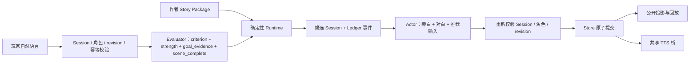

# N.E.K.O 小剧场架构开发文档

状态：当前开发与实施合同（Numeric v2）

本文是 N.E.K.O 仓库内小剧场唯一的架构开发文档，统一收录产品边界、Story Package、Runtime、模型权限、持久化、前端、生成器协作和验收要求。当前代码和测试高于本文；发现实现与本文不一致时，应先在[小剧场实测问题描述以及解决方案](./neko-theater-issues-and-solutions.md)记录可复现证据，再决定修改代码或修正文档。

## 1. 产品边界

小剧场只保留 Numeric v2 剧本模式。`/theater` 是唯一正式页面入口，只负责选剧、查看前情和角色身份以及开始或继续 Session；正式演绎在 N.E.K.O 本体胶囊与历史区中进行。旧 `/theater-home`、`/theater-numeric` 页面和自由模式的页面、API、Prompt、Session、Runtime 均已退役，不提供兼容重定向。

小剧场与普通聊天只共享当前猫娘配置、现有聊天宿主和底层 TTS 能力，不共享输入状态、草稿、历史、恢复指针或正式事实。剧场控制器只有在 Numeric v2 Session 激活且等待玩家输入时才能接管真实胶囊输入框；未激活时必须完全退出普通聊天链路。

Numeric v2 的产品定位是：

- 作者控制背景、双角色身份、主线、支线、结局、隐藏数值规则、路线条件和过渡合同；
- 玩家使用自然语言决定当下行动；
- Evaluator 只判断本回合隐藏数值变化和当前幕是否完成；
- Actor 只生成旁白、猫娘对白和推荐输入；
- Runtime 确定性处理节点推进、路线、结局、`min_turns`、Ledger、Session 和原子提交；
- 不使用正式 Choice；推荐输入只是可选的普通自然语言快捷输入；
- 隐藏数值、阈值、路线条件和内部判定依据不对玩家公开。

## 2. 模块与权限

| 模块 | 职责 |
| --- | --- |
| `services/theater/numeric_v2.py` | Story Package 合同、静态图、条件与可达性编译 |
| `numeric_v2_registry.py` | 剧本包导入、列举、加载与删除 |
| `numeric_v2_cast.py` | 将作者候选身份投影为当前玩家称呼和当前猫娘名 |
| `numeric_v2_identity.py` | 角色卡不可变 ID 与当前猫娘绑定 |
| `numeric_v2_evaluator.py` | 单回合 metric 依据与强度、目标证据和 `scene_complete` 判定；确定性换算 delta |
| `numeric_v2_runtime.py` | 候选状态、限幅、`min_turns`、路线、结局和 Ledger 事件 |
| `numeric_v2_actor.py` | Actor 上下文投影、Prompt 预算和单次模型调用编排 |
| `numeric_v2_actor_output.py` | Actor 输出解析、混合正文校验、换场去重和推荐输入保护 |
| `numeric_v2_workflow.py` | 固定 Evaluator → Runtime 候选 → Actor → 身份复验 → 原子提交的应用工作流 |
| `numeric_v2_store.py` | Session、Ledger、表现历史和槽位索引的原子持久化 |
| `numeric_v2_archive.py` | 结束回执、单集记忆胶囊和完整公开演绎冷档案 |
| `numeric_v2_maintenance.py` | 冷启动审计、隔离区和可恢复删除事务 |
| `main_routers/numeric_theater_router.py` | `/api/theater-numeric` 的请求校验、错误映射、TTS 与归档 HTTP 入口 |
| `app/memory_server/routes.py`、`memory/recent.py`、`memory/timeindex.py` | 剧场胶囊 upsert、有界周目记忆、时间索引覆盖和 Prompt 渲染隔离 |
| `utils/llm_client/messages.py` | 内部消息来源元数据的序列化、识别与供应商协议剥离 |
| `static/js/theater_selector.js` | `/theater` 的剧本选择、导入、删除、开始和继续交接 |
| `static/js/theater_transport.js` | 选择页与本体共用的消息协议、请求 ID 和本地 JSON/CSRF 请求边界 |
| `static/app/app-theater-runtime.js` | N.E.K.O 本体中的 Session 恢复、输入提交、内容块播放和结束流程 |
| `services/theater/tts_bridge.py` | 已提交猫娘对白的共享 TTS 播放桥 |



权限边界不可跨越：

- Evaluator 不能选择路线、编写剧情或写 Session；
- Actor 不能修改 metric、节点、路线、结局、Ledger 或正式事实；
- Runtime 不解释自然语言，只应用已验证 delta，并从作者声明的路线中确定性选择；
- 前端不能提交隐藏 metric、阈值或目标节点；
- Store 只提交完整成功回合，不保存模型执行中的候选半状态；
- TTS 失败只降级为文字，不能回滚已经提交的剧情。

不新增 Planner、Director、多轮 Repair、自动评分模型或运行时动态剧情规划层。

## 3. Story Package 合同

剧本模式只接受 `neko.story.numeric.v2`，顶层核心结构为：

- `meta`
- `intro`
- `characters`
- `catgirl_binding`
- `metric_schema`
- `initial_state`
- `start_node_id`
- `nodes`
- `endings`

Story Package 是作者事实源，不包含玩家 Session、Ledger、模型演绎历史或生成器项目元数据。

### 3.1 角色与身份

作者包可以使用候选男女主身份描述，但运行时必须统一投影：

- 男主由用户扮演；`player_address_known=false` 时 Actor 只能看到“你”，直到用户输入中出现完整配置昵称并由成功回合原子确认；
- `player_address_known=true` 时显示和演绎才使用当前猫娘对玩家的称呼；
- 女主由当前猫娘扮演，统一使用当前角色卡猫娘名；
- 候选原名不能重新出现在 Actor 输出中；
- 玩家与猫娘的行为、经历和台词归属不能交换；
- 角色卡不可变 ID 只用于存储身份，不进入人格正文。

### 3.2 隐藏数值

`metric_schema` 定义数值 ID、范围、bands 和允许的增减规则；`initial_state.metrics` 必须完整覆盖所有 metric。`initial_state.player_address_known` 是结构化布尔状态，声明本剧开场时猫娘是否已经知道玩家称呼，不能从自然语言摘要或“称呼未知”等文案解析；旧 Story Package 缺少该字段时只按 `false` 兼容。编译器会为当前规范补齐该字段，同时保留补齐前的旧规范哈希作为兼容哈希，Runtime 恢复既有 Session 时接受两者，避免升级后误判剧本包变化。可选 `relationship_effect` 只能是 `positive / negative / none`，由作者或生成器明确声明该数值是“越高越亲近”“越高越疏远”还是“不控制关系距离”；旧包缺省按 `none` 兼容，Runtime 不得根据数值 ID、名称或题材猜测。

Evaluator 只能选择作者已经声明的 `criterion_id` 和有限强度 `weak / normal / strong / decisive`，不能直接决定任意 delta。服务端依据该 metric 对应方向的 `per_turn_limit` 确定性换算：`weak=1`、`normal=ceil(limit/3)`、`strong=ceil(2×limit/3)`、`decisive=limit`，再由 Runtime 限幅。关系型 metric 的相同依据在最近四条 Ledger 事件中已经获得奖励时，仅换一种说法、重复礼貌或延续同一态度不能再次变化；只有出现新的成本、风险、明确兑现或可验证结果时才允许继续计分。玩家端不显示原始值、metric ID、阈值、route gate、强度或内部判定证据。

### 3.3 节点、路线与结局

每个非结局节点必须声明 `min_turns`，范围为 1—20；生成器新建和生成时默认填 8，作者可以修改。这里的回合是“当前节点内成功提交的玩家自然语言输入回合”，不是主线章节数，也不包含失败、重复或 revision 冲突的提交。`min_turns` 只是最短停留时间：

- 未达到最少回合时，Runtime 返回 `waiting_min_turns`；
- 已达到但 `scene_complete=false` 时，返回 `scene_incomplete`，不能按回合数硬切；
- `scene_complete=true` 后才计算 route gate；
- 条件不满足时返回 `conditions_blocked` 并留在当前节点；
- 多条路线同时满足时，只选择唯一最高 priority；同优先级并列属于非法状态；
- 只有一个出口的顺序节点允许空条件；同一节点有多个出口时，每条路线都必须有明确数值条件；
- 每个可达非结局节点最终都必须能够到达 terminal ending。

非结局节点还可以声明玩家不可见的 `recommended_turns`，范围为 `min_turns`—40；生成器默认填 15。旧包未声明时，Actor 使用 `min_turns + 2`（最高 40）的兼容默认值。它是软节奏预算，不是正式路线条件：

- 接近预算时，Actor 应减少重复闲聊并把互动重新聚焦到本幕 `pending_goals`；
- 达到或超过预算时，Actor 应主动收束当前交流，允许休息、离开和时间流逝，但不能替玩家行动或跳过本幕目标；
- `recommended_turns` 不改变 `scene_complete`，不触发路线，也不改变 Runtime 的 `min_turns`、route gate 和 priority 判定；
- 玩家端不显示预算；作者可以在生成器节点检查器中调整。

每个非结局节点的 `story_beat` 可以使用以下结构化作者事实；新包应优先使用，旧包保持原样兼容：

- `opening_scene`：本幕唯一确定性可见开场。新包不得再让 Runtime 从 `summary` 首句猜开场；旧包缺少时才兼容取摘要首句。开场只能建立环境或猫娘可见行动，不能替“你”执行行动或决定；
- `relationship_ceiling`：当前幕允许的最高关系阶段，只能是 `stranger / guarded / cooperative / trusted / intimate`。Actor 将它与隐藏关系 metric 的当前阶段取更严格者；旧包缺少时才从既有文本合同兼容投影；
- `goals`：带稳定作者 ID、行为主体和证据方式的目标数组，与旧 `must_happen` 互斥。同幕最多八项，`owner` 只能是 `catgirl / player / shared / environment`；Actor 不能代替 `player` 目标行动，`shared` 必须保留双方各自证据；
- `goals[].evidence.mode=semantic` 时由 Evaluator 结合已提交事实做语义判断且不得填写字面锚点；`mode=exact` 时必须提供 1—8 个完整 `anchors`，服务端只在该 owner 允许的已提交来源中逐字核验。锚点缺失会把模型给出的 `scene_complete=true` 确定性降为 `false`，但不会由程序反向把未完成目标判为完成。

结构化目标示例：

```json
{
  "id": "goal.reboot_identity_question",
  "owner": "catgirl",
  "description": "猫娘明确说明主存储区损坏，并询问自己的过去与唤醒者身份。",
  "evidence": {
    "mode": "semantic",
    "anchors": []
  }
}
```

兼容投影不会把缺省 `opening_scene`、`relationship_ceiling` 或 `goals` 写回旧 Story Package，因此不会改变旧包 canonical bytes、package hash 或既有 Session 绑定。旧 `must_happen` 继续映射为稳定 `goal.N`；只有旧包才允许 Evaluator 使用既有文本归属与引号锚点兼容规则。

路线的 `transition_contract` 至少承担两类约束：

- `must_deliver`：换场时必须带入目标场景的事件或信息；
- `must_preserve`：换场后仍必须保持的已发生事实。

进入 terminal node 后 Session 标记为 `ended`，前端显示公开结局标题和摘要并关闭输入。Normal、Good、Bad 等结局类型属于作者语义，不改变 Runtime 的统一终局处理。

## 4. 单回合合同

正式顺序如下：

```text
玩家原话
  → 校验 Session ID、Story、当前猫娘不可变 ID、base_revision、client_turn_id 和输入长度
  → Evaluator 一次调用
  → 服务端把 criterion + strength 确定性换算为 delta
  → Runtime 应用 delta、goal_evidence、min_turns、scene_complete、route gate 和 priority
  → Runtime 按完整配置昵称精确检查本轮披露候选，形成候选称呼状态
  → Actor 一次调用
  → 重新校验 Session、角色绑定和 revision
  → 原子提交 Session + Ledger event + performance record
  → 公开快照
  → 已提交猫娘对白进入 TTS
```

Evaluator 输出严格限定为：

```json
{
  "scene_complete": false,
  "metric_changes": {
    "metric_id": {
      "strength": "weak",
      "criterion_id": "author_rule_id"
    }
  },
  "goal_evidence": {
    "goal.1": [3]
  }
}
```

`goal_evidence` 只引用当前节点最近一次访问中已经提交的 revision，用来保留对某项目标子条件有实质贡献的原始回合，不等于宣告整项目标完成，也不能引用当前尚未生成的 Actor 输出。单项目标最多保留最近四条，全幕最多保留最近八个不同 revision；模型遗漏时服务端可以用强词面锚点补充“应保留哪条原记录”，但不能据此把 `scene_complete` 改为 `true`。Runtime 一旦锁存本幕完成或切换节点，就清空这些已消费证据，避免旧目标长期占用后续 Prompt。

普通未换场回合的 Actor 输出严格限定为：

```json
{
  "performance": "（把咖啡推到玩家手边）先暖暖手。刚才那件事……（抬眼看向玩家）我答应了。",
  "suggested_inputs": ["玩家可以直接输入的普通自然语言"]
}
```

`performance` 是模型一次生成的完整演绎正文：全角中文括号内只允许猫娘或环境的即时微动作，括号外全部视为当前猫娘实际说出口的对白。动作与对白可以自然穿插，不限制固定对白句数，也不要求每句对白前机械添加动作。Runtime 在提交前校验括号成对、禁止嵌套并要求普通回合至少有一个微动作和有效对白；提交后按同一解析器确定性投影为内部 action/dialogue 片段，供历史展示、TTS、Evaluator、归档与近重复保护消费。Session 保存原始 `performance` 顺序，不保存第二份易漂移的解析结果；旧 `content`、`narration/dialogue` 记录继续由兼容读取器展开。

推荐输入是点击后原样发送的玩家自然语言，不强制以“我”开头。纯动作省略玩家主语并从动作动词起笔；纯台词直接写玩家实际说出口的话；动作与台词混合时先写动作，再用中文引号标出台词。对白内部仍可按语义自然使用“我”等代词。推荐输入不得退化为“解释、询问、展示、选择”等编辑指令，也不由前端机械改写语态。

旁白采用分层节奏：普通回合以对白为主体，每个括号只写一项动态微动作，目标长度不超过 18 个汉字或 12 个单词；不能写静态情绪解释、心理结论、关系评价，也不能压缩多个连续动作、未来剧情或整幕摘要。开场、`transition_bridge`、`target_opening` 和结局交付继续使用独立 `scene_narration`，保持原有场景旁白样式且不受微动作字数限制。实时演绎时，`performance` 按原始字符顺序在同一个猫娘历史消息气泡中逐字显示；Runtime 只把已经提交且位于括号外的对白片段依次交给 TTS。独立场景旁白继续使用 system 气泡且不进入 TTS。`min_turns` 仍只控制节点最早完成时间，`recommended_turns` 仍只提供软收束节奏，两者都不作为旁白字数配置。

节点 `chapter` 标题作为 Actor 的软主题锚点：开场和未换场回合提供当前标题，换场回合同时提供来源与目标标题。标题只在玩家输入和已发生记录都没有明确对象、且存在多个同样成立的候选焦点时用于取舍。它不是已发生事实、幕完成条件或必须复述的文案，不能覆盖 `recent_context`、`pending_goals`、禁止事项或过渡合同。Evaluator 和 Runtime 不使用标题判定幕完成、路线或结局。

### 4.1 换场合同

当 Runtime 已选择路线时，Actor 同一回合必须完成三个连续动作：

1. 直接回应玩家本轮输入并收住来源节点的当前互动；
2. 只用必要的环境、时间或地点变化完成桥接，不替玩家补写行动；
3. 建立目标节点 `opening_scene` 的现场，但不在同一回合演完整个目标节点。

换场输出继续使用固定顺序的 `source_response`、`transition_bridge`、`target_opening` 三段结构。`source_response.performance` 使用混合正文并至少包含一句直接回应玩家的对白；`transition_bridge.scene_narration` 只交代目标开场没有覆盖的必要环境、时间、地点变化或来源收束，不能出现“你 / 您 / 男主 / 玩家 / 配置昵称”并为用户分配动作，去重后没有独立事实时允许为空且前端不显示占位旁白；`target_opening.scene_narration` 必须以 Runtime 提供的目标 `opening_scene` 原文开头，随后可用 `target_opening.performance` 交付目标场景中的猫娘动作与对白。解析器、Runtime 和 Store 分别校验三段完整性、可见目标节点与 Ledger `to_node_id` 一致。任一条件不满足时整回合不提交，前端按三段顺序连续展示，不额外暴露节点标题。新提交的 performance 使用内部合同版本 3；旧合同版本继续兼容恢复。

节点 ID 已推进不等于玩家看见了换场。换场交付必须成为可验证的提交条件；仅把 `route_changed`、目标 beat 和过渡合同放进 Prompt 不足以保证一致性。实测证据和复测状态见[“正式节点已推进，但可见场景没有切换”](./neko-theater-issues-and-solutions.md#问题-1正式节点已推进但可见场景没有切换)。

“休息、睡觉、离开、结束交谈”不是独立路线条件：

- 若本幕尚未完成，只能自然收束当前对话或做同一节点内的时间过渡，不能跳过 `pending_goals`；
- 若本幕已经完成且 Runtime 选出路线，可以作为进入下一场景或第二天的自然桥；
- Runtime 不增加关键词意图分类器，Evaluator 仍只判断数值和本幕完成度；
- Actor 在明确休息后不应继续推荐“装睡并继续对话”等与玩家意图冲突的输入，除非目标开场存在叫醒或紧急事件。

### 4.2 回合工作记忆

Numeric v2 不增加独立记忆模型或第三次总结调用。Session 和 Ledger 仍是完整历史档案；Actor 的“回合工作记忆”只是从已提交记录构建本轮 Prompt 的确定性投影，不产生新事实、不单独持久化、不参与 Runtime 推进。

装箱合同如下：

1. 玩家本轮输入完整优先，并作为 Human Prompt 的最后一个字段交付，避免末尾历史在注意力上覆盖当前要求；
2. 最新一轮已提交表现在预算允许时原样保留，物品位置、状态、持有人、许可和末句对白不能与旧记录一起平均裁剪；
3. 当前节点本次访问的开场或进入该节点的换场记录其次；在预算内发送本次访问的全部前文，超出预算时再从最早回合开始按完整句降级，不能混入循环重访前的同名节点记录；Evaluator 读取跨节点记录时只投影 `target_opening`，不把属于上一幕的 `source_response`、换场桥或触发换场的旧玩家输入重复算作新幕事实；
4. 任何降级都必须在完整句边界停止，不得向模型交付“虽然是”“如果你敢”等由程序截断的半句；
5. 未换场回合只发送 `current_story_beat`，不发送重复的来源 beat、空目标 beat 和空过渡合同；换场先做固定紧凑投影，只保留来源幕硬边界、目标幕待完成目标与硬边界、Runtime 目标开场、过渡合同及两幕各自的演绎和关系合同，不再发送完整来源 beat、目标自由文本临时状态或重复的数值解释；
6. Actor 总输入预算为 4800 Token，当前场景工作记忆最多 2200 Token。稳定背景、双方身份、当前玩家输入、当前/目标幕边界、过渡合同、角色人格和关系控制都按完整字段交付，不再把剧情字段裁成固定 180 Token 片段；
7. 换场紧凑投影在预算装箱前确定性完成；随后按固定顺序删除只用于防重复的 `recent_openings` 和 `recent_suggestions`，再从最早的完整历史回合开始淘汰。兼容装箱器仍能丢弃直接传入的已消费来源 beat 和重复风格说明，但正式换场链路不再生成这些字段。不能截断保留下来的字符串，也不能删除当前玩家输入或目标幕事实；固定合同本身仍超限时整轮失败并回退输入；
8. 通用 `bound_prompt_messages` 只作为最后安全网。Actor 专用装箱完成后，它不应再改写最新回合；
9. 若模型仍照搬上一轮全部对白，且本轮正文与上一轮达到高相似度，Actor 必须拒绝提交该结果。该保护不新增自动重试或模型调用，Session、Ledger 和 revision 保持原状。

旧 Session 不需要迁移；工作记忆每轮直接从现有 `opening_performance` 和 `performance_history` 重建。这一层只改变模型看到历史的方式，不改变公开 API、Ledger、Session revision 或原子提交。

### 4.3 角色化表达与文风多样性

Numeric v2 是由 AI 驱动的类 Galgame。角色卡切换的价值不能只体现为猫娘名字变化；在同一剧情身份和同一玩家输入下，不同猫娘仍应表现出可感知的措辞、句长、主动性、情绪外显方式和互动节奏差异。

演绎优先级必须拆开“能发生什么”和“如何表现”：

1. 已发生事实、节点 `boundaries` 和过渡合同决定剧情硬边界；
2. 当前猫娘角色卡是唯一核心人格，决定措辞、句长、价值取向、主动性和情绪外显方式；
3. 剧情身份、当前幕状态和隐藏关系 band 只能调整她此刻的目标、信任、距离、亲密度和主动性，不能覆盖核心人格；
4. 当轮情绪和文风变化在以上边界内自由生成。

现有 Story Package 字段直接复用，不新增第二份人格：

| 来源 | Actor 投影 | 权限 |
| --- | --- | --- |
| 当前角色卡人格摘要 | `acting_context.core_persona` | 唯一核心人格；人格冲突时优先 |
| `intro.catgirl_identity` | `acting_context.story_identity` | 初始剧情身份、经历、能力与目标，不定义基础性格 |
| `catgirl_binding.role_overlay` | `acting_context.story_role_context` | 如何进入故事及长期关系弧线，不定义基础性格 |
| 当前节点 `story_beat.catgirl_situation` | `acting_context.current_scene_state` | 当前幕临时状态 |
| 当前节点 `story_beat.acting_contract` | `acting_context.acting_contract` | 结构化声明当前认知、记忆、自称模式、人格权限和允许/禁止行为；优先于角色卡表达风格 |
| 目标节点 `story_beat` | `target_story_beat.pending_goals / boundaries` 与 Runtime 目标开场 | 换场时只交付目标幕待发生事实和硬边界，不发送可能与 Session 事实冲突的自由文本临时状态 |
| `relationship_effect != none` 的隐藏 metric bands 与当前幕关系合同 | `acting_context.relationship_control` | 两类上限取更严格者；控制距离、触碰、亲昵称呼、暧昧、依赖和关系承诺，不公开原始数值和阈值 |
| `relationship_effect = none` 的隐藏 metric bands | `acting_context.capability_state` | 提供能力、压力、线索等非关系状态，不得改变关系距离 |
| 目标节点关系合同 | `acting_context.target_relationship_control` | 仅在换幕回合提供，防止目标开场沿用来源幕的亲密许可 |

`characters` 当前只要求是对象，Actor 不消费，不能把它启用为并行人格事实源。每轮 Actor 都从角色卡、当前节点和 Session metrics 确定性重建 `acting_context`；`acting_contract` 明确规定当前认知、记忆和自称权限时，角色卡只能提供剩余的表达风格，不能覆盖该合同。数值跨 band 或 Runtime 进入目标节点时自然得到新的临时状态，不改写角色卡、不持久化模型总结，也不需要“每幕重写人设”。

关系型 metric 只由显式 `relationship_effect` 识别。Actor 把正向数值的低、中、高 band 投影为从戒备到亲密的阶段，把反向数值按相反方向投影；多个关系数值取最严格者，再与当前幕 `关系上限` 取更严格者，得到 `effective_stage`。该阶段是亲密行为硬上限：最低阶段只能礼貌回应、有限软化和保持距离，不能提前演出暧昧、占有、依赖、主动肢体接触、伴侣式亲昵称呼或已经建立的亲密关系；较高阶段仍必须由已发生事实支撑。核心人格只决定许可行为如何表达，不能越过阶段；推荐输入服从同一上限，低关系阶段也不能反向授权敌视、羞辱或威胁。Actor 只接收 band 标签、统一阶段和允许/禁止行为，不接收原始数值或阈值。

当前回合可见关系姿态使用 Evaluator 结算前的 Session metrics，避免玩家单次行为刚跨 band 就在同一条猫娘回复中瞬间改变关系；非关系型 `capability_state` 可以使用本回合结算后的候选 metrics，让线索、能力和压力变化及时影响表现。换场回合分别计算来源幕与目标幕上限，目标开场不能沿用来源幕更宽松的亲密许可。

关系语义不能用有限关键词正则伪装成硬校验，也不能依赖同一次 Actor 在生成正文后自报“是否越界”：同义改写无法穷举，自报结果也可能与正文矛盾。Runtime 应按 `effective_stage` 确定性投影阶段化 `response_contract`，并在 `acting_context` 最后交付，要求 Actor 先选择符合当前关系的回应姿态，再生成正文和推荐输入。结构、字段和确定性事实继续硬校验；自由文本中的关系语义在“不增加分类模型、Repair 或第二次 Actor 调用”的边界下属于单次生成合同，必须通过真实模型压力测试评估，不能宣称达到百分之百确定性拦截。

Actor 使用以下无额外模型调用的软文风控制：

1. 将完整 `acting_context` 放在 Human Prompt 尾部、靠近本轮输入交付；开场同样显式获得核心人格、初始关系 band 和当前幕状态；
2. 从最近三轮已提交表现中确定性提取首个内容块的首个完整分句，作为 `recent_openings`；每条最多 40 Token，只用于识别近期起手结构、比喻和动作组合，不产生新事实、不单独持久化；
3. Actor 应根据角色与情境选择从对白、动作、停顿或环境变化切入，不能把“听到玩家的话 → 固定反应 → 对白”当作每轮模板；
4. “听到”“闻言”等词不是禁词，在当下最自然时可以使用；目标是避免连续机械复用，而不是通过同义词替换制造另一套模板；
5. 旁白优先展示可观察反应，少替作者评价、概括或给玩家发言贴标签；不能为了追求变化随机改变人格、关系、事实或剧情节奏；
6. 不使用 Runtime 随机轮换模板，不增加文风模型、Planner 或额外 Actor 调用。现有近重复提交保护只拦截“全部对白照搬且整轮高度相似”，不能把单个常用词或角色口头禅当成错误。

正式质量验收至少包括：同一角色连续 8—10 轮的起手结构复用检查，以及同一 Story、同一输入在三张明显不同角色卡下的盲测对比。通过标准是角色差异能够从措辞、节奏和行为反应中识别，而不只是替换显示名称；该项需要真实模型压测，单元测试只验证 Prompt 权重、边界和上下文投影。

## 5. Session、Ledger 与原子性

每个回合使用稳定 `client_turn_id` 和 `base_revision`：

- 重复提交不能重复调用模型或写入第二条记录；
- 服务端已提交但响应丢失时，同一 `client_turn_id` 只返回当前权威快照；胶囊据此重建完整历史并移除乐观气泡，不要求服务端再次返回或播放单条 performance；
- revision 冲突返回 409，前端刷新服务端快照并保留未提交草稿；
- Evaluator、Actor 或 Store 任一步失败都不提交半回合；
- Actor 生成成功前不写 Session、Ledger 或表现历史；称呼状态与成功回合的 Session、Ledger event、performance record 一起原子提交；
- 称呼未知时不把配置昵称发送给 Actor；只有玩家本轮明确包含完整昵称时，Actor 输出中的相同字符串才允许通过确定性保护；
- Session 文件中的 Ledger 事件和表现记录按 revision 一一对应，加载时复验节点、数值、计数器和链尾；
- 并发结束、重复结束、剧本删除和回合提交通过相同的故事级边界保护，只有一个最终结果可以提交。

公开 HTTP 投影只包含恢复和演绎所需信息：intro、当前场景摘要、开场表现、表现历史、revision、Session 状态、推荐输入和公开结局。完整 Ledger、隐藏数值和内部规则保留在服务端。

## 6. 演绎槽位与持久化生命周期

Numeric v2 的持久化唯一键是：

```text
Story ID × 猫娘角色卡不可变 character_id
```

每个组合最多保留一个 Session 文件，`story_sessions.json` 只保存槽位到 Session ID 的恢复指针。

- 角色卡改名不改变 `character_id`，因此不丢进度；
- 删除角色卡后新建同名角色会得到新 ID，不能继承旧进度；
- 关闭窗口或退出 N.E.K.O 不结束 Session，重启后恢复当前猫娘对应的剧本槽位和 `player_address_known`；
- 切换猫娘不删除其他猫娘的进度，切回后恢复各自槽位；
- 剧情终局在当前槽位保留只读记录；玩家主动退出写入 `ended_reason=user_exit`，不改变 Ledger、revision 和演绎历史，并可从选剧页原子恢复为 `active`；
- 主动退出后同时提供“继续”和“开始”：继续恢复同一 Session，“开始”经确认后创建新 Session ID 并原子替换旧文件；剧情终局只提供“开始”；
- 正常恢复只读取索引；Numeric v2 冷启动初始化或显式维护才全盘复验文件并重建索引；
- 损坏、无主或重复文件移入有界隔离区，最多保留 6 份，不能阻断其他合法槽位恢复。

删除剧本使用可恢复事务级联删除 Story Package、该剧本全部 Session 和索引项；任一步失败恢复删除前快照。存在 `active` Session 时，前端列出对应猫娘名并要求确认。删除猫娘角色卡按不可变 ID 级联删除其在所有剧本下的 Session。

活动 Session 仍不限制单次演绎的回合数或文件体积，Ledger 与表现历史会在该周目内持续增长。玩家确认记忆后，完整公开演绎转入不参与 Prompt 的冷档案；近期工作记忆按每个 Story 最近三个周目、全部 Story 合计最多三十条收敛；冷档案按 Story × `character_id` 默认保留最近五份未收藏记录，收藏记录不参与自动淘汰。

### 6.1 演绎记忆归档

玩家在剧本页明确选择“记下本次演绎”后，服务端从已结束 Session 确定性生成单集记忆胶囊并复用 memory server `/cache/{lanlan_name}`；前端不能拼接 transcript、直写记忆文件或在结束前台增加摘要模型调用。

#### 6.1.1 存储分层

活动 Session、Ledger 与 `performance_history` 是演绎期间的唯一事实源。“记下本次演绎”之后，数据分成冷档案和工作记忆两层；完整 transcript 不进入普通聊天 Prompt。

| 层级 | 稳定键与位置 | 保存内容 | 是否进入日常 Prompt |
| --- | --- | --- | --- |
| 活动演绎事实 | Story ID × `character_id` 的当前 Session 槽位 | 完整 Session、Ledger、开场和表现历史 | 只供 Numeric v2 Runtime 与 Actor 使用 |
| 结束回执 | `numeric_v2/end_receipts`，按 Session 指针和结束事实定位 | `pending / writing / written / skipped`、归档 revision 水位、稳定请求 ID 和待提交冷档案 | 否 |
| 完整公开冷档案 | `numeric_v2/public_archives/<sha256(session_id)>.json` | 玩家可见的开场、玩家输入、旁白、转场、动作、猫娘对白和公开结局 | 否 |
| 单集工作记忆 | 当前猫娘 `recent.json` | 每个 Session 一条 `system` 单集摘要胶囊 | 是，但只以虚构剧场上下文渲染 |
| 时间索引副本 | 当前猫娘 `time_indexed.db` | 每个 Story 一个稳定事件，内容覆盖为最近三个周目胶囊 | 只服从相同的剧场来源隔离 |

冷档案 schema 为 `neko.theater.numeric.v2.public-archive`。顶层只保存 `story_id`、`session_id`、剧本标题、不可变 `character_id`、归档时的双方称呼、revision、暂停或完成状态和公开结局；`opening` 保存有序表现及 `parts`，`turns` 按 revision 保存 `player_input`、有序表现及 `parts`。`parts.kind` 只允许玩家可见的 `scene_narration / action / dialogue` 投影。隐藏数值、关系 band、阈值、路线条件、Evaluator 输出、推荐输入、内部节点 ID 和 Ledger 一律排除。

暂停周目的摘要取最新一轮公开表现，规范空白后最多保留 360 个字符，并优先在完整句末收束；已经进入公开结局时直接使用结局摘要。这个摘要过程完全确定性，不新增 LLM 调用，也不把冷档案全文重新总结一遍。

#### 6.1.2 单集胶囊合同

每次归档只向 memory server 发送一条 `role=system` 消息。基础元数据为：

```json
{
  "source": "theater_numeric_v2",
  "memory_tier": "episode_summary",
  "message_kind": "episode_summary",
  "story_id": "story_id",
  "session_id": "session_id",
  "story_title": "剧本标题",
  "episode_status": "paused | completed",
  "ending_title": "公开结局标题或空字符串",
  "ending_summary": "公开结局摘要或空字符串",
  "episode_summary": "确定性单集摘要",
  "archive_from_revision": 1,
  "archive_through_revision": 8
}
```

memory server 写入时再确定性补充 `run_index`、`story_run_count` 和 `ending_titles_seen`。同一 `story_id + session_id` 的暂停、继续和完成归档必须替换原胶囊，沿用原 `run_index`；状态、摘要和 revision 范围以最新成功写入为准。重新开始使用新 Session ID，因此形成同一 Story 的新周目。每个 Story 在 `recent.json` 中只保留最近三个周目胶囊，但最新胶囊继续携带累计周目数和去重后的已见结局集合。

胶囊不是猫娘对白，也不是玩家现实经历。Prompt 渲染只能自然说明猫娘与玩家共同演绎过该虚构剧本、这是第几周目、本次暂停或达到哪个结局，以及公开摘要；不能给 `system` 胶囊套用玩家或猫娘署名。剧本标题已有成对书名号或当地语言标题符号时原样保留，缺失时才由八语言模板补齐。

#### 6.1.3 写入、失败与重试顺序

归档端点先复验结束回执、Story、Session、当前 `character_id` 和 revision，再与回合提交、重新开始、剧本删除共用故事级锁。锁内执行以下顺序：

```text
receipt: pending
  → receipt: writing
  → Theater：原子写待提交公开冷档案
  → memory server：recent 按 Session upsert
  → memory server：以 recent 为基线重建全部剧场 time_indexed 事件
  → Theater：发布冷档案并执行“最近 5 份 + 收藏”保留策略
  → receipt: written，并推进 archived_through_revision
```

memory server 对当前猫娘使用 settle lock 串行 recent 与时间索引更新。待提交冷档案在迁移旧时间索引之前落盘，但不出现在正式档案列表；memory server 成功后才发布。任一步失败都把 receipt 恢复为 `pending`，重试再次执行同一 Session upsert 和全量有界剧场索引重建，不追加重复胶囊。玩家在失败后改选“暂不记录”时销毁待提交档案。相同结束事实的重复点击、刷新和响应丢失由 Story ID、Session ID、revision、`character_id` 生成的稳定 `end_receipt_id` 与 `archive_request_id` 收敛。

点击“暂不记录”只把 receipt 标记为 `skipped`，不创建胶囊或冷档案，也不删除可继续的 Session。归档持有故事级锁期间，重新开始和剧本删除必须等待，不能在删除完成后重新产生孤立冷档案。

#### 6.1.4 记忆隔离与容量边界

- `BaseMessage.metadata` 在 `recent.json` 和 SQL 时间索引序列化中保留，转换成供应商 OpenAI 消息时主动剥离，不能把内部来源字段发送成模型协议内容；
- 全部 Story 在 `recent.json` 中合计最多三十条剧场胶囊；时间索引每次以这一有界集合重建，每个 Story 使用一个稳定事件，并自动删除旧版剧场全文行、已淘汰胶囊和已不在 recent 中的 Story 事件；
- 普通聊天压缩只摘要非剧场消息，压缩提交后把结构化剧场胶囊原样放回；普通历史触发硬上限裁剪时也必须保留剧场胶囊及其来源元数据；
- 剧场胶囊不参与普通聊天的用户事实、猫娘自我披露、反馈、复读、人格提取、证据信号、反思合成或通用 history review，不能把角色扮演内容晋升成现实事实；
- 完整公开冷档案不进入 recent 压缩、时间召回或普通 Prompt。每个 Story × `character_id` 默认保留最近五份未收藏档案，收藏档案额外保留；取消收藏后立即重新执行保留策略；
- 每个可恢复 Session 只保留最新回执指针。重新开始删除旧 Session 回执；冷启动 GC 删除无 Session 指向、已被新 revision 替换的回执和待提交档案；
- 旧格式 `recent.json` 中同一 Session 的多条剧场正文在下一次剧场胶囊写入时折叠为一条 `system` 摘要；同次写入会以 recent 有界集合原子重建 `time_indexed.db` 剧场行，完成旧时间索引的惰性迁移；
- 选剧页提供显式“忘记该剧本”。确认后删除当前猫娘该 Story 的 recent 胶囊、time-indexed 剧场行、完整冷档案和旧回执，但不删除 Story Package 或当前 Session；已结束 Session 保留一个最新 `skipped` 决策回执，防止页面立即重复询问。

#### 6.1.5 重开、删除与恢复

已经 `written` 的周目在“重新开始”前必须存在公开冷档案。兼容旧版本时，如果旧 receipt 已写入记忆但还没有对应 `public_archives` 文件，Runtime 先从仍在槽位中的旧 Session 补写冷档案；补写失败则不得替换旧 Session。补写成功后，新 Session 原子替换恢复槽位，旧周目胶囊与冷档案按各自生命周期保留。

删除剧本时，可恢复删除事务必须同时备份并级联删除 Story Package、该 Story 的 Session、槽位索引、公开冷档案、结束回执和待提交档案；事务失败时一起恢复。删除角色卡时按不可变 `character_id` 清理其 Session、冷档案和回执，并纳入角色删除回滚快照；旧数据缺少 ID 时才使用历史猫娘名回退。已经写入当前猫娘记忆系统的单集胶囊不因删本地剧本包而跨服务静默删除；用户需要完整删除时使用“忘记该剧本”。

“记下本次演绎”最终语义是：让猫娘在日常对话中保留一份有界、明确标记为虚构的单集摘要，同时把完整公开 transcript 写入 Theater 冷档案。需要检查具体回合时从 `public_archives` 按 Story ID 与 Session ID 读取，不能反向依赖 recent 胶囊重建演绎。

## 7. 前端与 TTS

- `/theater` 选择页显示背景介绍、玩家身份和猫娘身份，不显示节点标题、场景卡或隐藏状态；
- N.E.K.O 本体历史区按服务端已提交顺序播放玩家原话、场景旁白和猫娘演绎内容，不把剧场历史混入普通聊天消息；
- 普通回合的括号微动作与对白保留在同一猫娘消息中，开场、换场和结局旁白使用独立 system 消息；
- 只有猫娘对白进入 TTS，括号微动作和独立场景旁白不朗读；服务端只允许按已提交内容块坐标请求播放；
- 推荐输入直接作为普通自然语言提交，不先回填输入框，也不携带正式 Choice ID；
- terminal scene 关闭玩家输入和推荐输入，并引导返回选剧页；玩家主动结束先确认，再回到选剧页询问是否写入记忆；
- 刷新只恢复已提交历史，不重播历史 TTS；
- TTS 去重键包含 Session、revision 和内容块坐标，不能与普通聊天音频串播。

## 8. NEKO_Numeric_drama 生成器协作边界

剧本生成器是作者侧工具，后续可以 SDK 形式嵌入 N.E.K.O，但职责保持独立：

- 创建作者项目并生成初始主线和一个 Normal 结局；
- 编辑节点、支线、路线条件、过渡合同、隐藏数值和多个结局；
- 编译、检查、跨仓库复验、导出和安装 Story Package；
- 保证导出、安装和 N.E.K.O 复验使用相同 canonical bytes；
- 不持有 Session、Ledger、演绎状态或 Runtime 推进权；
- 不增加 Planner、Repair 或额外评分模型。

首次结构生成不要求模型同时输出 metric、阈值、priority、`min_turns` 或 `recommended_turns`。两类回合默认值、稳定 ID、正式条件、互补路线、结构校验、编译和原子写入应由程序确定性处理。

主线模型每章使用 `catgirl_progress_events` 输出 1—4 项由“女主”或“环境”主动完成的原子事件。每项只能包含一个可独立核验的交付，不能把展示资料、解释来源和确认结论合并成一个复合目标；涉及日期、编号、期限、金额或条款时，实际值必须直接进入对应事件，缺少既定值时改写为协商、报价或共同填写。生成器将新项目的每项事件分别投影为结构化 `goals`，保留稳定 ID，并明确 `owner` 与 `evidence.mode`；只有旧作者项目和旧 Story Package 继续兼容 `must_happen`。旧作者草稿的单数 `catgirl_progress_event` 只作编辑和编译兼容，新模型输出统一使用数组字段。

生成器预设和缺省数值根据 `relationship_effect` 选择安全限幅：关系型默认每回合增减上限为 3，非关系型默认 5；作者在高级设置中仍可显式修改。该默认值只负责降低未来剧本的关系跳变速度，Runtime 继续使用 Story Package 中已经声明的正式限幅。

### 8.1 引导式支线创作

支线生成采用“终点先行、结局反推、默认不要求手算阈值”：

1. 作者从当前恰好只有一个出口的非结局节点发起；
2. 先选择终点：回到主线、通往已有结局或产生新结局；
3. 选择回到主线时，必须让作者明确选择具体回接节点，默认推荐原顺序出口的下一幕；
4. 产生新结局时，先生成并确认可编辑的结局草稿，再从结局反推 1—3 幕过程；
5. 作者用自然语言说明触发原因和想要的篇幅；
6. 生成模型只生成可预览的剧情过程与因果解释；
7. 作者确认后，程序一次性写入节点、路线、过渡合同和可选新结局。

默认界面展示“当信任达到愿意托付秘密的程度”一类人类可读语义，不要求作者手算 metric ID、运算符、阈值和 priority。高级编辑仍必须可以检查和修改原始条件，不能形成黑箱。

若作者已经选择条件，模型只能解释因果；只有作者选择“让生成模型推荐”时，模型才能从程序依据现有 metric bands 构造的候选集合中返回一个候选 key。项目缺少合适 metric，或 bands 只有无法表达剧情含义的占位词时，向导必须先要求作者完善数值规则或确认新增预设，不能让模型静默发明正式数值。

回接点选择器必须显示会绕过的主线幕和关键事实。支线需承接被绕过的 `must_happen` 与主线路线 `must_deliver`；1—3 幕无法安全承接时，在模型调用前禁用该候选。主线顺序来自生成器作者项目元数据，不能依赖 `mainline_XX` ID 前缀猜测，也不写入 Story Package。旧项目无法唯一识别主线时，由作者沿现有路线确认。

模型只接收任务需要的上下文投影：背景、双角色身份、来源节点、最近 1—2 个上游节点、原出口、已选终点、被绕过事实、相关 metric 语义与 bands、允许候选、作者方向和篇幅。目标预算为 8K—12K tokens，硬上限 16K；不发送完整项目、无关支线、Session、Ledger 或 Runtime 历史。超限候选应在选择前禁用并解释，不能截断关键事实后继续生成。

生成器的专项字段和 DTO 仍以 `NEKO_Numeric_drama` 仓库内生成器设计文档和当前代码为准；它们不能覆盖本页的 Runtime 权限边界。

## 9. 验收矩阵

架构改动至少验证以下范围：

1. Story Package schema、数值规则、路线条件、可达性和结局编译；
2. `min_turns`、`recommended_turns` 软节奏、`scene_complete`、priority、条件阻塞、支线进入与回流；
3. Actor 身份替换、玩家行为归属、开场、换场和推荐输入合同；
4. Session revision、幂等、并发提交、原子失败、重启恢复和跨剧本隔离；
5. 角色改名、同名新角色、切换角色、重新开始、删剧本和删角色；
6. 前端公开投影、刷新恢复、结局面板、输入关闭和隐藏数值隔离；
7. 剧场模式与普通聊天的输入、草稿、历史、音频和恢复链路不串线；
8. 八语言用户文案 key 一致且 JSON 可解析；
9. 记忆归档必须覆盖：明确同意才写入、待提交档案发布/销毁、公开冷档案不含隐藏状态、同 Session upsert、暂停到完成更新、新 Session 周目递增、同 Story 最近三个周目与全局三十条上限、旧时间索引迁移、冷档案最近五份与收藏保留、回执 GC、显式忘记、普通压缩与硬裁剪保留剧场胶囊、重开保留已确认冷档案、删除事务回滚和失败安全重试；
10. 真实前端模型回放按固定归因顺序记录在问题文档；
11. 真实桌面 TTS 设备发声仍需人工验收，自动测试只能覆盖桥接和降级语义。
12. 数值与关系专项必须覆盖：强度到 delta 的确定性映射、同依据重复奖励抑制、目标证据每项目四条/全幕八条上限与用完即删、低关系越级对白和推荐输入拒绝、跨 band 延迟到下一回合生效；
13. Actor 预算专项必须覆盖：先删辅助字段、再淘汰最早完整回合、换场来源目标降级顺序、固定事实与当前输入不截断，以及固定合同超限时不产生半回合；
14. 生成器专项必须覆盖：主线每章 1—4 项原子 `catgirl_progress_events`、旧单数字段兼容、复合事件拆分、玩家归属阻断，以及关系/非关系数值默认限幅分别为 3/5。

任何“提示词看起来已经要求模型做到”的行为，都必须用真实输出或可执行回归证明；Prompt 本身不算完成证据。
