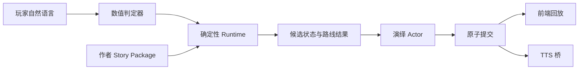

# N.E.K.O 小剧场架构

状态：当前架构（Numeric v2）

## 模式隔离

| 模式 | 页面 | 服务端状态 | 持久化目录 |
| --- | --- | --- | --- |
| 剧本模式 | `/theater-numeric` | Numeric v2 Session + Ledger | `theater/numeric_v2/` |
| 自由模式 | `/theater` | Free Session 历史 | 自由模式私有目录 |

两种模式不共享 Prompt、Session、恢复指针或正式状态，只共享当前猫娘配置和 TTS 播放桥。

## 剧本模式模块

| 模块 | 职责 |
| --- | --- |
| `numeric_v2.py` | Story Package 合同、静态图和可达性编译 |
| `numeric_v2_registry.py` | v2 包导入、列举与加载 |
| `numeric_v2_evaluator.py` | 单次回合数值判定，只返回 metric delta 与证据 |
| `numeric_v2_runtime.py` | 候选状态、`min_turns`、route gate 和 Ledger 事件 |
| `numeric_v2_actor.py` | 已结算回合的旁白、猫娘对白和推荐输入 |
| `numeric_v2_store.py` | Session、Ledger 与表现历史的原子持久化 |
| `numeric_theater_router.py` | `/api/theater-numeric` 的 v2-only HTTP 入口 |
| `theater_numeric_v2.js` | v2 页面状态、输入、恢复和表现回放 |
| `tts_bridge.py` | 已提交猫娘对白的共享播放桥 |

## 权限边界

Evaluator 不能选择路线，Actor 不能修改正式状态，前端不能提交隐藏 metric。只有 Runtime 能应用数值并选择作者已声明路线，只有 Store 能完成正式提交。

## 事务与恢复

- 每个回合使用稳定 `client_turn_id` 和 `base_revision`；
- 重复的已提交 `client_turn_id` 直接返回现有快照，不重复调用模型；
- revision 冲突返回 409，前端刷新快照并保留草稿；
- Actor 生成成功前不写 Session、Ledger 或表现历史；
- Session 文件包含完整 Ledger 链，加载时复验 revision、节点、数值和表现记录尾部；
- 终局与主动结束都保留只读历史，重新开始使用新 Session ID。

## 公开投影

HTTP 响应只包含恢复和演绎所需字段：公开 intro、当前场景摘要状态、开场表现、表现历史、revision、Session 状态和推荐输入。原始 metric、阈值、route gate、内部判定理由和完整 Ledger 不投影到页面。

## 当前验收重点

- 每个非结局节点达到 `min_turns` 前不推进；
- 条件满足后只走唯一最高优先级路线；
- 支线可以按作者路线回到主线；
- 三类结局均可通过不同数值轨迹到达；
- 模型失败、revision 冲突和重复请求都不产生半回合；
- 剧本模式与自由模式状态不串线；
- 真实桌面 TTS 发声仍需人工设备验收。
