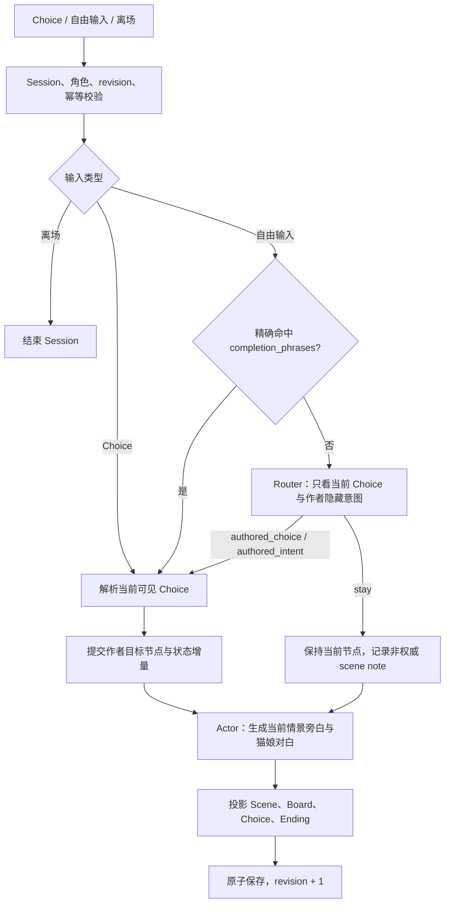

# N.E.K.O 小剧场架构

## 1. 当前产品边界

小剧场是玩家与当前猫娘的一对一情景演绎。

- 剧情结构完全来自 Story Package：节点、边、前置事实、Choice 与结局均由作者声明。
- 玩家可以在当前情景内自由交流；模型负责自然回应，但不能离开故事背景、主题、角色身份和已公开事实。
- 自由输入只有在明确命中当前作者 Choice 或作者隐藏意图时才推进剧情。
- 未命中作者入口时保持当前节点，不创建临时支线、动态事实、新道具、新线索或新结局。
- “玩家角色”“男主”等剧本身份在演绎中统一以第二人称“你”呈现；猫娘公开文本使用本场实际猫娘名。

这意味着运行时不再承担开放式动态剧情生成。作者负责“故事会走到哪里”，模型负责“角色在这里怎么自然地说”。

## 2. 权威边界

| 内容 | 权威来源 | 模型权限 |
|---|---|---|
| 当前节点、可达边、Choice | Story + 服务端静态图 | 只能从当前白名单选择 |
| 剧情事实、道具、线索、flag | 作者节点的状态增量 | 不得新增或修改 |
| 正式结局 | 作者 ending 节点与条件 | 不得生成 |
| 旁白、猫娘对白 | Actor 演绎；失败时作者回退 | 可以生成，但必须留在当前情景 |
| 自由交流笔记 | 服务端有界 scene notes | 只辅助承接对话，不参与可达性和结局 |
| Session、revision、幂等结果 | 服务端 | 不可见、不可修改 |

模型输出永远只是演绎或路由候选。服务端只接受当前 Story 已声明的稳定 ID。

## 3. 回合流程



Choice 和自由输入最终共用同一个作者图推进函数，因此自然语言命中不会产生另一套剧情语义。

### 3.1 作者推荐分支

同一节点存在多条 `recommended` 出边时，满足目标节点 `preconditions` 的分支全部显示为 Choice。玩家点击哪一项就进入哪条作者路径。

### 3.2 作者隐藏分支

`latent` 边不会显示按钮。Router 只能返回当前节点已声明的 `intent_id`；唯一命中后立即进入该边的作者目标节点。

旧版“连续表达多次后才进入支线”的 `goal_id / pullbacks_before_transition` 机制已删除。旧 Story 中这些额外字段可继续存在，但当前运行时不读取它们。

### 3.3 自由交流

未命中任何作者入口时：

1. 当前节点、事实、道具、线索和结局不变；
2. Actor 在当前背景和角色设定内回应；
3. 玩家原话可以作为有界 `scene_notes` 保存，帮助下一轮承接；
4. 推荐 Choice 仍保持作者原文和稳定 ID。

## 4. 核心模块

| 模块 | 职责 |
|---|---|
| `runtime.py` | 启动、恢复、提交、结束和角色归属边界 |
| `turn_service.py` | 单条回合编排、候选副本和原子提交 |
| `session_store.py` | Session 存储、active 索引、锁、revision 与幂等 |
| `story_loader.py` | Story 发现、精确加载和公开卡片 |
| `story_contracts.py` | 静态 Story、节点、边、Choice 与可达结局校验 |
| `story_graph.py` | 当前节点、静态出边、Choice 和隐藏意图解析 |
| `rules.py` | 作者事实、道具、线索、flag 与结局提交 |
| `llm.py` | Router、Actor、一次 Repair 和模型调用 |
| `llm_response_contracts.py` | Router / Actor JSON 合同 |
| `llm_performance_guard.py` | 演绎越界与内部信息泄漏检查 |
| `projector.py` | 公开响应投影 |
| `turn_causality.py`、`model_trace.py`、`observability.py` | 私有诊断与低基数指标 |

没有继续把这些职责压进少数大文件。会话一致性、原子保存和模型安全仍是独立边界。

## 5. 已删除模块

以下模块属于旧动态支线生成链，当前产品不再需要：

| 已删除模块 | 原职责 | 删除原因 |
|---|---|---|
| `intent_tracker.py` | 累计图外自由意图与证据 | 自由交流不再生成剧情 |
| `branch_planner.py` | 让 Planner 生成 Runtime Branch Patch | 分支只来自 Story |
| `branch_patch_contracts.py` | 校验动态支线 Patch | 不再存在动态 Patch |
| `branch_runtime.py` | 提交 Branch Fact、Goal、动态 Choice | 模型无剧情事实权限 |
| `branch_lifecycle.py` | 激活、汇流、关闭临时支线 | 不再存在活动临时支线 |
| `branch_fact_contracts.py` | 校验动态事实候选 | 事实只来自作者节点 |
| `branch_contract_common.py`、`branch_contracts.py` | 动态合同公共层和兼容门面 | 下游消费者已删除 |
| `fact_view.py` | 合并静态事实与 Branch Fact | 只剩单一 `narrative_facts` |
| `story_dynamic_contracts.py` | 校验 World Contract、动态 Goal 与 Ending Domain | 当前运行时忽略旧动态扩展 |
| `turn_branch_flow.py` | 动态支线回合编排 | 回合收敛到 `turn_service.py` |

同时删除了对应 Narrative Eval 脚本、动态支线 fixture、单元测试和 v2.6/v2.7 动态架构文档。

## 6. 轻量状态

新 Session 的 `story_state` 只建立：

- `current_node_id`
- `completed_node_ids`
- `narrative_facts`
- `available_prop_ids`
- `used_prop_ids`
- `clue_ids`
- `flags`
- `scene_notes`
- `branch_commitment`（只记录已进入的作者隐藏边）

旧 Session 中的 `dynamic_intent`、`pending_intent`、`active_runtime_branch`、`branch_facts`、`completed_goal_ids` 和 `branch_history` 不再读取。恢复时不主动破坏旧文件；下一次正常演绎只按当前作者节点继续。

`narrative_facts` 同时支持作者结构化三元组和字符串事实。节点 `preconditions.required_facts` 使用同一稳定比较规则，因此旧 Story 的字符串事实可以正确解锁作者分支。

## 7. Story 兼容规则

运行时继续接受旧 Story Package 中与动态架构相关的额外字段，例如：

- `world_contract`
- `narrative_goals`
- `ending_domains`
- `dynamic_content_slots`
- `completes_goal_ids`
- 推荐边上的旧 `goal_id`

这些字段仅作为向后兼容数据保留，不参与当前运行。作者应使用静态 `edges`、目标节点 `preconditions`、`state_diff`、`suggestions` 和 ending 节点表达所有可玩剧情。

## 8. 模型合同

Router 固定输出：

```json
{
  "route_kind": "authored_choice | authored_intent | stay",
  "matched_choice_id": "",
  "authored_intent_id": "",
  "response_focus": {}
}
```

Actor 固定输出：

```json
{
  "narration": "",
  "dialogue": "",
  "choice_rewrites": []
}
```

`choice_rewrites` 仅为旧响应解析兼容保留，必须为空；前端 Choice 始终来自作者原文。

## 9. 验证要求

涉及小剧场主链的修改至少验证：

- Story Loader 静态合同；
- 字符串与结构化事实前置条件；
- 作者主线/支线可达性；
- 自由交流不改变权威剧情状态；
- Choice 与自然语言命中提交相同状态；
- Session 并发、幂等、恢复和角色归属；
- TTS 单次领取和结束态；
- Router / Actor 输出合同与内部信息隔离；
- 前端窗口和接口 smoke。

真实模型 smoke 只验证 Router 与 Actor；不再验证 Planner、Runtime Branch 或 Branch Fact。
